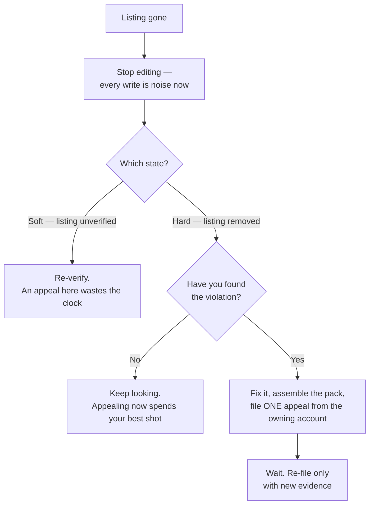

# What an outage costs, and how to come back

Diagnosis settles what happened. Two practical problems follow it: the write budget you are about to spend in a panic, and the fact that most of your instruments cannot see an outage at all. Then the procedure for getting the listing back.

## The edit cap, and why it bites hardest here

Google caps profile edits at ten per minute, per profile, and documents that ceiling as one which cannot be increased. [The profile is the product](../../02-core-practice/the-profile-is-the-product/index.md) introduces it; the mechanism, and the source, are in [Write limits and failure modes](../../05-reference/write-limits-and-failure-modes.md). Three things surprise people, and all three surface during exactly the scramble a suspension produces.

**The budget is per profile, not per tool or per person.** Two people fixing the same listing in two browsers share one allowance. So do two tools, and so do a bulk hours update and a scheduled post landing in the same minute. The failure lands on whichever arrived last, which is why the symptom presents as an unrelated bug in an unrelated system.

**Every write counts, including the ones that feel like corrections.** Undo is a write. Re-applying a rejected value is a write. Each photo is a write. So is publishing a post. A panicked "let me put everything back" is the most reliable way to hit the ceiling.

**Hitting the cap leaves you in a partial state.** A run that stops halfway has applied some edits and not others, and a half-applied identity change — new name, old address — is exactly the inconsistency that reads badly. SEOG refuses the write before it reaches Google and tells you to try again in a minute: better than a silent failure, but not a queue. Nothing is retried for you.

So the rule is **pace your edits and verify each one**: the cap makes bulk work unattributable long before it makes it slow. [Multi-location and franchise work](../multi-location-and-franchise/index.md) plans around it.

## What a suspension does to your measurements

**Rank checks record a real absence with a false cause.** During a hard suspension every keyword check comes back *not in the results* and every grid scan comes back empty. The readings are correct — the business genuinely was not there — but they are not a *ranking* measurement.

Six months later the chart shows a crater and a recovery, and whoever reads it credits whatever work was running at the time. Annotate the window at the point of use; do not delete the readings, because deleting evidence to make a chart look sensible is how a change log stops being usable.

**A profile refresh on a delisted listing looks like success.** When the underlying place record is gone the re-pull finds nothing, the stored copy is left exactly as it was, and the header stamps *Synced just now*. Every field reads the same because it is the same — the last known good copy, preserved. Useful (it is the pack you appeal with), and a trap if you read the fresh timestamp as fresh data. *(Verified against current behaviour, 2026-07-27.)*

**The profile-score trend keeps drawing**, because a snapshot is still written from the preserved values. **Review counts stall rather than drop**, because there is nothing to sync from. Neither is a signal of anything, and neither should be reported as one — [Why two tools disagree](../why-two-tools-disagree/index.md) generalises the point.

So: **only signals that go out to Google and look for the listing detect a suspension** — a rank check, a grid scan, or your own eyes in a private window. Everything computed from stored data will tell you the business is fine.

## Getting reinstated

What follows is our reading of a process Google documents thinly and changes without notice. Not legal advice, and the entry points move. *(Last reviewed 2026-07-27.)*

*Two branches decide everything, and both are commonly skipped: which suspension you are in, and whether the thing that caused it is fixed before anyone at Google looks again.*

**1. Stop editing.** Every further edit is noise in the record, spends the write budget, and can extend a pending state.

**2. Establish which state you are in.** The three checkpoints above. A soft suspension needs re-verification, not an appeal, and filing the wrong one wastes the clock.

**3. Find and fix the violation before you appeal.** People invert this, and inverting it is the main reason appeals fail. If the listing still breaks the guidelines when it is re-examined you get the same answer, and you have spent your best shot. Read Google's *Guidelines for representing your business on Google* directly rather than a summary — it is the operative document, and it is revised.

**4. Assemble the evidence.** It varies by cause; the recurring set is exterior photographs showing permanent signage with the street visible, interior photographs, a lease or utility bill, the business registration, a trade licence for regulated categories, vehicle signage for a service-area business. Every document must carry the *same* name and address as the profile, character for character.

**5. File one appeal, from the account that owns the profile.** Start from the suspended profile in Google's own dashboard, not from a URL in a blog post — the standalone entry point has moved more than once, and retired forms are a common way an appeal goes nowhere. Parallel appeals, or appeals from a second account, are the fastest route to a refusal.

**6. Wait, touch nothing, and re-file only with new evidence.** Google publishes no service level; reported turnarounds run from days to weeks, so treat any number you read as one person's sample. Nothing new to submit means you have not found the violation yet. Past that the ladder ends at the Google Business Profile Help Community — a real path, not a guarantee.

## What comes back

A reinstated listing generally returns with its reviews, because the reviews belong to the profile *(observed; Google does not document what survives a reinstatement)*. Verify everything else rather than assuming it — hours, attributes, photos, posts — because what you get back is the record Google restored, not necessarily the record you had.

And reinstatement is not recovery. Position does not snap back when the listing does, and the first fortnight of readings belongs to the outage rather than to your work. Re-measure against the pre-suspension baseline, give it weeks, and make no critical edit while you watch it come back — you will not be able to separate the two effects.

---

**Next:** [Labs: triage, the identity pack, and the outage protocol →](./suspension-labs.md)
