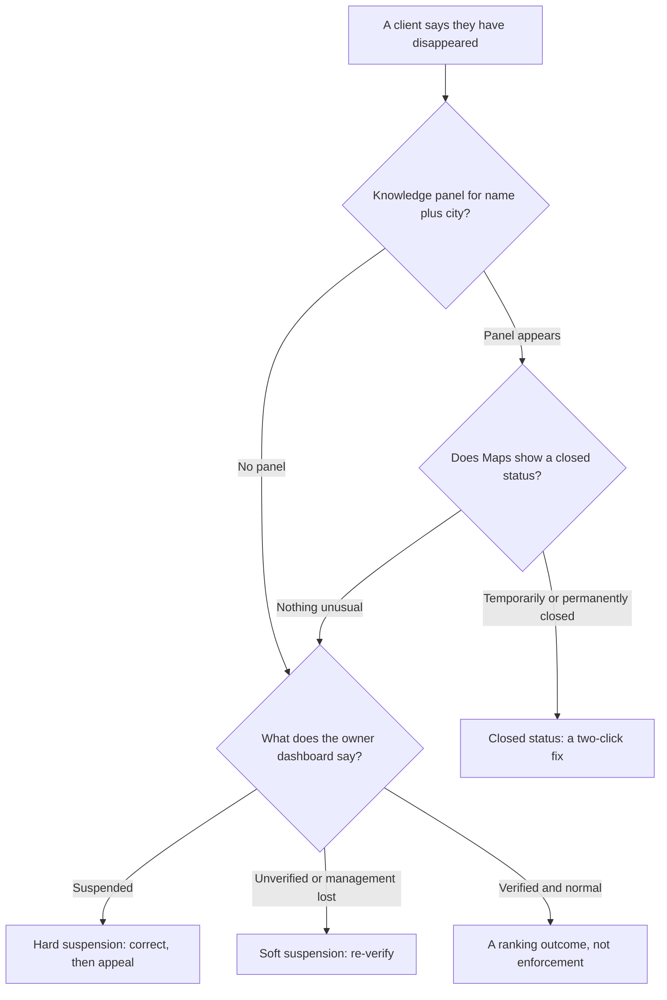

# Suspensions, and how to come back

A client calls and says they have disappeared from Google. Usually they are wrong about what happened, and a wrong diagnosis leads straight to the wrong action — filing an appeal for something that is not a suspension, or creating a second listing that turns a recoverable situation into a guidelines violation.

So: the differential diagnosis first, the recovery procedure second. Then what an outage does to every number you have been reporting for six months, because that damage outlasts the suspension.

## Which kind of gone is it?

"Gone from Google" describes at least six states. Only two are suspensions.

| State | What you see publicly | What the owner dashboard says | What it is |
| --- | --- | --- | --- |
| **Rank drop** | Not in the pack; still findable by name | Verified, normal | A ranking outcome, not enforcement |
| **Pending re-verification** | May be temporarily unpublished | Pending / "verify now" | Consequence of a critical edit |
| **Marked closed** | "Permanently" or "Temporarily closed" | Verified, closed status | Someone set it — you, Google, or an accepted user edit |
| **Duplicate consolidated** | One listing where there were two | Yours may vanish from the list | A merge, not a removal |
| **Soft suspension** | Listing there, looks normal to customers | Unverified / management lost | Enforcement against the *ownership* |
| **Hard suspension** | Removed from Search and Maps | Suspended | Enforcement against the *listing* |

Separating them takes five minutes and three checkpoints, in order.

1. **Search the exact business name plus the city**, in a private window. A knowledge panel means the listing exists — and a business absent for `emergency plumber` but present for its own name has a ranking problem, not this one ([Rank is a map, not a number](../../01-foundations/rank-is-a-map-not-a-number/index.md)).
2. **Open Maps and search the exact name plus the street.** Catches the closed-status cases, which read as a disappearance in a rank report and are a two-click fix.
3. **Open the profile in Google's own dashboard.** The only checkpoint that sees a soft suspension, which is invisible from outside.

Skipping step 3 is how people spend a week optimising a listing that was fine and an account that was not.

## Hard and soft

The terms are industry vocabulary; Google's documentation uses neither *(the underlying states are what the dashboard shows)*.

**A soft suspension removes your verified ownership.** The listing stays live and customers see no difference — what you lose is control: no editing, no review replies, and anything reading the profile through an owner login stops returning data. It usually resolves by re-verifying, not by appealing.

**A hard suspension removes the listing from Search and Maps**, and the reviews go with it. That is the one that costs money by the day, and the one the reinstatement process exists for.

> So **check the dashboard before you tell anyone what happened** — only one of the two is an emergency.

## What actually triggers it

Nobody outside Google can rank these by weight, and anyone publishing a percentage breakdown of suspension causes is showing you their sample, not the mechanism.

**What is observable is the *shape*.** Suspensions cluster around claims of identity — who you are and where you are — and almost never around content quality. A thin description does not get you suspended. An address you cannot document does.

**The address does not hold up.** Virtual offices, mail-forwarding addresses, coworking desks, a registered-agent address, a unit number that does not exist, a service-area business showing a street address it does not staff. The largest cluster in every practitioner account, and the hardest to argue out of: the fix is usually "change the address", not "explain the address". [Service-area businesses](../service-area-businesses/index.md) covers the rules that keep SABs clear of it.

**The name does not match the real world.** A keyword in the name field is the most-reported violation in local search, and anyone who notices can report it — including the competitor sitting below you ([Spam and fake listings](../spam-and-fake-listings/index.md) covers the redressal machinery).

**The entity does not hold up.** A category describing something not sold at that location, a website redirecting to a lead-generation domain, two profiles at one address for one business — each a mismatch between what the profile claims and what Google corroborates elsewhere.

**A pattern of edits.** Critical fields changed in bursts, ownership changing hands, an edit that contradicts what Google already believes. This is the category behind the "I only changed the phone number" reports: the phone number was not the trigger, the sequence was.

**Category-level scrutiny.** Some verticals face harder verification — locksmiths, garage-door repair, addiction treatment. Be careful what you attribute to what, though.

**The documented programme is not the one people mean.** The *Advanced Verification* programme Google actually documents belongs to **Google Ads and Local Services**, not to Business Profiles: locksmith and garage-door advertisers must pass it to serve in the Local Services unit.

That the same categories also draw stricter *Business Profile* verification is a consistent practitioner observation and an **open question** against published documentation — Google has not published a category list for it. Treat vertical-specific advice as observation, not policy.

### The gap between cause and consequence

**Trigger and enforcement are usually weeks apart**, which is why almost every account begins "it happened for no reason": the reason happened in March, the suspension in May, and nobody kept a record joining them. An appeal that names no corrected violation is an appeal asking Google to re-examine an unchanged listing.

The app records each fix it applies with the value it replaced — that is what undo restores from — but surfaces only a count, *N profile edits applied since your last refresh*, and there is no browsable history screen. **Your own dated change log is still the artefact that matters**, as [Did it work?](../../02-core-practice/did-it-work/index.md) sets it up.

---

**Next:** [What an outage costs, and how to come back →](./getting-reinstated.md)
