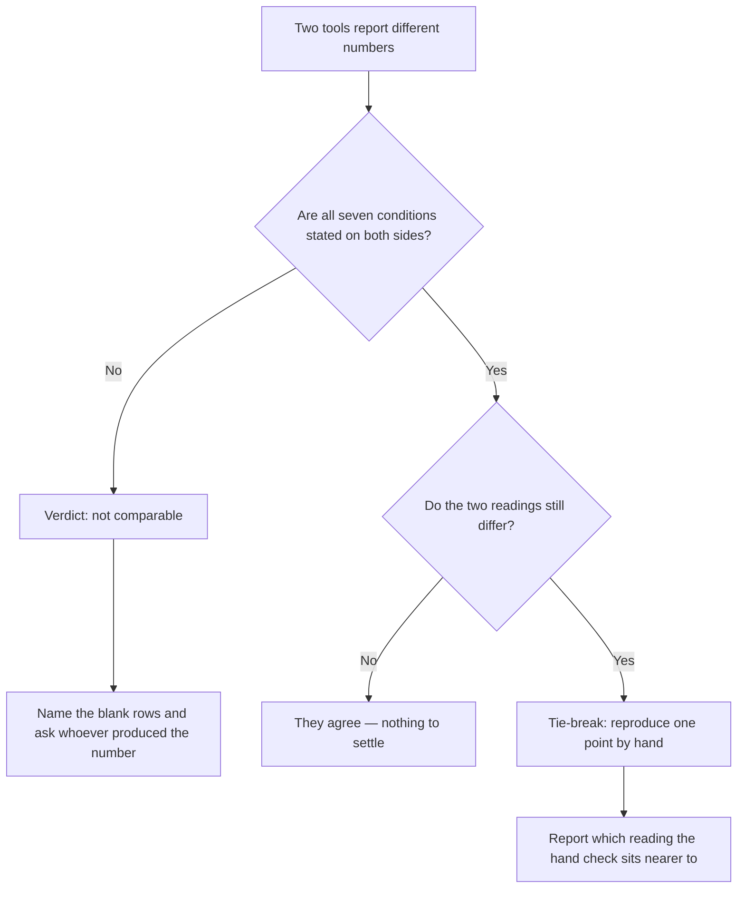

# Settling the disagreement

The instrument, the origin and the radius do most of the damage. Four conditions remain, and then the procedure for settling which reading is wrong.

## Depth: every ruler stops somewhere

**Both the single check and the grid read twenty results deep.** Past twenty you are not ranked 21; you are **not measured**. The check says so in words — *you're not in the top N here* — and names who holds #1, so a null result still carries information.

**A tool reading a hundred deep reports #34 where this one reports nothing.** Neither is wrong; they are different rulers, and deeper is not automatically better, because nothing at #34 is visible to a human on any surface.

Depth buys early warning — #61 to #38 is progress you cannot otherwise see — and costs you an invitation to average numbers that describe invisibility. Two tools censoring at different depths therefore cannot produce comparable "average position" ([reading a geo-grid without fooling yourself](../reading-a-geo-grid/index.md)).

## Language is not cosmetic

You can request results in a specific language or leave it blank and let the provider pick. **Blank is not neutral**; it is a default you did not choose and cannot see.

Language is part of a tracked keyword's *identity* here — the same phrase in English and in Finnish is two independent rows with independent histories, because they are two different measurements.

**What language certainly changes is the strings that come back.** Whether it also shifts *which* businesses come back, and in what order, is a market-by-market question rather than a rule *(inference — run the two rows side by side; in a monolingual market you will usually see no difference)*.

Helsinki, Montreal, Barcelona and Brussels are where two trackers disagree hardest, and language is usually why.

## The moment

Rank is a sort order over near-tied scores, and a sort is discontinuous: a hair of movement underneath swaps two businesses and moves a reported position by a whole integer. "The number changed" and "the world changed" are different claims.

**A grid scan is not an instant.** Points are measured in sequence with a deliberate pause between them, so the far corner is not read at the same moment as the centre.

**Compare stamps before numbers.** Every card showing fetched data is stamped for this reason. A day between two readings is a day in which the disagreement may be entirely real.

**Search volume stales differently, and is not local.** The monthly volume beside a keyword comes from Google's Keyword Planner data, which Google documents as *"the approximate number of monthly searches on a query, averaged for the past 12 months"* — approximate is Google's word.

Practitioners have long observed the returned values landing on a fixed set of rounded buckets rather than exact counts *(observed and widely reported; Google does not document the buckets)*. The request carries a *country-level* geographic target and a language, and the answer is cached here for about a month.

Two tools reporting different volumes for one phrase can both be faithfully quoting Google, for different targets — and neither figure tells you how many people search it in your town ([what people actually search](../../01-foundations/what-people-actually-search/index.md)).

## Identity: are you sure that result is you?

A rank check must decide whether a result *is* the business. The honest way is to match the stable place identifier — the machine key from [the business entity](../../01-foundations/the-business-entity/index.md) — which is what happens here, on the single check and on every grid point. The convenient way is to match the name as a string.

**Name matching fails both ways:**

- **False positives** — a franchise sibling three towns over is counted as you.
- **False negatives** — the name on Google no longer matches the name in the tool, because somebody edited the profile.

A tool that quietly matched a different branch will show a beautiful, entirely fictional improvement. Duplicate listings are the same problem wearing a hat — one tool tracks the record that ranks, another the record that does not, and both are "correct" ([spam and fake listings](../spam-and-fake-listings/index.md)).

## So which one is wrong?

Run the seven conditions. Fill in what you can and mark the rest unknown.

> **A disagreement is a defect only when two tools agree on all seven conditions and still differ.** Until then they measured different things, and arguing about which number is right is arguing about the wrong question.

**Most disputes die at row two or three**, and the honest verdict is *not comparable*.

When two readings genuinely share all seven and still disagree, there is one tie-break: reproduce a single point by hand and see which is nearer. That hand reading is not an oracle — it has its own seven conditions, one of which is your own browsing history — but it is a third opinion from a different mechanism, which is what you need.

What you tell the client is a sentence, not a defence:

> "Those two numbers were measured from different points, at different depths, on different days. Here is what ours measures and why we chose it. To reproduce the other one I need the conditions it was taken under, and the report does not state them."

That ends the meeting. "Their tool is inaccurate" starts an argument you cannot win.

> **Without SEOG** · Every condition above can be set by hand — that is Lab 22.3 — and the record-keeping decays after about a dozen readings. [Doing all of this without SEOG](../../99-appendix/doing-it-without-seog.md).

---

**Next:** [Labs: refereeing a rank number →](./labs-refereeing-a-number.md)
