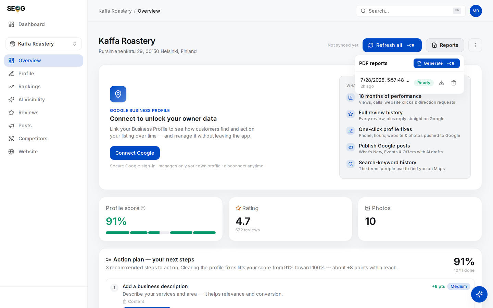

# Assembling the report package

The four questions decide what a report must answer. This page is the assembly: what the generated PDF actually is, the package it sits inside, the cadence you agree before anyone has a reason to prefer otherwise, and which part of the job a machine may not touch.

## What the generated PDF is, and what it is not

The app generates a report as a PDF. Knowing what is in it — and what is not — stops you mistaking it for the deliverable. As generated on 2026-07-27, in order:

- A header: business name, address and category, the **generation date**, and the date the data was **last synced** (the second appears only once the business has been refreshed at least once). Two dates, deliberately, because they answer different questions.
- **Key metrics**: profile score, rating with its review count, photo count.
- **Google performance** for a fixed recent window, owner-only. If the profile is not connected it says so in words rather than leaving a suggestive blank.
- The **business profile** as stored: status, phone, website, price, hours, description, attribute groups.
- The **profile audit**: every check, grouped into the five categories with a per-category percentage, failures first, each with its remedy.
- **AI visibility readiness**: score out of 100, tier, and the nine factors with weights and actions.
- The **implementation plan**: the merged, prioritised list, each item tagged with impact and points.

Now the part that matters. **It is a state document, not a period document.** No keyword positions, no geo-grid, no competitor set, no review texts, no change log, no before-and-after of any kind. It renders the business as it stands today, so it cannot, by construction, answer question 2 or question 3.

The PDF is therefore your **evidence annexe**, not your report. The narrative is yours to write, and it is the part worth money. If a supplier's monthly deliverable is a generated PDF with a covering email, the client is paying a retainer for a button.

*The button in question. It is one click and it produces a competent artefact — which is exactly why it is dangerous to hand over unaccompanied. Everything the client actually asked ("did it work, what did you do, what next") lives in the narrative you write around this, not inside it.*

Two details that bite later.

**The performance window is the report's choice, not yours.** It covers a fixed recent window — **not** the period you had selected on screen. The section heading names the window it used (28 days as generated on 2026-07-27), so quote it from there rather than from the Performance panel's selector.

**Reports are pruned at ten per business.** An eleventh drops the oldest, so on a monthly cadence your engagement baseline is the first thing to go. Copy each dated PDF into your own archive on generation day.

## The three-layer package

**Layer 1 — the page.** The four questions, in plain language, no tool vocabulary, one page. The client must be able to act on this alone, having opened nothing else.

**Layer 2 — the annexe.** The dated PDF, grid exports labelled with keyword, preset and date, read-back evidence for anything published to Google, and the change log.

**Layer 3 — the raw data.** On request. Never in the deliverable.

One rule welds them: **nothing in layer 1 may lack support in layer 2.** Which is why you write layer 1 first and check it afterwards — a claim whose support you cannot find gets deleted, not softened. Softening is how "we cannot attribute this" becomes "we're seeing encouraging signals".

> **Without SEOG** · Layer 2 by hand is the Google Business Profile dashboard's own exports, screenshots of each published change, and a spreadsheet with one row per coordinate and one column per date. Layer 1 was always a text file. Identical discipline, identical failure mode: nobody hand-records conditions consistently for six months. See [Doing all of this without SEOG](../../99-appendix/doing-it-without-seog.md).

## Cadence, and the trap of monthly

Clients pay monthly. Local visibility moves over quarters. Reporting *outcomes* monthly on a quarterly signal manufactures noise — and manufacturing noise is how you end up under pressure to manufacture wins. Split the cadence instead, and agree it before anyone has an incentive to prefer otherwise:

| Every month | Every quarter |
| --- | --- |
| What was done, dated, with evidence it landed | The measurement: same keywords, same presets, same centres |
| What is next, and why | Attribution, in the three buckets |
| Anything that failed | A revised plan for the next quarter |

Two rules make it hold. **Re-measure on a pre-committed date, not a convenient one** — measuring when the numbers look good builds a machine that only prints good news. And **three readings before you call a trend**; a line fits any two points.

## Automating the package without automating the lie

For a technical reader most of this is a solved problem, and it is worth being precise about which part.

Reading stored data is free; fetching new data from Google costs. A reporting pipeline should therefore be **almost entirely reads** — stored keyword history, stored grid scans, the profile-score series, stored review data — with the paid fetches on your pre-committed measurement date and nowhere else.

> If assembling the report costs about what measuring costs, you built it wrong.

([How the labs work](../../00-start-here/how-the-labs-work.md); the client-facing version is [What the work costs](../what-the-work-costs/index.md).)

An agent connected to the app can queue the PDF, poll until it is ready, pull the period's stored history and lay out layers 1 and 2 — see [Running local SEO with an AI agent](../running-local-seo-with-an-ai-agent/index.md).

**What is not automatable is question 3.** Ask a language model why a number moved and it will produce a fluent cause, because producing fluent causes is what it does.

It has no access to the change log in your head, the competitor suspended in week two, or the fact that this trade is dead in August. So it will attribute anyway.

> The sentence that *declines* to attribute is the one you are paid for — and a person whose name is on the document has to write it.

Hence the last rule: **automated assembly, signed judgement.** A report with no named author is a report nobody has to defend.

---

**Next:** [Report labs: write it, grade it, schedule it →](./labs-and-common-mistakes.md)
