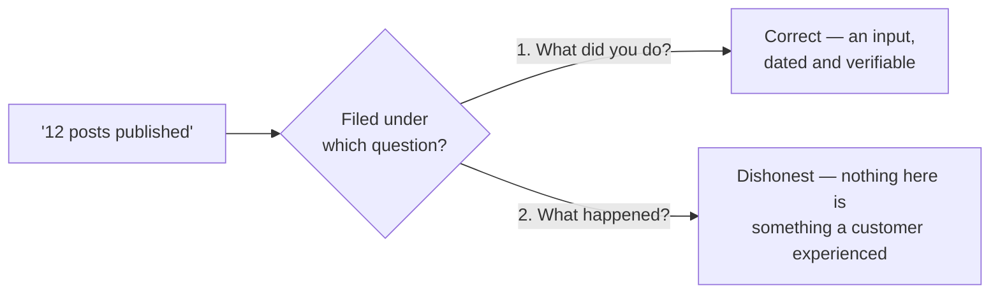

# Writing a report a client can check

The client never watches you work. They read a document, once a month, and decide from it whether to keep paying. That makes the report the product in the only sense that matters commercially — and it is the most consistently dishonest artefact in this industry, because every incentive points one way and almost nobody checks.

This chapter is the document: what it must contain, what gets put in instead, and a rubric for telling those apart — as useful for grading the report you *inherit* as the one you write.

## The report is a liability document

**Notice what recurs.** If you are coming to this from engineering and thinking about selling it: fixes are one-off. The report is what you ship every period, forever, and what renewal is decided on.

It is also what you may have to defend — to a successor consultant hired to review you, or to the client in a year with four reports side by side.

> **Write every sentence as though the next reader is paid to find the flaw in it.** That one constraint removes most of what is wrong with local SEO reporting and costs nothing to adopt.

A second consequence people miss: **what you report is what you have agreed to be judged on.** Lead with map-pack coverage and you have signed up to move map-pack coverage; lead with calls and you have signed up for an outcome you only partly control.

Pick it on purpose, in month zero — [The ninety-day plan](../the-ninety-day-plan/index.md) is where that becomes a schedule.

## The four questions

An honest report answers four questions, in this order. Everything else is decoration.

**1. What did you do?** Dated, specific, verifiable by someone who is not you. *"Rewrote the business description on 4 March; confirmed live on Google the same day by re-reading the published field"* is a row. *"Profile optimisation"* is a category label pretending to be a row.

**2. What happened?** Numbers measured the same way as last time, each carrying its conditions: a rank reading carries surface, query, coordinate and date; a grid reading carries centre, preset and keyword row; an owner metric carries its window. A number without its conditions is not a measurement, it is a rumour with a decimal point.

**3. What of that is attributable to the work?** Sorted into verified, plausible and unattributable — the three buckets from [Did it work?](../../02-core-practice/did-it-work/index.md). This classification *is* the judgement the client is buying, and it is the only section that costs you something to write honestly. Which is why it gets skipped.

**4. What next, and why that?** Next period's work, with the reason it is next rather than one of the other twenty things that are also wrong. A fifth is optional and underrated: **what you deliberately did not do**. It turns a to-do list into a plan.

Two pages answering those four beats forty pages of charts. A report that cannot be reduced to them is not a short report — it is an incomplete one in a large coat.

## The padding taxonomy

Here is what goes in instead, and why each is tempting.

**The metric dump.** Every number the tool can export, no interpretation. Tempting because exporting is free and interpreting is not, and because volume reads as effort. It costs the client the two numbers that mattered — now on page 19 — and trains them to skim, so when a real finding arrives nobody reads it.

**Input counts presented as outcomes.** *"12 posts published, 40 citations submitted, 8 keywords optimised."* The tell: not one of those numbers describes anything a customer could experience. Be fair about it — input counts are the correct answer to question 1. The dishonesty is filing them under question 2.

*The same sentence, honest in one section and misleading in the next. Almost no padding in this taxonomy is a lie about a fact; it is a fact filed under the wrong heading, and the reader takes the heading at its word.*

**The unsegmented rank.** *"Average position 4.2."* No surface, no coordinate, no date, no found rate beside it — and average rank counts only the points where you appear, so disappearing from your worst locations *improves* it ([Rank is a map, not a number](../../01-foundations/rank-is-a-map-not-a-number/index.md)). A rising average with a falling found rate is a decline in a good mood.

**The tracked set that quietly changed.** Easy keywords added, hard ones dropped, the aggregate reported as movement. The most effective way to show improvement while producing none, it needs no skill, and it is invisible unless the set is written where the client can compare. It works on any axis — a new grid preset, a longer window, a different denominator — so freeze all of them and make every change a dated line.

**The headline chosen afterwards.** Six outcome metrics move every month and one moved a lot. Choosing which to lead with *after* seeing them is how a report becomes a horoscope. Decide the headline metric in month zero.

**The screenshot.** One AI answer naming the client; one map-pack screenshot showing position 1. Samples of one, taken signed-in, on office Wi-Fi, at the coordinate where the business looks best. Assistant answers vary run to run for the same prompt — only a rate over a window of runs compares to an earlier rate ([Does the AI recommend this business?](../../03-advanced/ai-visibility/index.md)).

**The recycled action plan.** Identical to last month's — not always deception, so be precise: a generated plan is computed from *current state*, so if the state did not change, the plan cannot. Shipping it as "this month's recommendations" is padding. Shipping it as an appendix labelled *current state*, with the real plan above it, is fine.

**Ranking for the business name.** *"#1 for `<business name>`."* A knowledge panel, not a competitive result. It reports that Google can read.

## How a client can tell

Six checks, no partial credit, about fifteen minutes and no tooling.

| Check | Passes when | Fails when |
| --- | --- | --- |
| **Conditions** | Every number carries surface/query/coordinate/date, or its window, or its preset | Bare numbers, or one "as of" date for the whole document |
| **Frozen set** | The tracked keywords and locations are listed, and any change to them is a dated line | The set is not stated anywhere, or differs from last month with no note |
| **Falsifiability** | Movements are split into verified, plausible and unattributable | Everything appears under achievements |
| **Spot-check** | You can pick one work item and verify it yourself in five minutes | Work is described only as categories: "optimisation", "authority building" |
| **Cost of admission** | Something in it was expensive to admit — a failed test, a claim declined | Uniformly positive, every month |
| **Movement in the plan** | Next steps reference last period's result and have changed | Next steps are last month's list |

The cheapest is the last: put two consecutive months side by side and diff the "next steps" section. One minute, and it tells you whether anyone was thinking.

Now the uncomfortable recommendation. **Give this rubric to your own clients.** Handing someone the instrument for grading you is a costly signal, and costly signals are the only credible kind in a market where every supplier's website says the same things.

---

**Next:** [Assembling the report package →](./assembling-the-package.md)
