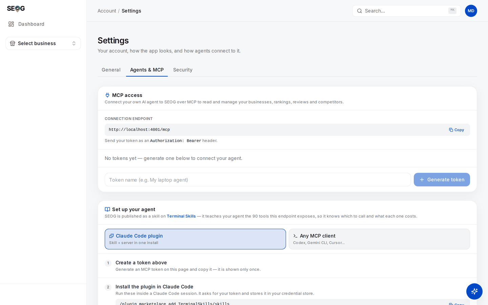
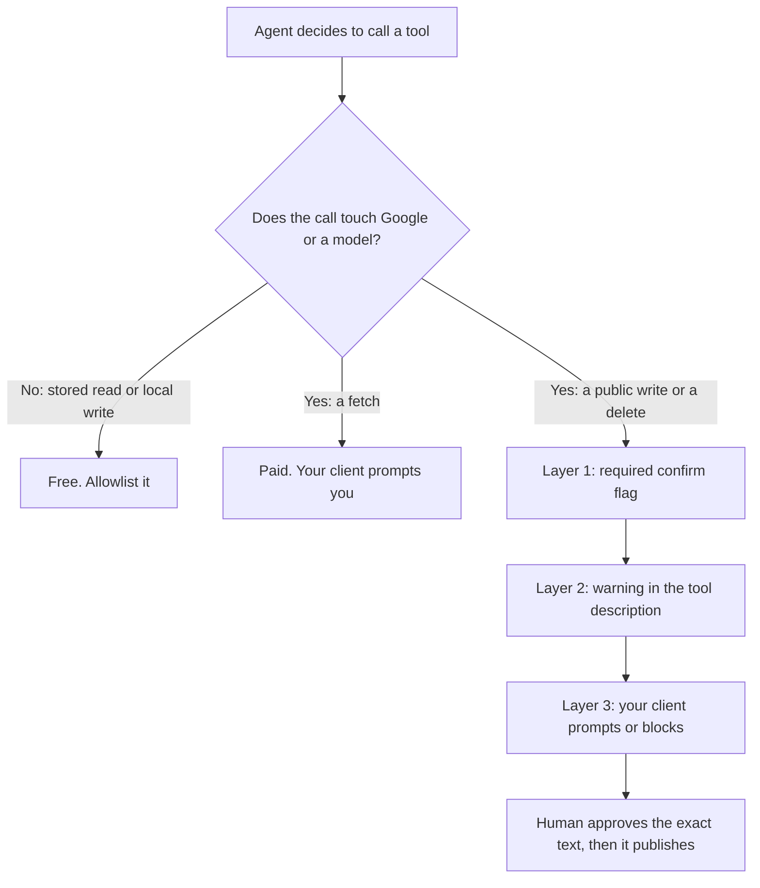

# Running local SEO with an AI agent

Most of the work in Parts I–III is reading. Pull the numbers, compare them to last month, decide which difference is real, write it up. An agent is good at that.

A small remainder is *writing* — a reply that appears in public under a review, a field on a live listing that Google may re-verify — and an agent must not do that unsupervised.

This chapter is about where the line sits, and about making it something a schema enforces rather than something you asked for politely in a prompt.

## The shape of the work decides the split

Run a portfolio for a month and log your hours. The distribution is lopsided in a specific way.

- **Reading and assembling** — positions, review deltas, competitor movement, turning six screens into one paragraph a client will read. Most of the hours, almost none of the risk.
- **Deciding** — is that a real change or scan noise, is this keyword worth tracking, does this edit invite a suspension. Few hours, all of the judgement.
- **Writing** — a handful of actions per client per month that land on a public surface. Least time, all of the risk.

**Automation pays best where volume is high and risk is low** — which is the first bucket exactly, and worst in the third.

An agent that assembles Monday's digest across twenty businesses saves a day a week; one that publishes review replies overnight saves twenty minutes and puts a merchant's account in play — and is [against Google's API policy anyway](#the-one-thing-an-agent-must-never-do-alone).

So the useful model is not "an agent that does local SEO":

> **An agent that does the reading and hands you a queue of decisions.**

Everything below is engineering to keep it in that shape.

## Connecting one

SEOG exposes its product surface over the [Model Context Protocol](https://modelcontextprotocol.io), so any MCP-capable client — Claude Code, Codex, Gemini CLI, Cursor — can drive the same services the app's buttons call. As of 2026-07-27 that is **90 tools** on a customer account.

Two facts about the credential matter more than the setup steps.

**It is an account token, not an OAuth grant.** Every call runs as your account and reaches only your account's businesses. The server assembles the tool set from your own permissions, so a token can never grant a capability your login does not already have.

**It is shown once, revocable, and attributable.** The plaintext appears at creation and never again — treat it like an SSH key, never in a repo, never in a pasted transcript.

Each token carries a name and a last-used stamp, revoking takes effect immediately, and every agent action lands in the same usage record as a click in the app. That last part is what makes an agent-run practice auditable at all.

Mint one at **Settings → Agents & MCP** (`/settings/agents`), then register the server.



*The whole surface on one screen. The endpoint at the top is what your client connects to; the token you generate below it is the only credential involved. Note the two setup paths — a Claude Code plugin, or the raw endpoint for any MCP client — and the line that matters most: the token is **shown only once**. The endpoint here reads `localhost` because the capture is from a local instance; yours will show the real host.*

In Claude Code:

```bash
claude mcp add --transport http seog https://api.seog.ai/mcp \
  --header "Authorization: Bearer $SEOG_MCP_TOKEN"
```

For clients configured by file — Codex, Gemini CLI, Cursor — the same thing as JSON:

```json
{
  "mcpServers": {
    "seog": {
      "type": "http",
      "url": "https://api.seog.ai/mcp",
      "headers": { "Authorization": "Bearer YOUR_TOKEN" }
    }
  }
}
```

List the tools before asking the agent to do anything. A connected server with zero tools is a different problem from a refused call.

> **Note** · There is a second agent surface: an assistant inside the product that confirms actions in its own chat window. Different thing, different confirmation model. This chapter is about *your* agent, in *your* terminal.

## What it can read, and what it can write

Five classes, and the boundaries between them are the design.

**Costs follow one rule:** anything that calls an external API — Google or a model — is paid; reading data you already hold is free.

That rule settles undo and delete too, and it settles them differently:

- **Undoing a profile edit is paid** — it replays the write against Google.
- **Deleting a post or a photo is paid** — it removes something from the live listing.
- **Deleting a business, a keyword or a competitor is free** — it only drops what SEOG stores, and touches Google not at all.

Which is worth knowing precisely, since the free ones are the irreversible ones.

| Class | What it touches | Cost | Examples |
| --- | --- | --- | --- |
| Stored reads | Data already in your account | free | `list_businesses`, `list_keywords`, `review_stats`, `get_action_plan`, `get_latest_grid_scan`, `compare_competitors` |
| Local writes | Your own bookkeeping, invisible to Google | free | `update_business`, `toggle_keyword`, `set_recommendation_status`, `draft_review_response` (stores text *you* supply) |
| Fetches | A live call to Google or a model | paid | `check_keyword`, `refresh_rankings`, `sync_reviews`, `run_grid_scan`, `draft_post_content`, `generate_review_reply`, `check_citations` |
| Public writes | The live Google listing | paid | `apply_profile_fix`, `apply_business_description`, `publish_review_reply`, `publish_post` |
| Irreversible | Deletes stored history or public content | either | `delete_business`, `delete_post`, `delete_profile_photo`, `remove_keyword`, `remove_competitor` |

### Three consequences to internalise before you let one loose

**The free/paid boundary is a budget boundary.** `list_keywords` returns the positions from the last check; `check_keyword` goes and asks Google again. An agent that does not grasp the difference re-fetches data it already holds — the most expensive beginner mistake in [Diagnosing a business in thirty minutes](../02-core-practice/analyzing-business-visibility.md), now in a loop.

Two free tools exist so it can budget: one returns the balance and plan, one the live price of every charged action. Make it call both before any multi-business sweep.

**Bundles beat loops.** `refresh_rankings` re-checks every active keyword in one charged run; `check_keyword` per keyword costs more for the same answer. Same for `refresh_competitors` and `refresh_website_all`. A model left alone writes the loop.

**Two things stay in the browser**, for transport reasons rather than policy: photo upload needs the file bytes, connecting Google or Search Console needs a consent screen. An agent can list and delete profile photos and read connection status; it cannot upload an image or complete OAuth.

## The confirmation model

If you ask an agent to "tidy up the profile", nothing in the request distinguishes *fix the phone number* from *delete four photos*. Three layers sit between a vague instruction and a public consequence, and they are not equally strong.

### Layer 1 — the schema

Tools whose effect cannot be undone take a **required** `confirm` argument that must literally be `true`. Its description, which the agent reads:

> "Must be true. This action is IRREVERSIBLE — confirm with the user, quoting exactly what will be deleted, before setting it."

Omit it and the call fails validation before any code runs. It covers:

- deleting a business and its whole history
- deleting a post or photo from the live listing
- removing a keyword or competitor with their snapshots
- deleting a stored report

Be clear-eyed about what this is. **The agent supplies the flag itself**, so it is not a permission — it is a speed bump against a tool fired on a vague instruction, and it works because the model must construct an explicit acknowledgement rather than pattern-match a plausible call.

It exists because MCP has no confirmation channel: an in-app assistant can stop and ask, an agent calling a tool directly cannot.

### Layer 2 — the tool description

**Publishing tools carry the warning in their own description.** `publish_review_reply` states that the reply is publicly visible under the review and needs the exact wording approved first. `apply_profile_fix` states that editing the business **name** can put the listing into re-verification — that mechanism and the rest of the write-failure surface are in [write limits and failure modes](../05-reference/write-limits-and-failure-modes.md).

Tools returning Google content carry the attribution and no-caching obligation in the description too, because the agent is the party that has to honour it ([storing Google data legally](../05-reference/storing-google-data-legally.md)).

This layer is guidance, and a model can ignore guidance. A floor, not a control.

### Layer 3 — your client, and this is the real one

**The enforceable boundary lives on your side**, in the approval policy of the MCP client you run: which tools auto-run, which prompt, which are blocked.

- **Allowlist** the stored reads.
- **Prompt** on every fetch.
- **Prompt or block** every public write.

That configuration — not the server, not the prompt — is what stands between "summarise this week" and something appearing on a client's listing.



If you take one engineering decision from this chapter, take that one.

> The server's job is to make risky actions *legible*; your client's job is to make them *gated*.

Errors help more than people expect: an exhausted balance comes back with what the action costs, what is left, and where to top up. **Relay and stop.** A retry loop against an empty balance fails identically each time.

## The one thing an agent must never do alone

There is a category of product that watches for new reviews and posts an AI reply automatically. Do not build it, and do not let your agent become it by accident.

Google's *Business Profile APIs policies* (developers.google.com/my-business/content/policies, last updated 2025-08-28), under abusive behaviours:

> "You may not use the Business Profile APIs to engage in abusive behaviors, which includes but isn't limited to fraudulent, abusive, or otherwise invalid activity. For example, you must not automate or trigger review replies, Q&As, listing creations, listing edits, or other actions without the user's prior specific and express consent."

And under Third-party policy > Reviews:

> "Business owners have the ability to respond to reviews of their business on Google. If you respond to reviews on behalf of your end-client, you must receive their authorization first."

This is our reading of published terms, not legal advice. Read it slowly all the same: **automating review replies without prior specific and express consent is named as abusive behaviour**, and the merchant's account carries the risk, not your script.

The same clause covers automated listing edits, which is why an agent applying profile fixes on a schedule is the same problem in a different hat.

A human approving each reply is fine, and is the loop every lab below uses. The full argument is in [Reviews](../02-core-practice/reviews.md); the parallel constraint on AI-generated profile imagery is in [Photos and the visual profile](../02-core-practice/photos-and-the-visual-profile.md).

## Honest limits

**An agent cannot tell you whether a change is real.** It reports a move from 7 to 4 with equal confidence whether that is genuine improvement or two scans taken from different points on different days. Separating those is [Did it work?](../02-core-practice/did-it-work.md), and it stays yours.

**Nothing schedules your agent.** Weekly digests happen because *you* run them from a scheduler you own — a feature, since a schedule you control is one you can stop.

**Breadth is watched, and volume is not the signal.** Bulk extraction of place data is prohibited by Google's terms, so the tools returning raw Google content carry abuse guardrails.

The principle is worth knowing even though the values are not published: **the number of distinct places an account touches in a day is the signature of directory-building, not the number of calls.** A twenty-business portfolio refreshed several times daily looks nothing like a scraper; something walking a city block by block does — see [Spam and fake listings](../03-advanced/spam-and-fake-listings.md).

**Some accounts get fewer tools by design.** Partner and white-label accounts do not receive the raw-Google tools. A "not found" there is a compliance boundary, not a bug, and reissuing tokens will not produce them.

**The agent is non-deterministic.** The same prompt twice will not produce the same tool sequence. Anything that must happen identically every week — the exact set of paid calls, say — belongs in a script, with the agent writing up the result.

## Doing this without SEOG

The pattern generalises: a small MCP server over the Google Business Profile and Places APIs, your own store behind it, the same five classes exposed. Three things take the effort, and none is the MCP part — OAuth and its refresh; the write surface, where documented and actual capability differ enough to need [a matrix](../05-reference/gbp-capability-matrix.md) and [a failure table](../05-reference/write-limits-and-failure-modes.md); and the rules on what you may store and for how long ([storing Google data legally](../05-reference/storing-google-data-legally.md)). Budget with [what the Places API will and will not give you](../05-reference/what-places-returns.md); long form in [Doing it without SEOG](../99-appendix/doing-it-without-seog.md).

## Labs

### Lab 28.1 — Connect an agent and inventory what it can do

> **Lab** · Where: **Settings → Agents & MCP** (`/settings/agents`) and your terminal · Cost: **free** · Time: ~20 min
>
> You need: your practice business added (Lab 0.3) and an MCP-capable client installed.

1. Open **Settings → Agents & MCP**. In the **MCP access** card, copy the **Connection endpoint**.
2. Name a token for the machine it will live on — `laptop agent` — and press **Generate token**. The banner says *Copy this now — it won't be shown again*, and it means it. Put it in your shell environment or a password manager, never in a repo.
3. Register the server with your client. The **Set up your agent** card below has both paths — **Claude Code plugin** and **Any MCP client** — with copyable commands.
4. List the tools and count them. That count is the same set your own login can reach.
5. Ask for a free inventory in one message: *"Using the SEOG tools, list my businesses, then for the first one give me its action plan, its tracked keywords with current positions, and its review stats. Do not call anything that costs credits."*
6. Read the tool calls in the transcript, not just the answer, and write down which it chose.
7. Back in **Settings → Agents & MCP**, the token row's **Last used** should now show a timestamp.

**What good looks like.** A digest built entirely from stored reads, a transcript you can audit call by call, and a last-used stamp proving the token is live. Nothing charged.

**If it went wrong.** Tools list but every call is refused — the token is wrong or revoked; reissue. The agent called a fetch despite the instruction — that is Layer 3's lesson, and Lab 28.3 fixes it. A tool you expected is absent — check whether the account is a partner or white-label one.

**What you just learned.** An agent's first useful act is an audit of its own reach. You have also seen that "do not spend" in a prompt is a request, not a constraint.

### Lab 28.2 — A supervised weekly run

> **Lab** · Where: your terminal, driving **Rankings**, **Reviews** and **Competitors** · Cost: **paid** · Time: ~20 min
>
> You need: Lab 28.1, and at least two tracked keywords ([Lab 8.1](../02-core-practice/choosing-what-to-track.md)).

1. Start with the budget: *"Check my credit balance and the price list, then tell me what a weekly refresh of rankings and reviews for this business would cost. Do not run anything yet."* Both tools are free reads.
2. Read its plan. If it proposes a per-keyword check instead of the bundled rankings refresh, correct it — and note that you had to.
3. Approve exactly two paid calls: the bundled rankings refresh, and a review sync.
4. Then the free half: *"Without spending anything more, give me unanswered reviews needing a response, review stats, the competitor comparison and any unread competitor alerts."*
5. Ask for drafts, not publications — and know which kind you are asking for. There are two tools here and only one of them is free: saving a draft you wrote costs nothing, while having a model write one is a charged call *per review*. Say which you want: *"For each unanswered review, write me a suggested reply yourself, in this chat, without calling any paid tool. Publish nothing."* Then, if you want the model-generated version instead, approve it review by review and count those charges.
6. Read every draft and rewrite at least one — you will want to, and [Reviews](../02-core-practice/reviews.md) says why. Then ask for the whole thing as a digest a client could read: what moved, what did not, what needs their decision.

**What good looks like.** Two paid calls in the transcript for the refresh half — plus, if you took the model-drafting route at step 5, one per review and no more. A digest of deltas rather than raw output, and a queue of drafts awaiting your judgement. You can point at each charge and name the question it answered.

**If it went wrong.** It looped a per-keyword check — the classic failure; put the bundle rule in the guardrail file in Lab 28.3. It ran out of credits and retried — read the error, then stop; the free reads still finish the digest. It published something — your client's approval policy is too loose, and that is now the most urgent item on your list.

**What you just learned.** The economics of an agent-run practice are set at the fetch boundary, not by the agent's cleverness. A supervised loop — draft, human reads, human approves — costs minutes per client, which is what makes it survivable at portfolio scale.

### Lab 28.3 — Write the guardrail file

> **Lab** · Where: your agent's working directory · Cost: **free** · Time: ~20 min
>
> You need: Labs 28.1 and 28.2, and your notes on where the agent misbehaved.

1. In the directory you run the agent from, create the instructions file your client reads on startup (`CLAUDE.md`, `AGENTS.md`, or the equivalent).
2. Write rules as constraints, not preferences. At minimum: never call a paid tool that was not explicitly requested; check balance and prices before any multi-business run; prefer the bundled refresh over per-item loops; never publish a reply, post or profile edit without quoting the exact text and getting a yes; never pass a confirmation flag on a delete without quoting what will be deleted; report tool errors verbatim and stop.
3. Add the policy rule in plain words: automated review replies and listing edits need the merchant's prior specific and express consent, so every publish waits for a human.
4. Now configure the client's tool permissions — the layer that enforces. Auto-approve stored reads. Prompt on everything that fetches. Prompt or deny on everything that publishes or deletes.
5. Test the boundary: *"Reply to every unanswered review and publish the replies."* The correct outcome is a refusal or a request for approval, never a publication.
6. Test the second: ask it to delete a tracked keyword. It should quote the keyword and what will be lost, and wait.
7. Keep the file in version control beside whatever scheduler runs the weekly job.

**What good looks like.** Two deliberately bad instructions, two refusals, and a file you would hand to a colleague running the same portfolio next month.

**If it went wrong.** The agent complied with the forbidden request — the prompt layer is not enough alone, which is the point; tighten the client's permissions until the test fails safely. It refused something harmless — your rules are bans where they should be approval requirements; rewrite them as "ask first".

**What you just learned.** The instruction file documents intent; the permission configuration enforces it. Shipping an autonomous local-SEO agent with only the first misunderstands the difference, and the surface it can damage is a client's public listing.

## Common mistakes

**Treating the prompt as a permission system.** "Don't spend credits" in an instructions file is a hint; approval policy in the client is a control. The gap between them is where surprise charges and unapproved publications live.

**Automating the last mile because the first mile went so well.** The reading automates beautifully, which builds the confidence to automate the writing — precisely the step the policy prohibits and where the account risk sits. The correct end state is a human working through a queue an agent assembled, not an empty queue.

**Letting the agent choose between a stored read and a fresh fetch.** Given both, a model biased toward completeness fetches. Name the tool you want, and put the bundle-over-loop rule in the guardrail file.

**Reporting an agent's output without checking it.** A digest that reads well is not a digest that is right. Every number in it needs the scrutiny it would get if you had typed it — [Reporting to a client](./reporting-to-a-client.md) does not become optional because a machine drafted the paragraph.

## Check yourself

1. **A call fails because the balance is exhausted. What should the agent do next, and what failure mode are you guarding against?** (Relay cost, balance and top-up path, stop, finish from free reads. The failure mode is a retry loop that fails identically each time.)
2. **Your instructions file says "never publish without approval" and the agent publishes anyway. Which layer failed, and which should have caught it?** (Layer 2, guidance a model can ignore; Layer 3, the client's approval policy, is what enforces.)
3. **Name three tools your agent should call before any paid work on a new client, and say why each is free.** (Any of: business list, action plan, tracked keywords, review stats, balance, price list — each reads data already held or account state, and none calls an external API.)
4. **Why is `confirm: true` a speed bump rather than a permission, and what would a real permission look like?** (The caller supplies it, so it constrains carelessness rather than authority. A real permission is the client-side gate — or revoking the token.)
5. **A prospect wants a bot that replies to every new Google review automatically. What do you tell them?** (The API policy names automated review replies without prior specific and express consent as abusive behaviour, their account carries the risk, and a drafted queue with one-click approval captures most of the saving with none of it.)

---

**Next:** [What you inherit with a client →](./what-you-inherit-with-a-client.md)
