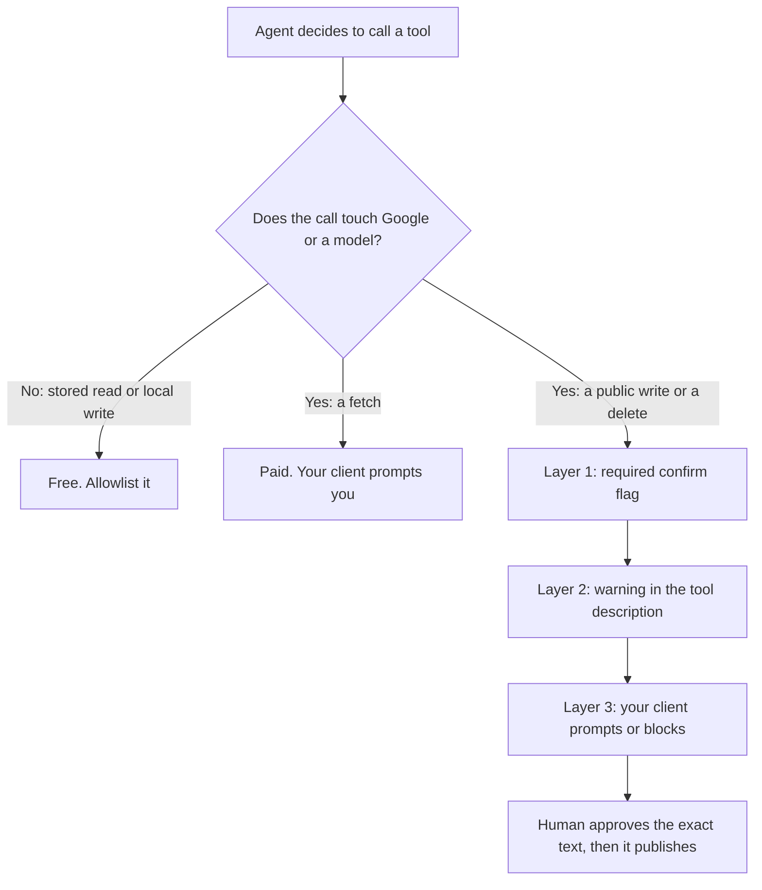

# Guardrails, policy and honest limits

Connecting an agent and knowing which of its tools cost money is the easy half. The rest is containment: how an irreversible action gets gated, the one job an agent must never take alone, and what stays outside its reach whatever you configure.

## The confirmation model

If you ask an agent to "tidy up the profile", nothing in the request distinguishes *fix the phone number* from *delete four photos*. Three layers sit between a vague instruction and a public consequence, and they are not equally strong.

### Layer 1 — the schema

Tools whose effect cannot be undone take a **required** `confirm` argument that must literally be `true`. Its description, which the agent reads:

> "Must be true. This action is IRREVERSIBLE — confirm with the user, quoting exactly what will be deleted, before setting it."

Omit it and the call fails validation before any code runs. It covers:

- deleting a business and its whole history
- deleting a post or photo from the live listing
- removing a keyword or competitor with their snapshots
- deleting a stored report

Be clear-eyed about what this is. **The agent supplies the flag itself**, so it is not a permission — it is a speed bump against a tool fired on a vague instruction, and it works because the model must construct an explicit acknowledgement rather than pattern-match a plausible call.

It exists because MCP has no confirmation channel: an in-app assistant can stop and ask, an agent calling a tool directly cannot.

### Layer 2 — the tool description

**Publishing tools carry the warning in their own description.** `publish_review_reply` states that the reply is publicly visible under the review and needs the exact wording approved first. `apply_profile_fix` states that editing the business **name** can put the listing into re-verification — that mechanism and the rest of the write-failure surface are in [write limits and failure modes](../../05-reference/write-limits-and-failure-modes.md).

Tools returning Google content carry the attribution and no-caching obligation in the description too, because the agent is the party that has to honour it ([storing Google data legally](../../05-reference/storing-google-data-legally.md)).

This layer is guidance, and a model can ignore guidance. A floor, not a control.

### Layer 3 — your client, and this is the real one

**The enforceable boundary lives on your side**, in the approval policy of the MCP client you run: which tools auto-run, which prompt, which are blocked.

- **Allowlist** the stored reads.
- **Prompt** on every fetch.
- **Prompt or block** every public write.

That configuration — not the server, not the prompt — is what stands between "summarise this week" and something appearing on a client's listing.

If you take one engineering decision from this chapter, take that one.

> The server's job is to make risky actions *legible*; your client's job is to make them *gated*.

Errors help more than people expect: an exhausted balance comes back with what the action costs, what is left, and where to top up. **Relay and stop.** A retry loop against an empty balance fails identically each time.

## The one thing an agent must never do alone

There is a category of product that watches for new reviews and posts an AI reply automatically. Do not build it, and do not let your agent become it by accident.

Google's *Business Profile APIs policies* (developers.google.com/my-business/content/policies, last updated 2025-08-28), under abusive behaviours:

> "You may not use the Business Profile APIs to engage in abusive behaviors, which includes but isn't limited to fraudulent, abusive, or otherwise invalid activity. For example, you must not automate or trigger review replies, Q&As, listing creations, listing edits, or other actions without the user's prior specific and express consent."

And under Third-party policy > Reviews:

> "Business owners have the ability to respond to reviews of their business on Google. If you respond to reviews on behalf of your end-client, you must receive their authorization first."

This is our reading of published terms, not legal advice. Read it slowly all the same: **automating review replies without prior specific and express consent is named as abusive behaviour**, and the merchant's account carries the risk, not your script.

The same clause covers automated listing edits, which is why an agent applying profile fixes on a schedule is the same problem in a different hat.

A human approving each reply is fine, and is the loop every lab below uses. The full argument is in [Reviews](../../02-core-practice/reviews/index.md); the parallel constraint on AI-generated profile imagery is in [Photos and the visual profile](../../02-core-practice/photos-and-the-visual-profile/index.md).

## Honest limits

**An agent cannot tell you whether a change is real.** It reports a move from 7 to 4 with equal confidence whether that is genuine improvement or two scans taken from different points on different days. Separating those is [Did it work?](../../02-core-practice/did-it-work/index.md), and it stays yours.

**Nothing schedules your agent.** Weekly digests happen because *you* run them from a scheduler you own — a feature, since a schedule you control is one you can stop.

**Breadth is watched, and volume is not the signal.** Bulk extraction of place data is prohibited by Google's terms, so the tools returning raw Google content carry abuse guardrails.

The principle is worth knowing even though the values are not published: **the number of distinct places an account touches in a day is the signature of directory-building, not the number of calls.** A twenty-business portfolio refreshed several times daily looks nothing like a scraper; something walking a city block by block does — see [Spam and fake listings](../../03-advanced/spam-and-fake-listings/index.md).

**Some accounts get fewer tools by design.** Partner and white-label accounts do not receive the raw-Google tools. A "not found" there is a compliance boundary, not a bug, and reissuing tokens will not produce them.

**The agent is non-deterministic.** The same prompt twice will not produce the same tool sequence. Anything that must happen identically every week — the exact set of paid calls, say — belongs in a script, with the agent writing up the result.

## Doing this without SEOG

The pattern generalises: a small MCP server over the Google Business Profile and Places APIs, your own store behind it, the same five classes exposed.

**Three things take the effort, and none is the MCP part:**

1. **OAuth and its refresh.**
2. **The write surface**, where documented and actual capability differ enough to need [a matrix](../../05-reference/gbp-capability-matrix.md) and [a failure table](../../05-reference/write-limits-and-failure-modes.md).
3. **The rules on what you may store and for how long** ([storing Google data legally](../../05-reference/storing-google-data-legally.md)).

Budget with [what the Places API will and will not give you](../../05-reference/what-places-returns.md); long form in [Doing it without SEOG](../../99-appendix/doing-it-without-seog.md).

---

**Next:** [Agent labs: connect, run and constrain one →](./labs-and-common-mistakes.md)
