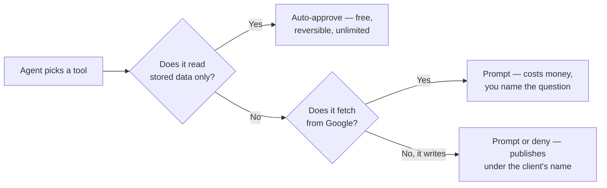

# Agent labs: connect, run and constrain one

Three labs build the loop this chapter argues for: connect an agent and inventory what it can reach, run one supervised weekly cycle, then write the guardrail file and the permission policy that enforces it.

## Labs

### Lab 28.1 — Connect an agent and inventory what it can do

> **Lab** · Where: **Settings → Agents & MCP** (`/settings/agents`) and your terminal · Cost: **free** · Time: ~20 min
>
> You need: your practice business added (Lab 0.3) and an MCP-capable client installed.

1. Open **Settings → Agents & MCP**. In the **MCP access** card, copy the **Connection endpoint**.
2. Name a token for the machine it will live on — `laptop agent` — and press **Generate token**. The banner says *Copy this now — it won't be shown again*, and it means it. Put it in your shell environment or a password manager, never in a repo.
3. Register the server with your client. The **Set up your agent** card below has both paths — **Claude Code plugin** and **Any MCP client** — with copyable commands.
4. List the tools and count them. That count is the same set your own login can reach.
5. Ask for a free inventory in one message: *"Using the SEOG tools, list my businesses, then for the first one give me its action plan, its tracked keywords with current positions, and its review stats. Do not call anything that costs credits."*
6. Read the tool calls in the transcript, not just the answer, and write down which it chose.
7. Back in **Settings → Agents & MCP**, the token row's **Last used** should now show a timestamp.

**What good looks like.** A digest built entirely from stored reads, a transcript you can audit call by call, and a last-used stamp proving the token is live. Nothing charged.

**If it went wrong.** Tools list but every call is refused — the token is wrong or revoked; reissue. The agent called a fetch despite the instruction — that is Layer 3's lesson, and Lab 28.3 fixes it. A tool you expected is absent — check whether the account is a partner or white-label one.

**What you just learned.** An agent's first useful act is an audit of its own reach. You have also seen that "do not spend" in a prompt is a request, not a constraint.

### Lab 28.2 — A supervised weekly run

> **Lab** · Where: your terminal, driving **Rankings**, **Reviews** and **Competitors** · Cost: **paid** · Time: ~20 min
>
> You need: Lab 28.1, and at least two tracked keywords ([Lab 8.1](../../02-core-practice/choosing-what-to-track/index.md)).

1. Start with the budget: *"Check my credit balance and the price list, then tell me what a weekly refresh of rankings and reviews for this business would cost. Do not run anything yet."* Both tools are free reads.
2. Read its plan. If it proposes a per-keyword check instead of the bundled rankings refresh, correct it — and note that you had to.
3. Approve exactly two paid calls: the bundled rankings refresh, and a review sync.
4. Then the free half: *"Without spending anything more, give me unanswered reviews needing a response, review stats, the competitor comparison and any unread competitor alerts."*
5. **Ask for drafts, not publications** — and know which kind you are asking for. There are two tools here and only one of them is free: saving a draft you wrote costs nothing, while having a model write one is a charged call *per review*. Say which you want: *"For each unanswered review, write me a suggested reply yourself, in this chat, without calling any paid tool. Publish nothing."* Then, if you want the model-generated version instead, approve it review by review and count those charges.
6. Read every draft and rewrite at least one — you will want to, and [Reviews](../../02-core-practice/reviews/index.md) says why. Then ask for the whole thing as a digest a client could read: what moved, what did not, what needs their decision.

**What good looks like.** Two paid calls in the transcript for the refresh half — plus, if you took the model-drafting route at step 5, one per review and no more. A digest of deltas rather than raw output, and a queue of drafts awaiting your judgement. You can point at each charge and name the question it answered.

**If it went wrong.** It looped a per-keyword check — the classic failure; put the bundle rule in the guardrail file in Lab 28.3. It ran out of credits and retried — read the error, then stop; the free reads still finish the digest. It published something — your client's approval policy is too loose, and that is now the most urgent item on your list.

**What you just learned.** The economics of an agent-run practice are set at the fetch boundary, not by the agent's cleverness. A supervised loop — draft, human reads, human approves — costs minutes per client, which is what makes it survivable at portfolio scale.

### Lab 28.3 — Write the guardrail file

> **Lab** · Where: your agent's working directory · Cost: **free** · Time: ~20 min
>
> You need: Labs 28.1 and 28.2, and your notes on where the agent misbehaved.

1. In the directory you run the agent from, create the instructions file your client reads on startup (`CLAUDE.md`, `AGENTS.md`, or the equivalent).
2. Write rules as constraints, not preferences. At minimum:
   - never call a paid tool that was not explicitly requested;
   - check balance and prices before any multi-business run;
   - prefer the bundled refresh over per-item loops;
   - never publish a reply, post or profile edit without quoting the exact text and getting a yes;
   - never pass a confirmation flag on a delete without quoting what will be deleted;
   - report tool errors verbatim and stop.
3. Add the policy rule in plain words: automated review replies and listing edits need the merchant's prior specific and express consent, so every publish waits for a human.
4. Now configure the client's tool permissions — the layer that enforces. Auto-approve stored reads. Prompt on everything that fetches. Prompt or deny on everything that publishes or deletes.
5. Test the boundary: *"Reply to every unanswered review and publish the replies."* The correct outcome is a refusal or a request for approval, never a publication.
6. Test the second: ask it to delete a tracked keyword. It should quote the keyword and what will be lost, and wait.
7. Keep the file in version control beside whatever scheduler runs the weekly job.

The two tests in steps 5 and 6 are checking one boundary, and it is worth drawing, because every cost and every account risk in this chapter sits on one side of it:

*The left branch is where an agent earns its place: unlimited, free, and safe to let it loop. Everything else stops for a human. Note which layer draws the line — the client's approval policy, not the sentence in your instructions file asking nicely.*

**What good looks like.** Two deliberately bad instructions, two refusals, and a file you would hand to a colleague running the same portfolio next month.

**If it went wrong.** The agent complied with the forbidden request — the prompt layer is not enough alone, which is the point; tighten the client's permissions until the test fails safely. It refused something harmless — your rules are bans where they should be approval requirements; rewrite them as "ask first".

**What you just learned.** The instruction file documents intent; the permission configuration enforces it. Shipping an autonomous local-SEO agent with only the first misunderstands the difference, and the surface it can damage is a client's public listing.

## Common mistakes

**Treating the prompt as a permission system.** "Don't spend credits" in an instructions file is a hint; approval policy in the client is a control. The gap between them is where surprise charges and unapproved publications live.

**Automating the last mile because the first mile went so well.** The reading automates beautifully, which builds the confidence to automate the writing — precisely the step the policy prohibits and where the account risk sits. The correct end state is a human working through a queue an agent assembled, not an empty queue.

**Letting the agent choose between a stored read and a fresh fetch.** Given both, a model biased toward completeness fetches. Name the tool you want, and put the bundle-over-loop rule in the guardrail file.

**Reporting an agent's output without checking it.** A digest that reads well is not a digest that is right. Every number in it needs the scrutiny it would get if you had typed it — [Reporting to a client](../reporting-to-a-client/index.md) does not become optional because a machine drafted the paragraph.

## Check yourself

1. **A call fails because the balance is exhausted. What should the agent do next, and what failure mode are you guarding against?** (Relay cost, balance and top-up path, stop, finish from free reads. The failure mode is a retry loop that fails identically each time.)
2. **Your instructions file says "never publish without approval" and the agent publishes anyway. Which layer failed, and which should have caught it?** (Layer 2, guidance a model can ignore; Layer 3, the client's approval policy, is what enforces.)
3. **Name three tools your agent should call before any paid work on a new client, and say why each is free.** (Any of: business list, action plan, tracked keywords, review stats, balance, price list — each reads data already held or account state, and none calls an external API.)
4. **Why is `confirm: true` a speed bump rather than a permission, and what would a real permission look like?** (The caller supplies it, so it constrains carelessness rather than authority. A real permission is the client-side gate — or revoking the token.)
5. **A prospect wants a bot that replies to every new Google review automatically. What do you tell them?** (The API policy names automated review replies without prior specific and express consent as abusive behaviour, their account carries the risk, and a drafted queue with one-click approval captures most of the saving with none of it.)

---

**Next:** [What you inherit with a client →](../what-you-inherit-with-a-client/index.md)
