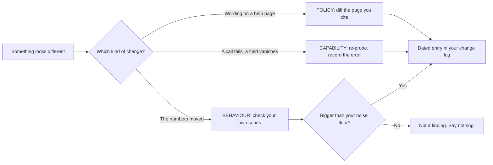

# Staying current when the ground moves

The expensive part of this job is not learning it. It is noticing, before a client does, that something you know stopped being true. Google retires capabilities without announcing them, edits policy pages with no version history, and changes ranking behaviour it never described in the first place. The industry fills each silence with confident guesses within days.

What you sell on a retainer is being right about a system that moves. This chapter is the routine that keeps that true — around two and a half hours a month, plus a rule for deciding what a given rumour is even about.

## Three kinds of change, detected three ways

Almost everyone applies one method — reading the news — to all three. It works for the first, is slow and unreliable for the second, and is actively harmful for the third.

| Kind of change | Example | Announced? | How you detect it |
| --- | --- | --- | --- |
| **Policy** | Two review-solicitation practices banned on 17 April 2026 | No — new text on a help page | Diff the pages you cite |
| **Capability** | Q&A API discontinued 3 November 2025, public panel phased out from that December; per-post metrics gone since February 2023 | Rarely, and late | Re-probe; treat any unexpected failure as a signal |
| **Behaviour** | "The pack got more local this month" | Never | Your own stored series, over months |

**Policy changes are *findable*, but nobody pushes them to you.** The two new review-solicitation clauses appeared on Google's prohibited-content page on 17 April 2026 with no announcement; they were spotted the same day by Amy Toman, a volunteer Google Diamond Product Expert reading the page, and reached the industry through her post rather than through Google. Standing agency advice was in breach for weeks.

**Capability changes are worse**, because the failure is silent and lands on your side — something errors inside a job nobody watches, and you find out when a client asks why the posts stopped.

**Behaviour changes are what everybody writes about and nobody can establish.** Positions move constantly, because rank is a sort over near-tied scores and a sort is discontinuous ([reading a geo-grid without fooling yourself](../../03-advanced/reading-a-geo-grid/index.md)).

One account's movement is never evidence of a system change, and almost every "I've noticed Google is now…" post was built from exactly that.

*The third branch is the one that catches people. Everything on the behaviour path has to clear your own measurement noise before it is allowed to become a claim — and most of it never does.*

Dated entries for the first two kinds — what changed, when, and what it broke — are in [the local search changelog](../../05-reference/local-search-changelog.md). Read it before you accept anyone's account of what Google "just" did.

## Documentation is a lagging indicator

**The retirement list does not list the retirements.** Google's deprecation schedule for the Business Profile surface carries a recent stamp and a stale record: read on **2026-07-27**, its most recent discontinuation entry was dated **July 2024**, and it still did not list the Q&A API that Google itself discontinued on 3 November 2025 — sixteen months later, and eight months before we looked.

The retirement was announced, but on the Q&A API's own change log, not on the page whose job is to list retirements. That is not sloppiness. It is a property of all vendor documentation: **it records intent at some past moment, not current state.**

> Documentation establishes what was intended. Only a call establishes what is.

## Facts have half-lives, and yours are not equal

A flat re-check schedule wastes time on durable things and misses volatile ones. Sort what you know by how fast it rots.

| Class of fact | Example | Re-check |
| --- | --- | --- |
| Mechanism | Rank is a function of a coordinate | Years — when a surface is replaced, not on a calendar |
| Structure | Which post types exist; which fields trigger re-verification | Twice a year |
| Policy text | What you may ask a customer for | Quarterly; changes silently, more than once a year |
| Capability | Whether a specific write path still works | Quarterly, and on any unexpected failure |
| Published rates | AI Overview incidence, ranking-factor weights | Annually, when an edition lands — vendor surveys either way |
| AI engine behaviour | How an assistant gets the user's location | Months. The fastest-rotting material in this manual |

**The last row deserves a warning.** ChatGPT shipped opt-in device-location sharing on iOS and web on **26 March 2026** — off by default, and Android still listed as coming *(as read 2026-07-27; re-check before citing)*.

Every AI-visibility series crossing that date holds a discontinuity that has nothing to do with the business being measured. Dating engine changes is what separates that chart from a random walk with a story attached.

## The watchlist, in tiers

Weight every source by one question: **can I reproduce what it claims, and is it dated?** Anything failing both is entertainment.

**Tier 1 — primary text.** Business Profile representation guidelines; the Business Profile API policies (which do publish a *last updated* date — still 2025-08-28 when re-read on 2026-07-27); the Maps user-contributed-content policy; the Maps Platform terms. These decide what you may do and what you may quote, and they change with no announcement, no changelog and no feed.

**Tier 2 — Google's announcements.** Company blog, Search Central, "what's new" in Business Profile Help. A minority of changes, skewed to the flattering ones.

**Tier 3 — full-time watchers.** Search Engine Roundtable; Sterling Sky, Near Media and Whitespark; PPC Land for policy text; and the Business Profile community forum, where Product Experts meet the edge cases first. Fast and often right, but second-hand.

**Tier 4 — noise.** Undated posts, agency blogs recycling each other, generated "complete guide" pages. The tell: no date, no source, no way to reproduce, and a call to action.

Nothing in Tier 3 or 4 is ever the basis for an action. It is the basis for a *check* against Tier 1, or a probe.

---

**Next:** [The maintenance routine →](./the-maintenance-routine.md)
