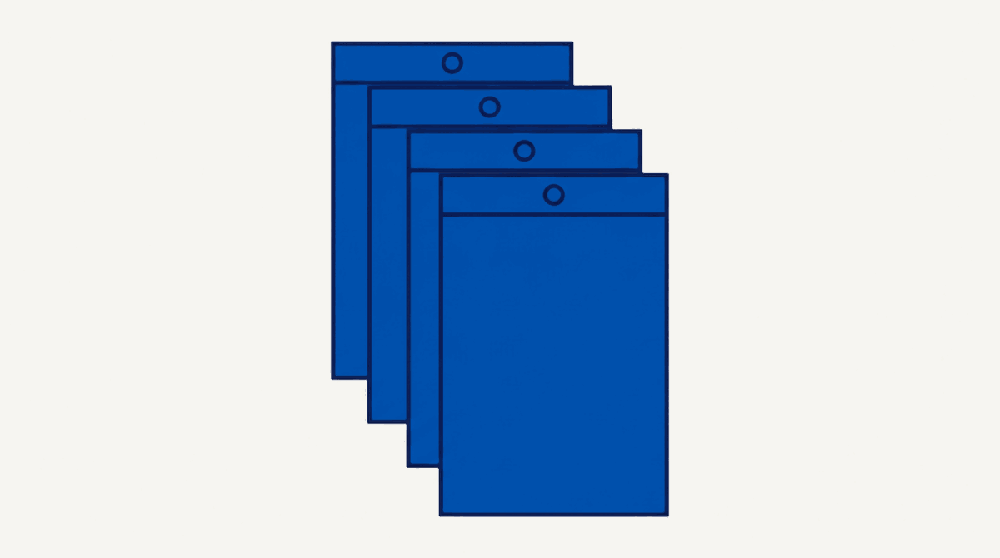
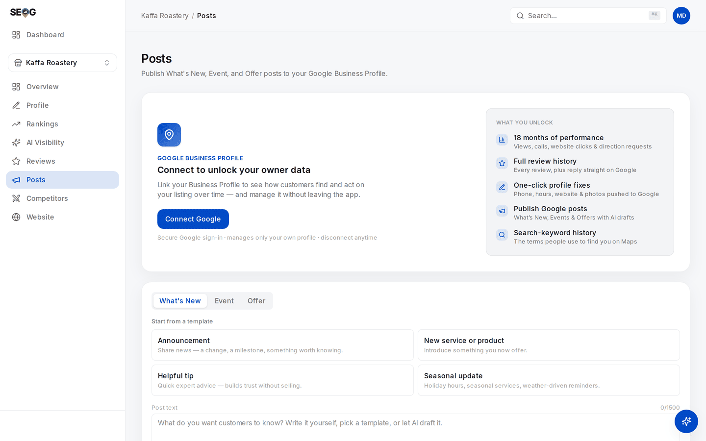

# Practising the routine

The routine only becomes yours once you have run it. These three labs build the source file, expose a cached rule inside your own tooling, and referee a claim against your own record.

*What Lab 31.1 is actually building: the same four documents, saved again on a date you record, month after month. Nothing here is clever. It is the entire difference between "I think the policy used to say something else" and a diff you can put in front of a client.*

## Labs

### Lab 31.1 — Build the source file and take the first snapshot

> **Lab** · Where: your own browser (no SEOG) · Cost: **free** · Time: ~30 min
>
> You need: nothing. Do this before you take a paying client.

1. Create a folder `sources/`, with a subfolder named for today's date.
2. Open each Tier 1 document. Save the readable text into the dated folder, and add a `README` line: the URL, the date you read it, and any *last updated* date the page publishes.
3. In the same `README`, write one sentence per document: **what would change for my clients if this page changed.** A document you cannot answer that for does not belong in the file.
4. Add a line for your instruments — rank tool, grid preset, AI prompt set — and today's date. Set a monthly reminder titled with the folder path, not the words "check SEO news".

**What good looks like.** Four dated text files and a `README` where every entry has a stated consequence.

**If it went wrong.** *No last-updated date on the page* — most have none, so your read date is the anchor, which is why the folder exists. *You cannot state a consequence for one page* — either you do not understand what it governs, or you copied it off someone else's list.

**What you just learned.** A source without a date is not a source. Version control can be imposed on documents that lack it, which turns "I think the policy used to say something else" into a diff.

### Lab 31.2 — Find where the rules are cached, and date them

> **Lab** · Where: **Posts** (`/b/{businessId}/posts`) · Cost: **free** · Time: ~15 min
>
> You need: your practice business added (Lab 0.3). This lab publishes nothing.

1. Open **Posts** and begin composing a **What's New** post. Do not publish.
2. Paste a very long body — a few thousand characters of any filler. The live issue list appears as you type. Read it: it names a limit. Write the number down.

*Where the lab runs, before you type anything. The counter above the field — **0/1500** — is the first of the two numbers you are after, and switching the tab to **Event** is what surfaces the second, much smaller one on the title. Both are hard-coded limits this composer enforces on Google's behalf, which is the point of the lab: neither number is in Google's documentation.*
3. Switch the type to **Event** and give it an over-long title. Note the second, much smaller limit, and the requirement for a complete start **and** end date and time.
4. Now answer the question this lab exists for: **where did those numbers come from, and when were they last true?** Neither appears in Google's current documentation; both were established by sending an over-long value and reading the field-level error that came back ([publishing without getting rejected](../../02-core-practice/publishing-without-getting-rejected/index.md), verified 2026-07-22).

   Note what it would cost to re-establish them today — not nothing, since the only way to test a write limit is to attempt a write. Close the composer without publishing.

**What good looks like.** Two numbers, a date, and a clear statement that the validator is a *cached probe result* — second-hand knowledge with an expiry, exactly like documentation.

**If it went wrong.** *No issue list appears* — validation runs only once the composer is touched; type into the body first. *You published by accident* — delete the post, and note that the deletion is itself a write against Google.

**What you just learned.** Every rule your tooling enforces was a fact somebody verified on a date, and almost nothing exposes that date. "Probed 22 July 2026, not re-checked since" is honesty the market does not offer, and it costs nothing to be first.

### Lab 31.3 — Referee a change claim against your own record

> **Lab** · Where: your browser, plus **Overview** and **Rankings** · Cost: **free** · Time: ~25 min
>
> You need: a change claim from the last ninety days — a blog post, a forum thread, a client's forwarded email — and a few weeks of your own stored history.

1. Write the claim in one sentence, then fill in three fields: **who observed it**, **on what date**, **what the observation was**. Leave blanks; do not infer.
2. Run the five questions in order. Stop at the first it fails and record which.
3. If it survives all five, look for it in your own record. Open **Overview** and read **Profile score over time**; open **Rankings**, select a keyword, read its position history. You want a step at or shortly after the claimed date — not a trend, a step.
4. Write down what else could have produced whatever you found: a refresh you ran, a preset you changed, a rival's listing appearing or vanishing, an ordinary re-sort.
5. Deliver a verdict in one of three forms — **not established** (naming the failing question), **consistent with my data but not attributable**, or **verified, here is the probe or the diff** — and log it in column B with today's date. Including the rejected ones. Especially those.

**What good looks like.** Most claims land at "not established", usually failing question 2, and you can name the failing question rather than express a general suspicion.

**If it went wrong.** *History too short to show a step* — record that as the finding and repeat in six weeks. *A step that lines up beautifully* — work step 4 harder than feels necessary.

**What you just learned.** Refereeing is not scepticism, it is a completed form. Your own dated history is what lets you argue about a change rather than repeat what you read.

## Common mistakes

**Acting on the news.** Reading a change and implementing it is the industry default and the source of most untraceable work. The chain is log → verify → act, and most items stop at step one. Skipping to step three also destroys attribution: you made two changes that month and cannot separate them ([did it work?](../../02-core-practice/did-it-work/index.md)).

**Asking an assistant whether something is still supported.** The training material is Google's out-of-date documentation plus generated "2026 guide" articles derived from it, several of which rank today and describe capabilities dead for months. The answer will be fluent, confident and up to two years behind. Use an assistant to find the primary page, never to tell you whether it is current.

**Never logging instrument changes.** You switched grid presets in month two, the coverage line stepped, and the report attributed it to the category fix. Nobody lied — the instrument change was not written down, so it could not enter the explanation.

**An urgent email about every update.** Tempting because it demonstrates vigilance, and it inverts: after the third one the client stops reading anything you send about a change.

## Check yourself

Answer against your actual files and clients, not in the abstract.

1. **Name the primary documents your service depends on, and the date you last read each.** Any you cannot date is one you are quoting from memory in front of paying customers.
2. **"Google started favouring businesses that post weekly, since June."** Which of the five questions does it fail first? *(Question 2 — nobody holds a dated observation of the previous state.)*
3. **Name one capability your delivery depends on that would fail silently, with a client noticing before you do.** Write its probe and its cadence. If you cannot name one, you have not looked at what runs unattended.
4. **Which fact in your standard client report has the shortest half-life?** For most people it is something about an AI surface, and most reports do not date it.
5. **A well-evidenced change lands and does not affect your clients. What do you send, and why send anything?** *(Three sentences: what changed, that it does not affect them, why not. Because the next one might, and that message's value depends on this one existing.)*

---

That closes Part IV, and the teaching half of this manual. What follows does not teach — it settles questions, one dated fact per heading, with the probe that established each.

It is also what goes stale fastest, which is why every entry carries the date it was last checked, and why a correction with a probe attached is the most useful thing anyone sends us ([contributing](../../99-appendix/contributing.md)).

**Next:** [How to read this reference →](../../05-reference/how-to-read-this-reference.md)
