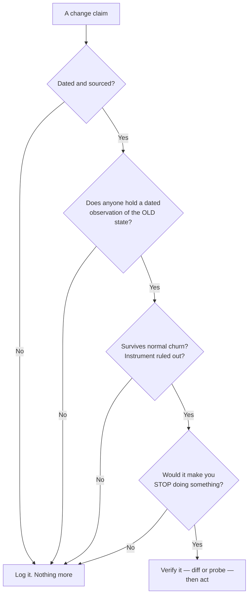

# The maintenance routine

Knowing what to watch is half of it. These are the instruments — a diff, a probe and a referee's checklist — and the schedule that fits them into about two and a half hours a month.

## The diff habit

**Be your own version control.** Tier 1 documents have no version history, so the highest-value twenty minutes of your month is making one yourself. Keep a dated local copy of every page you cite; once a month take a fresh copy and diff it.

When a clause moves you see the exact words that changed, on a date you can name — which is what you need when a client asks why the deliverable you sent in March says something different from what they read last night.

Two constraints:

1. **Read like a human, keep the copy for yourself.** This is a handful of pages read as a human would, saved for your own records: do not build a crawler over Google properties, and do not accumulate anything redistributable ([storing Google data legally](../../05-reference/storing-google-data-legally.md)).
2. **Do not rely on the public archives.** Help-centre pages are heavily scripted and archive badly, so public archives are a partial fallback at best *(inference — observed while trying to recover prior wording)*.

**You have watched the app do this to something else.** The **Activity** panel on `/b/{businessId}/competitors` compares each refreshed competitor snapshot against the stored one and raises a line when the difference crosses a threshold — a rating drop, a burst of reviews, a batch of new photos — and only for the rivals you have left on the watch list.

Two states, a comparison, and a rule about what counts as news. Apply that by hand to four policy pages and you have change detection for the part of your business nobody will notify you about.

## Re-probing, and probe hygiene

For capability questions the only instrument is a call. A **probe** is one request whose response reads as a verdict, stated precisely enough that a stranger can repeat it. Part V of this manual is a probe log rather than a documentation summary, and this section is why ([how to read this reference](../../05-reference/how-to-read-this-reference.md)).

Four verdicts are possible:

- **Works.**
- **Gone** — it used to and now refuses.
- **Never worked** — the interface offers it and the programmatic path never did.
- **Undocumented but working** — liable to vanish; never promise it without a fallback.

The third turns on one distinction, and the *shape* of the failure gives it to you. A *validation* error means the system understood you and declined; a *server* error on well-formed input usually means the path was never built.

That is how video-on-a-post was settled: Google's interface publishes video to a post, and the API fails with a server error on identical content *(probe-verified 2026-07-22)*. Interface parity is not API parity ([the capability matrix](../../05-reference/gbp-capability-matrix.md), [write limits and failure modes](../../05-reference/write-limits-and-failure-modes.md)).

Hygiene, because this is where people damage listings they do not own:

1. **Probe on a listing you own.** Never a client's. A probe is an experiment and experiments fail.
2. **Prefer probes that create nothing** — where the *failure* is the answer. If it must write, write something you would have published anyway, then remove it.
3. **Record input, output, date and verdict.** A probe you cannot restate is an anecdote.
4. **Re-stamp the date even when nothing changed.** "Last verified 2026-07-22, unchanged" is a fact, and a valuable one.
5. **Do not loop.** One probe answers a yes/no question; a thousand answer it a thousand times while looking like something else. Breadth of distinct places, not call volume, is the signature that gets accounts restricted.

On the AI surfaces the equivalent is a fixed prompt set run against unchanged anchors, so a change in the answer is a change in the engine, not in your question ([AI engine probe recipes](../../05-reference/ai-engine-probe-recipes.md)).

## Real change, or folklore? Five questions

Run any claim through these in order. Most die on the first two.

1. **Is it dated and sourced?** An undated claim is unusable whether or not it is true, because you cannot tell what it contradicts. The date is worth more than the claim.
2. **Is this a change, or a first noticing?** Most "Google just started doing X" is somebody meeting a year-old behaviour. The test: does anyone hold a *dated observation of the previous state*? Usually nobody does — so nobody can say when it changed, so nobody knows that it did.
3. **Could the observation survive normal churn?** A claim built on one business over one week is noise with a narrative wrapped round it.
4. **Did the instrument change instead?** A tool default, a grid preset, an engine's location handling — each produces a step that looks exactly like a change in the world ([why two tools disagree](../../03-advanced/why-two-tools-disagree/index.md)). Rule out your own equipment before you accuse Google.
5. **Does it cash out into a different action?** If your response is what you would have done anyway, the claim is untestable. The ones worth an afternoon would make you **stop** doing something.

*Notice how many roads lead to "log it". That is the routine working, not failing: the expensive habit is not missing a real change, it is re-planning a quarter around one that nobody can date.*

Then choose one response, out loud:

- **Log it** — no action, correct for most changes and the option the industry almost never takes.
- **Verify it** — a diff or a probe, converting a rumour into a dated fact you own.
- **Act on it** — only on verified changes.

## Your own change log

Two columns, dated, per engagement.

| Column | What goes in it |
| --- | --- |
| **A: what you changed** | Edits, replies, posts, citations, site work |
| **B: what changed underneath you** | Google policy and capability changes, engine changes, and changes to your own instruments: a new tool, a different grid preset, a keyword's search point moved |

Column A you get for free: fetched cards are stamped with their fetch time, profile-score snapshots are written at most once per business per day and draw **Profile score over time**, keywords keep their position history, and grid scans are dated ([did it work?](../../02-core-practice/did-it-work/index.md)).

**Column B you keep by hand.** No tool has it, including this one — the app records what *it* did, not what Google did, and a chart that steps for external reasons looks identical to one that steps because you were good.

Without column B, every step gets attributed to column A by whoever tells the story first. Sometimes that helps you. Eventually it will not.

## The routine, and what it costs

**Weekly, about twenty minutes.** Skim Tier 2 and Tier 3. Log dated, sourced items. Act on nothing.

**Monthly, about thirty.** Diff your Tier 1 pages. Re-read the log for anything that reached "verify" and stalled.

**Quarterly, about two hours.** Re-probe the capabilities your service depends on, and re-date your notes including the unchanged ones. Reconcile your log against [the local search changelog](../../05-reference/local-search-changelog.md), and read the new ranking-factors survey when an edition lands.

**On trigger.** A write that used to work fails; a client forwards an article; a series steps.

That sums to about two and a half hours a month — the whole maintenance cost of remaining the person who is right, and the most defensible line on an invoice.

> Your client can read the same posts you can; what they cannot do is tell which apply to them.

Which is also how to communicate a change: **before they read about it**, in three sentences. What changed and when. Whether it affects them. What you are doing.

When the honest answer is "this does not affect you", send that too — manufacturing urgency out of a routine update spends credibility you will want the day something real happens ([reporting to someone who is paying for it](../reporting-to-a-client/index.md)).

> **Without SEOG** · Nothing here needs a platform. The diff habit is a folder and a text comparison; the change log is a spreadsheet; probes are calls you make yourself. A tool buys you column A kept automatically, stamped with dates you did not have to remember — [doing all of this without SEOG](../../99-appendix/doing-it-without-seog.md).

---

**Next:** [Practising the routine →](./practising-the-routine.md)
