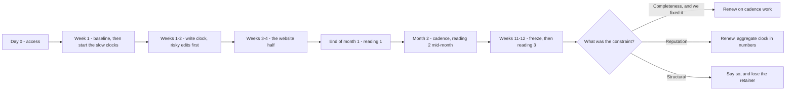

# The ninety-day plan

Most local SEO engagements fail on sequencing, not on skill. The work gets done in the order it appeared on a list, the slowest item starts in week nine, and ninety days later there is nothing to show — because the only signals that would have moved needed ninety days and were given three weeks.

The individual tasks are all in Part II and none of them is hard. What decides whether a quarter ends with evidence or with excuses is which task you start on day one.

## Why the unit is a quarter

Ninety days is the shortest window that contains a real measurement.

**A trend needs three readings, not two** — two points always draw a line, and half of those lines are noise. Readings must be far enough apart to be independent: a fortnight is the floor, because *(inference)* profile and review changes tend to show over weeks rather than days ([Did it work?](../02-core-practice/did-it-work.md)).

**Then do the arithmetic.** A baseline plus three fortnightly readings is seven weeks, and that assumes the change landed on day one. It never does. Add access, publication latency and one buffer, and you are at twelve weeks.

So the calendar is set by the slowest signal you promised to move. Promise something that needs six months and ninety days is a fraud however hard you work; promise only things that land in a fortnight and you have sold a week of work on a quarterly retainer.

Pricing that honestly is [What the work costs](./what-the-work-costs.md); scheduling it is this chapter.

## The four clocks

Every task in local SEO sits on one of four clocks. Sorting the work by clock, before sorting it by anything else, is what this chapter exists to teach.

| Clock | Work on it | How long it takes | Who has to act |
| --- | --- | --- | --- |
| **Write** | Phone, website link, hours, description, attributes, photos, service areas | Minutes to publish, an afternoon to do all of it | You |
| **Behaviour** | New reviews, replies, posts, photos from customers | Weeks — you act, other people respond | You *and* the client's staff |
| **Aggregate** | Review count, rating, reply rate, citation consistency | A quarter, by construction | Everyone, slowly |
| **Instrument** | Trend lines, comparable re-scans, the change log | As long as you have been measuring | You, on a schedule |

**The write clock is fast but not free of risk.** Most ordinary field edits go through Google's review before they become public — usually minutes, sometimes days ([LSM-GBP-07](../05-reference/write-limits-and-failure-modes.md)).

**Name, category and address are a different class.** They can put a listing into re-verification and out of Search and Maps for hours to days ([Suspensions and reinstatement](../03-advanced/suspensions-and-reinstatement.md)).

**An edit can also be silently rejected** — the field reads its old value after the next refresh, and that is the answer, not a bug ([write limits and failure modes](../05-reference/write-limits-and-failure-modes.md)).

**The aggregate clock dictates the calendar**, because you cannot compress it. Getting a business from 12 reviews to 20 is not an afternoon's work at any price — it is a rate problem.

**The thresholds are counters, not tasks.** Two different gates want two different numbers, and neither can be bought:

| Gate | What it wants |
| --- | --- |
| Profile audit | Review volume at 20, rating at 4.0 |
| AI-readiness rubric | 25 reviews, 4.2 rating, a review inside the last 60 days, replies on at least half |

Every one is a counter moving at the speed customers arrive: month-3 outcomes of month-1 decisions.

Which produces the inversion, worth saying flatly because it feels wrong:

> **Start the slow work first and do the fast work while it runs.** Quick wins are called quick because they can be done at any time. That is precisely why they should not be done first.

**The instrument clock is the one people forget.** Nothing re-measures on its own — every reading is a deliberate, usually priced action, and there are no recurring background jobs.

**The trend chart is opportunistic, not scheduled.** The snapshot feeding **Profile score over time** lands at most once per business per calendar day, and only on days you actually refreshed something — any of the profile, rankings, competitor or review refreshes writes it; a day nobody touched the business writes nothing.

Refresh twice in a quarter and the chart has two points on it, with no way to fill the gap retroactively.

## The generated plan is a first draft

Open the overview and **Action plan — your next steps** is already sitting there, ordered, with impact labels and point values. It is a useful starting object and it is not a schedule. Knowing how it was built is what lets you overrule it with confidence.

*A real plan on a real profile, and a good illustration of the argument. Seven rows, each with a point value and a tier. **Add a phone number** and **Get more reviews** both read "+10 pts, High impact" — one takes ninety seconds and the other takes a quarter. The list is arithmetic on completeness weights; the sequencing is your job, and it is the job you are paid for.*

### How the list is built

**It merges three sources into one deduplicated list:**

- the failing checks from the weighted profile audit;
- the AI-readiness factors the audit does *not* already cover;
- any stored website and listing fixes.

**Only two AI factors survive that deduplication** — *Get a fresh review* and *Reply to your reviews* — because everything else in the readiness rubric is already an audit check. And when the audit's own review-volume check has also failed, *Get a fresh review* is folded into it rather than listed twice, so you often see just the one row.

**The sort is impact tier first**, then recoverable profile-score points, then alphabetical by title.

**For a profile-audit row the impact tier is a pure function of that check's weight:** 9 or more is **High impact**, 6 to 8 is **Medium**, below 6 is **Low**.

**The other two sources are tiered on their own scales** rather than on audit weight: the AI-visibility rows from the readiness factor's weight, the website and listing rows from the stored fix's priority. So a tier compares rows within a source, and comparing tiers *across* sources means less than the shared label suggests.

### What the list cannot see

> **A tier is arithmetic on a weight — never a judgement about your business.**

Which is why you never work this list top-down. Three consequences:

**It cannot see effort.** "Add your opening hours" and "Get more reviews" both carry 10 points and both land in the High tier. One is ninety seconds. The other is a quarter of somebody's life.

**It cannot see risk.** Nothing in the ordering knows that editing a category can pull the listing out of Search for two days, or that doing so in week eleven destroys your final measurement.

**It cannot see catastrophe.** "Fix your business status" — the check that fails when a profile is marked closed or temporarily closed — weighs 4, so it is tagged **Low impact**. A business marked temporarily closed is close to invisible.

If you see that row it is the only thing you do that day, and the label says the opposite. A weight is a share of a completeness score, not a measure of consequence.

One whole category of finding is structurally absent. The plan is computed from stored profile, review, website and listing data without looking at a single search result, so it will never tell you the market is hard or that the constraint is [proximity](../01-foundations/relevance-distance-prominence.md) rather than completeness. That comes from a rank map, and it is often the most important sentence in the engagement.

## The quarter at a glance

The rest of the chapter is this shape, in words:

## Month 1 — write everything, and start what is slow

**Day 0 is access, and it is not day 1.** Three things have to be in hand:

- owner connection to the Google Business Profile;
- website access, or a named developer;
- one human who can approve copy.

Without the owner connection you cannot see the owner-written description or the performance numbers, and cannot apply a fix directly. Chasing access in week three costs a third of the quarter ([What you inherit with a client](./what-you-inherit-with-a-client.md)).

**Week 1 — diagnose, freeze, and start the aggregate clock the same day.** The baseline comes before any edit, for the reason given in [Diagnosing a business in thirty minutes](../02-core-practice/analyzing-business-visibility.md): an unmeasured change is an unprovable change. Then, before any quick wins, start the three things that pay out in month 3:

- **The review engine.** The review link and QR go to whoever meets customers, and somebody is accountable for asking. Week 1 work, first visible effect around week 6.
- **The reply backlog.** Clearing it moves the reply-rate factor, and every reply written now is one not written in month 3 under time pressure.
- **The citation work.** Directory corrections propagate on somebody else's schedule ([Citations and NAP consistency](../02-core-practice/citations-and-nap.md)).

**Week 1–2 — the write clock, risk-ordered.** Every absent field, in one or two sittings. Do the re-verification-risky edits — name, category, address — first within this block, never later: they need recovery time inside the engagement, and must be nowhere near a measurement window.

**Week 3–4 — the website half.** For a developer this is the asymmetry worth noticing: structured data, a real location page, contact consistency and agent-readable markup are a week of ordinary work, and the item most agencies quote a quarter for ([Making the site readable by agents](../02-core-practice/making-the-site-readable-by-agents.md)).

End of month 1: reading #1 and the first client report — a plan, a baseline, completed work. No ranking claim, and saying so in advance stops month 1 being the month you lose the account.

## Month 2 — cadence, and the first honest reading

Month 2 is where the engagement becomes a system or becomes a to-do list you keep re-reading.

**Establish the cadence.** Posts on a fixed weekly slot, photos monthly, replies twice a week, review requests continuously. A rhythm somebody can keep beats a burst that stops in week seven ([Publishing without getting rejected](../02-core-practice/publishing-without-getting-rejected.md)).

**Take reading #2 mid-month, on identical settings.** Same keyword row, same detail preset, same centre. A comparison in which the instrument changed measures your own settings.

**Start the competitor watch — and know what it is before you sell "monitoring".** Competitor alerts (rating drops and rises, review surges, photo surges, a new negative review) are a diff computed when you re-snapshot a competitor, not a background watch. An empty **Activity** panel means nobody re-checked. Put the re-snapshot on the calendar or it stays empty all quarter ([Reading a competitor](../02-core-practice/competitors.md)).

**Find out whether the client's half is happening.** If review inflow has not moved by week six, the plan is failing on the human side, not the technical side. Discovering that in week eleven means the quarter is lost, and it will be described as your failure.

## Month 3 — freeze, measure, decide

**Freeze new work in the final fortnight**, reviews and replies excepted. Practitioners resist this because doing nothing feels like not working. Doing nothing is what makes the last measurement mean something.

**Take reading #3, then diff against the frozen baseline** on the discipline in [Did it work?](../02-core-practice/did-it-work.md). Sort every movement into verified, plausible or unattributable, out loud, in the report — the unattributable bucket is what makes the other two believable. Assembling that document is [Reporting to a client](./reporting-to-a-client.md).

**Then answer the actual question: what would the next ninety days buy?** Three honest endings exist.

1. *The constraint was completeness and we fixed it* — renew on cadence work.
2. *The constraint is reputation, moving at the rate customers arrive* — renew, with the aggregate clock explained in numbers rather than promises.
3. *The constraint is structural: the market is hard, or the location is wrong for the queries that matter* — say so. You lose that retainer, keep the referral, and do not spend a year being paid to fail slowly.

The third ending is the one that builds a practice.

## What breaks a plan

**A suspension.** Everything stops and the calendar restarts around reinstatement. Build one buffer week into every quarter and never schedule risky edits late.

**Seasonality.** A plumber's December and a plumber's June are different businesses. If your quarter spans a seasonal boundary, baseline and final reading are not comparable — say so, or find a year-over-year comparison.

**The client's half not happening.** Reviews and photos need somebody who meets customers. Nobody has ever fixed this in month 3.

> **Without SEOG** · The plan is a spreadsheet and a calendar; nothing here needs a tool. What a tool changes is the cost of the instrument clock — the score snapshot, the comparable re-scan, the dated report — which by hand is the first thing to slip and the thing whose absence you discover in month 3. [Doing all of this without SEOG](../99-appendix/doing-it-without-seog.md) has the manual version.

## Labs

### Lab 27.1 — Rebuild the action plan as a calendar

> **Lab** · Where: **Overview** (`/b/{businessId}/overview`) · Cost: **free** · Time: ~25 min
>
> You need: your practice business diagnosed and a frozen baseline ([Lab 7.3](../02-core-practice/analyzing-business-visibility.md)).

1. Open the overview and read **Action plan — your next steps**. Press nothing else — this list is computed from stored data and costs nothing to read.
2. Copy every item into a table, in the order shown, with its impact label and its `+N pts` value where it has one.
3. Add four columns and fill them in yourself: **clock** (write / behaviour / aggregate), **owner** (you / client / developer), **risk** (safe / re-verification), **earliest useful start**.
4. Re-sort by *earliest useful start*, ascending, breaking ties with impact.
5. Assign each row to a week number, 1 to 12. Every aggregate-clock row lands in week 1 or 2.
6. For each row whose position changed, write one sentence on why the generated order was wrong for this business.

**What good looks like.** At least one item moved up because it is slow rather than important, and at least one High-impact item moved down because it takes ninety seconds. Every review-related row is in week 1.

**If it went wrong.** The plan is empty — the profile passes its checks, so your quarter is about reputation, website and rank rather than completeness; build the calendar from your rank map instead. Several rows are *unknown* rather than failing: you are not connected to the profile, which is a day-0 task.

**What you just learned.** A prioritised list and a schedule are different objects. Priority answers "what matters most"; a schedule answers "what must start now so it can finish". Only the second is a plan.

### Lab 27.2 — Start the slowest clock in week one

> **Lab** · Where: **Overview** (`/b/{businessId}/overview`) · Cost: **free** · Time: ~15 min
>
> You need: Lab 27.1.

1. In the action plan, find the review item — *Get more reviews*, *Improve your rating* or *Reply to your reviews*. If its description mentions a fresh review counting double, the recency factor collapsed into it.
2. On a review-volume or rating item, press **Get reviews**. Copy the link and download the QR image.
3. Write the deployment, not the intention: where that link and QR go (receipt footer, invoice email, counter card, follow-up text), who puts them there, and by which date.
4. Read the **Review momentum** card. Write down the reply ratio and the review count with today's date — the start line for the one number in your quarter that cannot be hurried.
5. Count the stored reviews with no reply. That is your month-1 reply workload; divide by the weeks you have.
6. Put a recurring slot in a real calendar for asking and for replying. Not a note. A slot.

**What good looks like.** A named person, a named surface and a date for the review ask, plus a dated starting count for reviews and replies. Publishing the replies is a separate, priced action covered in [Reviews](../02-core-practice/reviews.md) — this lab sets the line and the workload only.

**If it went wrong.** No **Get reviews** button on the item you opened: it appears on the review-volume, rating and recency items, while the reply item sends you to the Reviews screen. No link generated: the business record has no stored place identifier — re-check how it was imported.

**What you just learned.** The work that decides the quarter is delegated work, and delegated work with no owner, surface and date does not happen. Starting the aggregate clock is scheduling, not optimisation.

### Lab 27.3 — Book the measurement dates before you book the work

> **Lab** · Where: **Overview** (`/b/{businessId}/overview`) · Cost: **free** · Time: ~15 min
>
> You need: Labs 27.1 and 27.2, and the tracked keyword set from [Lab 8.1](../02-core-practice/choosing-what-to-track.md).

1. Scroll the overview for **Profile score over time**. If it is not there you have fewer than two daily snapshots — note that, because it is the point of the lab, not a fault.
2. If it is there, read *tracking since* and the point delta, and compare that date with your baseline date. Any gap is days you were not measuring.
3. Write four dated rows: baseline, reading 1 (end of month 1), reading 2 (mid month 2), reading 3 (week 11). Fortnightly at minimum, none in the last week.
4. Beside each reading, write the settings that must be identical every time: keyword row, detail preset, grid centre, and which stored report you will diff against.
5. Add the freeze rule in writing: no new profile or website changes after the start of week 11, reviews excepted.
6. Name who takes each reading. "The team" is not a name.

**What good looks like.** Four dates, each carrying its own settings, a freeze date and a named person. The measurement schedule now exists independently of whether the work goes well.

**If it went wrong.** The trend chart never appears — you are refreshing too rarely to produce snapshots, and the fix is scheduling, not tooling. Your reading dates cluster in the final fortnight: that quarter can produce one comparison, and one comparison is not a trend.

**What you just learned.** Measurement is work with its own calendar, cost and owner. Everyone who reaches month 3 with nothing to show got there by assuming it would happen automatically at the end.

## Common mistakes

**Working the generated list top-down.** It is sorted by impact tier and recovered points — a sort by *completeness weight*, which treats a listing marked temporarily closed as low impact and puts the ninety-second fixes ahead of the quarter-long ones. A day on attributes in week 1 is a day the review engine was not running.

**Shipping four fixes in one week.** One uninterpretable result. Stagger by domain — profile this fortnight, reviews next, website after — and you can still attribute something at the end.

**Shipping anything at all in the final fortnight.** It contaminates the only measurement anyone will read, and it cannot have taken effect. This is the most common way a good quarter reports as an ambiguous one.

**Promising rank in month 1.** Nobody outside Google knows how long a local change takes to affect ranking, and a promise made in week 1 forces the dishonest report in week 12.

**Treating alerts and scores as monitoring.** Nothing re-measures on its own. An empty competitor **Activity** panel and a flat trend line are both consistent with "nobody looked".

## Check yourself

Answer against your own practice business, with your Lab 27.1 table open.

1. **Which item on your list has the longest latency, and in which week did you schedule it?** If those answers are not "the aggregate one" and "week 1", say why.
2. **Your action plan tags an item Low impact. Reconstruct why from the check's weight — and name the case where that label is actively misleading.**
3. **You ship a category change in week 10 and rank falls in week 11. What can you honestly say?** At minimum: re-verification can remove a listing from Search for days, the reading sits inside that window, and the comparison is therefore unattributable.
4. **A client asks for a ranking guarantee in ninety days. Give the answer that keeps the account and the answer that keeps your credibility — and say whether they are the same sentence.**
5. **Halfway through month 2 the review count has not moved. What do you change — the plan, the client conversation, or the promise?** All three, and week six is when it costs least.

---

**Next:** [Running local SEO with an AI agent →](./running-local-seo-with-an-ai-agent.md)
