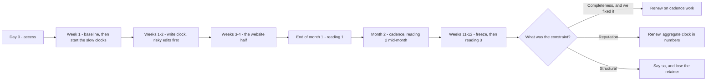

# The quarter month by month

Sorting the work by clock is the preparation. What follows is the schedule it produces: day 0 to week 12, in order, and the three things that break it.

## The quarter at a glance

The rest of this chapter, in one picture:

## Month 1 — write everything, and start what is slow

**Day 0 is access, and it is not day 1.** Three things have to be in hand:

- owner connection to the Google Business Profile;
- website access, or a named developer;
- one human who can approve copy.

Without the owner connection you cannot see the owner-written description or the performance numbers, and cannot apply a fix directly. Chasing access in week three costs a third of the quarter ([What you inherit with a client](../what-you-inherit-with-a-client/index.md)).

**Week 1 — diagnose, freeze, and start the aggregate clock the same day.** The baseline comes before any edit, for the reason given in [Diagnosing a business in thirty minutes](../../02-core-practice/analyzing-business-visibility/index.md): an unmeasured change is an unprovable change. Then, before any quick wins, start the three things that pay out in month 3:

- **The review engine.** The review link and QR go to whoever meets customers, and somebody is accountable for asking. Week 1 work, first visible effect around week 6.
- **The reply backlog.** Clearing it moves the reply-rate factor, and every reply written now is one not written in month 3 under time pressure.
- **The citation work.** Directory corrections propagate on somebody else's schedule ([Citations and NAP consistency](../../02-core-practice/citations-and-nap/index.md)).

**Week 1–2 — the write clock, risk-ordered.** Every absent field, in one or two sittings. Do the re-verification-risky edits — name, category, address — first within this block, never later: they need recovery time inside the engagement, and must be nowhere near a measurement window.

**Week 3–4 — the website half.** For a developer this is the asymmetry worth noticing: structured data, a real location page, contact consistency and agent-readable markup are a week of ordinary work, and the item most agencies quote a quarter for ([Making the site readable by agents](../../02-core-practice/making-the-site-readable-by-agents/index.md)).

End of month 1: reading #1 and the first client report — a plan, a baseline, completed work. No ranking claim, and saying so in advance stops month 1 being the month you lose the account.

## Month 2 — cadence, and the first honest reading

Month 2 is where the engagement becomes a system or becomes a to-do list you keep re-reading.

**Establish the cadence.** Posts on a fixed weekly slot, photos monthly, replies twice a week, review requests continuously. A rhythm somebody can keep beats a burst that stops in week seven ([Publishing without getting rejected](../../02-core-practice/publishing-without-getting-rejected/index.md)).

**Take reading #2 mid-month, on identical settings.** Same keyword row, same detail preset, same centre. A comparison in which the instrument changed measures your own settings.

**Start the competitor watch — and know what it is before you sell "monitoring".** Competitor alerts (rating drops and rises, review surges, photo surges, a new negative review) are a diff computed when you re-snapshot a competitor, not a background watch. An empty **Activity** panel means nobody re-checked. Put the re-snapshot on the calendar or it stays empty all quarter ([Reading a competitor](../../02-core-practice/competitors/index.md)).

**Find out whether the client's half is happening.** If review inflow has not moved by week six, the plan is failing on the human side, not the technical side. Discovering that in week eleven means the quarter is lost, and it will be described as your failure.

## Month 3 — freeze, measure, decide

**Freeze new work in the final fortnight**, reviews and replies excepted. Practitioners resist this because doing nothing feels like not working. Doing nothing is what makes the last measurement mean something.

**Take reading #3, then diff against the frozen baseline** on the discipline in [Did it work?](../../02-core-practice/did-it-work/index.md). Sort every movement into verified, plausible or unattributable, out loud, in the report — the unattributable bucket is what makes the other two believable. Assembling that document is [Reporting to a client](../reporting-to-a-client/index.md).

**Then answer the actual question: what would the next ninety days buy?** Three honest endings exist.

1. *The constraint was completeness and we fixed it* — renew on cadence work.
2. *The constraint is reputation, moving at the rate customers arrive* — renew, with the aggregate clock explained in numbers rather than promises.
3. *The constraint is structural: the market is hard, or the location is wrong for the queries that matter* — say so. You lose that retainer, keep the referral, and do not spend a year being paid to fail slowly.

The third ending is the one that builds a practice.

## What breaks a plan

**A suspension.** Everything stops and the calendar restarts around reinstatement. Build one buffer week into every quarter and never schedule risky edits late.

**Seasonality.** A plumber's December and a plumber's June are different businesses. If your quarter spans a seasonal boundary, baseline and final reading are not comparable — say so, or find a year-over-year comparison.

**The client's half not happening.** Reviews and photos need somebody who meets customers. Nobody has ever fixed this in month 3.

> **Without SEOG** · The plan is a spreadsheet and a calendar; nothing here needs a tool. What a tool changes is the cost of the instrument clock — the score snapshot, the comparable re-scan, the dated report — which by hand is the first thing to slip and the thing whose absence you discover in month 3. [Doing all of this without SEOG](../../99-appendix/doing-it-without-seog.md) has the manual version.

---

**Next:** [Ninety-day plan labs: build the calendar →](./labs-and-common-mistakes.md)
