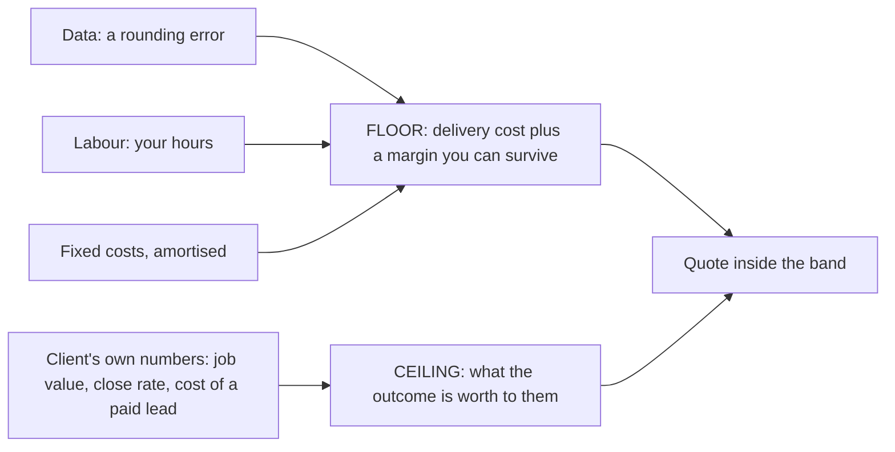

# Margin, pricing, and building a price book

Data is a rounding error, labour is the business, and the shape you sell in prices your risk as much as your work. What is left is the question of where the money actually comes from.

## Where the margin actually is

Four levers, in descending order of how much they move:

1. **Access.** A connected client's data is free; an unconnected book of business is the expensive way to run this.
2. **Hours per client.** Automate assembly, standardise the cycle, refuse bespoke report formats. The most room is here.
3. **Retention.** Onboarding repays around month three, which makes month-four churn the most expensive event in your accounts.
4. **Request discipline and cadence.** Small in dollars for one client, structural across a hundred.

And the honest conclusion, which is not a lever at all: **the margin is not in reselling data.** The data is cents, and any tool the client buys draws the same map you would show them.

What they cannot do is decide what the map means, choose the three things worth doing next, and stand behind that choice in writing next month. That is what a retainer buys, and why [reporting to a client](../reporting-to-a-client/index.md) is an operating chapter rather than a formatting one.

### Price between a floor and a ceiling

**So price from the client's side with a floor on your own.** The floor is delivery cost plus a margin you can survive. The ceiling is what the outcome is worth to them, computable from numbers *they already have*: average job value, close rate on inbound calls, and what a lead costs them in paid channels.

If a plumber's average job is $400 at a 30% close rate (an example — use their real figures), each extra call is worth about $120, so ten a month is a $1,200 ceiling. Quote inside that band and the conversation is about evidence rather than price.

*Both ends are computed, and neither is copied from a competitor. If the floor lands above the ceiling, that is a finding — see Lab 30.3.*

## Labs

### Lab 30.1 — Cost a client-month, and find which line dominates

> **Lab** · Where: a spreadsheet, plus [what the Places API will and will not give you](../../05-reference/what-places-returns.md) · Cost: **free** · Time: ~30 min
>
> You need: your tracked keyword set (Lab 8.2) and tracked competitor set (Lab 16.1), so the counts are real rather than imagined.

1. List every deliverable for one client in one month, specifically: *four weekly 5×5 grid scans*, *ten keyword positions weekly*, *review sync and replies*, *five competitor refreshes*, *ten AI prompts across three engines weekly*, *one report*.
2. Beside each, write the live requests it needs. A grid scan is one per point; a rank check is one per keyword per run; a competitor refresh is one record per competitor.
3. Price each row against Google's current published rates for the calls it needs. Sum the column.
4. Add labour — hours from the table above, at your own rate — and write the data share of delivery cost as a percentage.
5. Repeat for a *prospect audit* on a business you have no access to, then work out how many audits equal one hour of your time.

**What good looks like.** A data share that is a small fraction of delivery cost, and the name of the one deliverable that dominates it — almost always the one you run most often, not the one that looks most expensive per call.

**If it went wrong.** A total under a dollar usually means you counted a grid scan as one request rather than one per point. A data share above a quarter means you are either scanning far more often than the data moves, or you have not counted your own hours honestly.

**What you just learned.** Which line your business actually runs on. Almost everyone entering this trade optimises the data bill because it arrives as an invoice, and almost nobody optimises the hours, which is where the money goes. Cadence — how often you re-measure — moves your data cost far more than any other choice, and it is the one you can change this afternoon.

### Lab 30.2 — Time the cycle, not the tooling

> **Lab** · Where: **Overview**, **Rankings**, **Reviews**, **Competitors** (`/b/{businessId}/…`) · Cost: **free** · Time: ~45 min
>
> You need: [Lab 17.3](../../02-core-practice/did-it-work/index.md), so you have assembled a report once and know the steps.

1. Start a timer. Everything here reads stored data — press no refresh button. Note elapsed minutes at the end of every step.
2. **Overview**: read the profile score, the action plan and the review momentum card.
3. **Rankings**: read current positions and the latest grid snapshot, then write the one-sentence movement verdict you would put in a report.
4. **Reviews**: read every review since the last cycle and draft — in a text file, not in the app — the replies you would sign. This block will be the largest, and that is the finding.
5. **Competitors**: read the comparison, note what changed, then write the report paragraph you would send.
6. Total the blocks and multiply by your hourly rate. Then check the credit balance at the bottom of the sidebar: unchanged, because reading stored data is free ([how the labs work](../../00-start-here/how-the-labs-work.md)).

**What good looks like.** A per-client-month hours figure with your name on it, broken into blocks, where the largest block is human writing rather than machine fetching.

**If it went wrong.** You finished in fifteen minutes — you skimmed instead of producing what a client would receive. The number is only useful if the output is one you would actually send.

**What you just learned.** Delivery cost is dominated by the blocks a machine cannot finish for you. Which is also the honest answer to "can this be fully automated": the assembly, yes; the sentences a client pays for, no.

### Lab 30.3 — Build a price book you can defend

> **Lab** · Where: your browser and a spreadsheet · Cost: **free** · Time: ~45 min
>
> You need: Labs 30.1 and 30.2, so you know your floor.

1. Open the published pricing pages of six things you might resell or depend on: rank tracking, a citation service, a review-request tool, a reporting tool, hosting, one paid directory listing. Record price, unit (per location? per user? per month?), date checked, and URL.
2. Find three agencies in your own market that publish prices. Many will not — record that, because opacity is the norm and it is why buyers cannot compare.
3. Ask one business owner what they pay for anything marketing-adjacent and what they think they get. One real answer beats an industry average.
4. Build three columns for one deliverable — say a managed month for one location: **floor** (data plus labour from Labs 30.1 and 30.2, plus a share of fixed costs), **market** (what you could find published), **ceiling** (the client-side arithmetic at the end of this chapter, with a real business's numbers).
5. Write your price, and beneath it the sentence you will say when someone asks why it is not cheaper. Then compute break-even: fixed monthly costs divided by margin per client, and how many months at your realistic sales rate that takes.

**What good looks like.** A dated table where every number has a source you could show a client, and a break-even count that is a target rather than a hope. "Most of this market does not publish prices" is a legitimate row.

**If it went wrong.** Your floor is above your ceiling — a genuine result, meaning the segment is too small, your hours per client are too high, or you are selling something nobody values. Better discovered in a spreadsheet than in month four.

**What you just learned.** A defensible price is assembled from three independent numbers, not copied from a competitor — and the ceiling always comes from the client's economics, never from yours.

## Common mistakes

**Pricing as a markup on the data bill.** It feels rigorous and prices your labour at zero. When data is a few per cent of delivery cost, "50% margin on cost" is a loss dressed as discipline.

**Buying a fetch that stored data already answers.** The most common way a beginner spends many times what a competent operator spends for the same insight. Read the timestamp on the card before pressing anything.

**Quoting a retainer with no minimum term.** Onboarding repays around month three; a client who leaves at month two was a loss however well you served them, and the fix is contractual, not operational.

**Treating free owner data as free work.** The connection costs nothing to call and is worth more than everything else combined. Never obtaining it because "the owner will get to it" is the expensive scenario — not the API bill.

## Check yourself

Answer with your own spreadsheets open, not in the abstract.

1. **What does one month of your standard deliverable cost in data, to the nearest dollar, and which line dominates it?** If it is not a number you computed in Lab 30.1, you are guessing.
2. **A competitor charges half your price. Name two cost structures that let them do that profitably, and one that does not.** (Fewer hours through automation; a cheaper request design. Not: buying the same data more cheaply — the list price is the list price.)
3. **Which of your deliverables survive a 10× rise in Google's data prices?** Anything on the free tier and on owner access barely notices; anything built on rich rows at every grid point becomes a different business.
4. **A client asks why they should pay you rather than buy the tool themselves. Answer without mentioning data access**, because they can buy that. What is left is the honest product.
5. **What is your break-even client count, and how many months does it take at your current sales rate?** If you cannot answer, you do not yet know whether this is a business or a hobby with invoices.

---

**Next:** [Staying current →](../staying-current/index.md)
