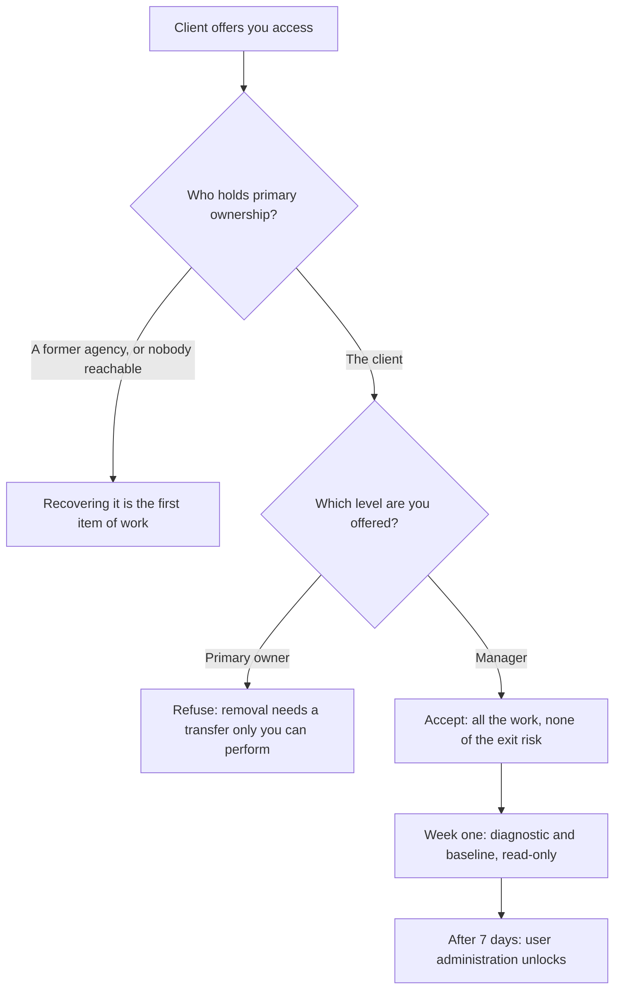

# What you inherit with a client

A client grants you access to their Google Business Profile. Three things arrive in that moment and only one of them is access.

The second is a history you did not make and are now answerable for. The third is a set of duties — written down, dated, enforceable, and read by almost nobody in this industry.

This is the least glamorous chapter in Part IV and the one that decides whether doing this for money is a business or a slowly accumulating liability.

> **Our reading, not legal advice.** Every rule below is quoted verbatim with its source and that source's date, so you can check it yourself. The interpretation after each quote is ours. If money or a licence depends on the answer, ask a lawyer, not a manual.

## The moment you become a "third party"

Google's Business Profile APIs policies divide the world into the merchant who owns a listing and the tools that act on their behalf. The instant you manage a profile for someone else, you are on the second side of that line.

> "You can only use the Business Profile APIs to create, manage, and report on business listings that you either own or are authorized to manage on behalf of the business owner, or to develop tools for end-clients to similarly manage their listings."
>
> — Business Profile APIs policies, *General API policies*. Page stamped **last updated 2025-08-28 UTC**; re-read 2026-07-27.

**Work through a tool the merchant signed into themselves** and the vendor carries the API-side obligations — scopes, token handling, storage limits — while you carry the client-side ones: authorization, notice, a clean exit.

**Build your own integration**, the instinct of most developers who reach this chapter, and **you carry both**.

Editing by hand in a browser puts you outside the *API* policies quoted here, but not outside the profile terms and representation guidelines that govern the listing itself *(inference — Google publishes no single document stating this)*.

## Ask for the right level of access

Most onboarding damage happens in the first ten minutes, when someone says "just make me the owner, it's easier". It is not easier.

> "As the owner, you have full control over the profile. You can add or remove users, manage profile info, and even delete the profile."
>
> "Managers, formerly known as 'site managers,' have mostly the same access to the profile as owners. The only exception is they can't add or remove users or remove the profile."
>
> — *Manage your Business Profile owners & managers*, Google Business Profile Help. Retrieved 2026-07-27.

| Can they… | Owner | Manager |
| --- | --- | --- |
| Manage profile info | yes | yes |
| Add or remove users | yes | no |
| Delete or remove the profile | yes | no |

**Ask for Manager.** You can do every piece of work in this manual as a manager. What you cannot do is delete the profile or remove the client from their own listing — exactly the power you should not want.

It also lets the client remove you in one click when the engagement ends, and an exit that depends on your cooperation is a bad exit even when you are trustworthy: it fails when you are unreachable, ill, or out of business.

**Primary ownership is the version to refuse.** A primary owner cannot simply be removed, ownership has to be transferred first, and offboarding becomes a task only you can perform. If a client's previous agency holds primary ownership, that is the first item of work.

*Read the "What you unlock" list as a duty list rather than a feature list. Every line is something you gain the power to see or change on someone else's business — eighteen months of their performance data, their complete review history, the ability to write to their live listing. The four obligations in the next section all follow from that panel, and they attach the moment it is dismissed.*

Then there is a clock:

> "When you become a profile owner or manager, you have to wait 7 days before you can manage some profile features."
>
> — *Manage your Business Profile owners & managers*, Google Business Profile Help. Retrieved 2026-07-27.

The same page lists what is withheld inside that window:

- deleting or undeleting the profile
- removing other owners or managers
- transferring primary ownership

Ordinary field editing is not on that list, which is the basis for treating it as unaffected — Google says "some profile features" and does not claim the list is exhaustive *(inference)*.

So: get access on day one, spend week one on the diagnostic and the baseline — read-only work anyway — and schedule anything touching user administration after the clock expires. [The ninety-day plan](../the-ninety-day-plan/index.md) assumes that shape.

### When the client cannot grant access

Sometimes nobody at the business can get in: a former employee verified the listing, an agency claimed it in 2019 and folded.

The documented route is slower and less certain than clients expect.

> "The current profile owner is then notified by email and has 3 days to respond."
>
> "If you don't get a response after 3 days, you may have the option to claim the profile."
>
> "The option to claim a profile isn't always available."
>
> — *Request ownership of a Business Profile*, Google Business Profile Help. Retrieved 2026-07-27.

Read the third quote as carefully as the first two: recovery can fail, and it can fail after weeks. Price it as its own piece of work with an honest "this may not succeed" attached, and never put ranking commitments on a timeline that depends on it.

---

**Next:** [The four duties, and the history you inherit →](./duties-and-history.md)
