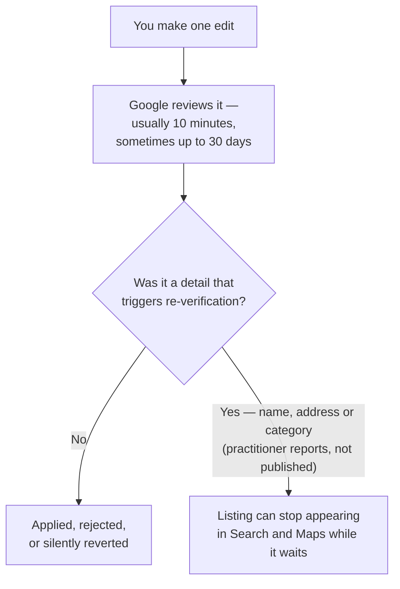

# What you are liable for, and how to document it

The duties are what you owe. This is what you are exposed to from the moment you hold access, and the labs that turn an inherited account into a documented one.

## What you are liable for now

- **Every edit publishes to a live listing.** Google reviews edits before they appear, and can reject or silently revert one. On timing Google is explicit: *"Edits usually take up to 10 minutes to review, but sometimes it can take up to 30 days"* (*Understand what happens to your Business Profile edits*, retrieved 2026-07-27). Plan for minutes; be able to survive weeks.
- **Some edits can pull the listing back into verification,** and a listing awaiting re-verification can stop appearing in Search and Maps. Google states that a request for extra information "is likely because some of your business details were recently updated" — but it does not publish *which* details.
  - **Open question:** practitioner reports converge on name, address and primary category; that list is second-hand, so treat it as a working assumption rather than a rule ([suspensions and reinstatement](../../03-advanced/suspensions-and-reinstatement/index.md)).
- **A published reply is public and effectively permanent.** Editing it later does not un-say it, and it must comply with Google's prohibited and restricted content policies.
- **Attribution follows the data into your deliverables.** Google-sourced content shown to a client carries an attribution requirement; white-labelling a report does not remove it.
- **Your client's behaviour becomes your operational problem.** If they gate reviews or stuff keywords into the business name while you hold manager access, you are the one managing the profile when it is suspended.
- **You still cannot promise a ranking**, and inheriting a client is where the pressure to promise one is highest, because the previous provider probably did. [What the work costs](../what-the-work-costs/index.md) is the honest version of that conversation.

The first two bullets compound, and that is the part worth holding in your head before you touch an inherited profile:

*Which details trigger the right-hand branch is not published — the list everyone quotes is second-hand. That uncertainty is the reason the inventory below comes before any fix: on a client you met last week, you cannot yet tell which edits are cheap.*

## Labs

### Lab 29.1 — Build the inheritance inventory

> **Lab** · Where: **Overview**, **Profile**, **Website** (`/b/{businessId}/overview`, `/profile`, `/website`) · Cost: **free** · Time: ~25 min
>
> You need: the business added to your portfolio (Lab 0.3), ideally the baseline from [Lab 7.1](../../02-core-practice/analyzing-business-visibility/index.md).

1. Open **Overview** and press no refresh button — everything here is stored, and every refresh control fetches from Google and is priced. Write down the "Synced" stamp in the header: that is how old your picture is.
2. Write the access row: who is primary owner, who are the owners, who are the managers, what level you hold. If you cannot answer all four from the client's Business Profile, that is your first finding.
3. Open **Profile** and go field by field — name, category, hours, phone, website, description, attributes — marking each *inherited as-is*, *known wrong*, or *unknown*. Fix nothing yet.
4. Open **Website**. Record the domain, and beside it who controls the registrar, the DNS, the CMS and the Search Console property. "Unknown" is a legitimate entry and also a task.
5. Add two rows: the disciplinary record (ever suspended, ever re-verified, any name/address/category change in twelve months, and how you know), and how reviews are currently solicited, in the client's own words.
6. Save it with the date in the filename, beside your baseline documents.

**What good looks like.** One dated page with at least three honest *unknown* entries. An inventory with no unknowns on a client you met last week is a fiction.

**If it went wrong.** Owner-only fields are invisible because the profile is not connected — record that as the inventory's first line rather than guessing values. You caught yourself fixing things while reading: stop, and note that the baseline is now contaminated.

**What you just learned.** Inheriting is a data-collection problem before it is an SEO problem, and the entries that matter most are the ones you marked unknown.

### Lab 29.2 — Take ownership of the replies you did not write

> **Lab** · Where: **Reviews** (`/b/{businessId}/reviews`) · Cost: **paid** · Time: ~20 min
>
> You need: Lab 29.1. Full value needs the Business Profile connected; without it you get the small recent public sample instead of the history.

1. Press **Sync reviews** in the page header. Connected, this pulls the owner review history; unconnected, only the handful of recent reviews public data exposes. Note which case you are in — it changes what this lab can prove.
2. In the filter bar, choose the **Answered** tab and leave the sort on **Newest**. These replies are already live under your client's name. (The filters live in the URL, so whatever view you end up with is a link you can send.)

*Both steps are here. **Sync reviews** is step 1, in the header beside **Request review**; the **Full review history** badge is how you tell you are on the connected path rather than the five-review public sample, which is the thing step 1 asks you to note. Step 2 is the tab strip — **Answered** is the set already published under your client's name, and it is the only tab that matters for this lab. The amber banner is the app telling you the age of what you are reading before you draw conclusions from it.*
3. Read every one. Flag any that name or describe an individual customer, dispute the facts of a complaint, disclose an order or account number, promise compensation, or read as sarcastic.
4. For each flagged reply write one line: what it says, why it is a risk, and whether you propose to edit it, leave it, or escalate.
5. Take that list to the client before changing anything. Editing an old reply is still publishing publicly, which is what the acknowledgement gate on the publish step is for.
6. Switch to **Unanswered**, sorted by **Lowest rating**. That is your actual queue, and its length belongs in the kickoff report.

**What good looks like.** A short list of flagged legacy replies with a proposed action each, plus a count of unanswered reviews and the date of the oldest.

**If it went wrong.** The **Answered** tab is nearly empty on a business you know has replies — you are on the unconnected path reading a small recent sample, not the history. Say that in the report rather than concluding the previous provider never replied.

**What you just learned.** Removing a person from a profile does not remove their words from it. Every published reply is a permanent statement by the business, which is why authorization is a thing to obtain rather than a box to clear.

### Lab 29.3 — Rehearse the exit

> **Lab** · Where: your own documents, plus **Overview** (`/b/{businessId}/overview`) · Cost: **free** · Time: ~15 min
>
> You need: Labs 29.1 and 29.2.

1. Write the offboarding pack as a numbered list in execution order. At minimum:
   - the client removes your user from their Business Profile;
   - the client revokes any connected app's access from their own Google Account permissions;
   - you stop scheduled work;
   - you delete or return the stored data;
   - you hand over the baseline, the dated exports and the change log.
2. Put a target on it inside seven business days, and write that target into your contract template beside the sentence that access is returned regardless of any outstanding invoice.
3. Verify you can find each control before you need it. In the app, open the **⋮** actions menu at the right-hand end of the overview header — past **Refresh all** and the reports menu — and read the **Remove business** confirmation: it permanently deletes that business's rankings, reviews and competitors, and it cannot be undone. Then press **Cancel**. Do not run it on a live client.
4. List by name what the client keeps: the dated baseline, every report you generated, the change log, the Lab 29.1 inventory. That list is what "regain exclusive control" looks like done well.

**What good looks like.** A one-page checklist you could execute in an afternoon, with a named owner per step and no step only you can perform.

**If it went wrong.** A step requires you personally — a design flaw in the engagement, most often caused by accepting primary ownership. Fix it now, not at the end.

**What you just learned.** The exit is a feature of the engagement, designed at the start, not an argument at the end. The pack is both your compliance answer and the reason the client's next provider says you were the good one. Doing this without SEOG changes the tools and none of the steps — [doing it without SEOG](../../99-appendix/doing-it-without-seog.md).

## Common mistakes

**Accepting primary ownership because it is one fewer email.** It feels like trust and traps both sides: the client cannot remove you alone, and the exit depends on a transfer only you can perform.

**Treating the OAuth grant as the authorization.** The technical connection proves the client clicked a button. The policy asks for permission to act for them — and a fully automated review responder fails "prior specific and express consent" no matter how good the drafting model is.

**Fixing during the audit.** Especially tempting on an inherited profile, where the defects are visible and someone else made them. Every fix made before the baseline is frozen is a result you cannot claim later, and a change you may not be able to undo once the stored previous value ages out.

**Planning the archive you are not allowed to keep.** "A complete permanent history of your Google data" is the pitch the storage clause is written most unconditionally against. Sell your own measurements and your delivered documents instead — those you can keep, and they are the more defensible product anyway.

## Check yourself

Answer against a real business you manage or want to manage, not in the abstract.

1. **Name your access level on the profile, and every other owner and manager on it.** If you cannot, Lab 29.1 is not done.
2. **The client emails at 5pm on Friday to end the engagement. Write the steps, in order, with a completion date each.** Every step should be executable by them or by you, and none should need both.
3. **Which duties apply when your tool publishes a reply at 2am to a review that arrived overnight?** At least three: authorization first, the consent standard on anything automated, and notice to the client within 48 hours.
4. **What may you still hold about this client in two months, and what must have gone?** The distinction to reach is derived-and-generated versus stored Google content; the mechanism is in [storing Google data legally](../../05-reference/storing-google-data-legally.md).
5. **You inherit a 4.7-rated profile and a review tablet in reception that routes anything under four stars to a private feedback form. What do you do first, and what do you put in writing?**

---

**Next:** [What the work costs →](../what-the-work-costs/index.md)
