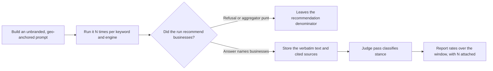

# AI engine probe recipes

Entries for constructing, running and recording a probe that asks an AI engine a local question and records whether a business is named. Each entry stands alone.

**Scope:** assistant-style engines reached through a vendor API.

- Google's Gemini with search grounding
- OpenAI's Responses API with the `web_search` tool
- Anthropic's Messages API with the server-side web-search tool

**Out of scope:** capturing a Google SERP AI Overview, which is a different surface measured a different way — see [LSM-AI-33](#lsm-ai-33--an-assistant-probe-cannot-tell-you-whether-google-rendered-an-ai-overview).

Where an entry cites a working implementation, that is SEOG's; every probe below runs against the vendor APIs directly and needs no tooling from anyone.

The record format these recipes produce is specified in [the AI visibility record schema](../99-appendix/ai-visibility-record-schema.md). Verdict vocabulary is defined in [how to read this reference](./how-to-read-this-reference.md).

The pipeline these entries describe, end to end:



| ID | Claim | Verdict |
| --- | --- | --- |
| [LSM-AI-11](#lsm-ai-11--an-assistant-api-has-no-location-parameter--the-coordinate-goes-in-the-prompt-text) | An assistant API has no location parameter — the coordinate goes in the prompt text | WORKS |
| [LSM-AI-12](#lsm-ai-12--the-default-probe-point-is-the-businesss-own-coordinates-which-is-the-most-flattering-point-available) | The default probe point is the business's own coordinates, the most flattering point available | WORKS |
| [LSM-AI-13](#lsm-ai-13--a-prompt-that-names-the-business-cannot-measure-whether-the-business-is-recommended) | A prompt that names the business cannot measure whether it is recommended | NEVER WORKED |
| [LSM-AI-14](#lsm-ai-14--the-prompt-must-demand-named-businesses-and-sources-or-neither-axis-is-measurable) | The prompt must demand named businesses and sources, or neither axis is measurable | WORKS |
| [LSM-AI-15](#lsm-ai-15--whether-moving-the-coordinate-moves-an-assistants-answer-is-unestablished) | Whether moving the coordinate moves an assistant's answer is unestablished | OPEN QUESTION |
| [LSM-AI-16](#lsm-ai-16--one-run-is-a-sample-not-a-measurement) | One run is a sample, not a measurement | WORKS |
| [LSM-AI-17](#lsm-ai-17--report-rates-over-a-rolling-window-per-keywordengine-not-the-latest-answer) | Report rates over a rolling window per keyword×engine, not the latest answer | WORKS |
| [LSM-AI-18](#lsm-ai-18--a-consistency-figure-requires-at-least-two-runs-in-a-cell-single-run-cells-must-be-excluded) | A consistency figure requires ≥2 runs in a cell; single-run cells must be excluded | WORKS |
| [LSM-AI-19](#lsm-ai-19--refusals-and-aggregator-punts-must-leave-the-denominator-not-count-as-a-miss) | Refusals and aggregator punts must leave the denominator, not count as a miss | WORKS |
| [LSM-AI-20](#lsm-ai-20--mention-and-citation-are-independent-axes-and-must-be-recorded-separately) | Mention and citation are independent axes and must be recorded separately | WORKS |
| [LSM-AI-21](#lsm-ai-21--a-boolean-is-not-a-re-auditable-record--store-the-answer-text-verbatim) | A boolean is not a re-auditable record — store the answer text verbatim | WORKS |
| [LSM-AI-22](#lsm-ai-22--substring-self-matching-cannot-separate-you-from-a-similarly-named-business) | Substring self-matching cannot separate you from a similarly named business | NEVER WORKED |
| [LSM-AI-23](#lsm-ai-23--fixture-answers-poison-every-rate-unless-they-are-flagged-at-write-time) | Fixture answers poison every rate unless they are flagged at write time | WORKS |
| [LSM-AI-24](#lsm-ai-24--keyword-matching-misclassifies-hedged-mentions--stance-needs-a-judge-pass) | Keyword matching misclassifies hedged mentions — stance needs a judge pass | WORKS |
| [LSM-AI-25](#lsm-ai-25--an-unparseable-judge-reply-must-store-null-never-a-false) | An unparseable judge reply must store null, never a false | WORKS |
| [LSM-AI-26](#lsm-ai-26--gemini-grounding-chunks-carry-a-redirect-uri-not-the-publishers-url) | Gemini grounding chunks carry a redirect URI, not the publisher's URL | UNDOCUMENTED |
| [LSM-AI-27](#lsm-ai-27--a-too-small-output-token-budget-returns-zero-grounding-metadata-not-an-error) | A too-small output-token budget returns zero grounding metadata, not an error | WORKS |
| [LSM-AI-28](#lsm-ai-28--demanding-json-only-in-a-grounded-gemini-prompt-stops-the-search-tool-engaging) | Demanding JSON-only in a grounded Gemini prompt stops the search tool engaging | WORKS |
| [LSM-AI-29](#lsm-ai-29--gemini-25-splits-a-reply-across-parts--reading-parts0-truncates-it) | Gemini 2.5 splits a reply across `parts` — reading `parts[0]` truncates it | WORKS |
| [LSM-AI-30](#lsm-ai-30--claude-can-end-a-turn-with-stop_reason-refusal-which-is-a-null-not-a-miss) | Claude can end a turn with `stop_reason: refusal`, which is a null, not a miss | WORKS |
| [LSM-AI-31](#lsm-ai-31--claudes-inline-citations-are-a-subset-of-the-pages-it-searched) | Claude's inline citations are a subset of the pages it searched | WORKS |
| [LSM-AI-32](#lsm-ai-32--openai-returns-cited-sources-as-url_citation-annotations-and-bills-web-searches-apart-from-tokens) | OpenAI returns cited sources as `url_citation` annotations and bills web searches apart from tokens | WORKS |
| [LSM-AI-33](#lsm-ai-33--an-assistant-probe-cannot-tell-you-whether-google-rendered-an-ai-overview) | An assistant probe cannot tell you whether Google rendered an AI Overview | NEVER WORKED |
| [LSM-AI-34](#lsm-ai-34--the-api-is-not-the-consumer-app-and-the-size-of-the-gap-is-unmeasured) | The API is not the consumer app, and the size of the gap is unmeasured | OPEN QUESTION |
| [LSM-AI-35](#lsm-ai-35--no-probe-in-this-chapter-establishes-why-an-engine-named-a-business) | No probe in this chapter establishes *why* an engine named a business | OPEN QUESTION |
| [LSM-AI-36](#lsm-ai-36--probe-cost-multiplies-keywords--engines--runs) | Probe cost multiplies keywords × engines × runs | WORKS |

---

## Prompt construction and geo-anchoring

### LSM-AI-11 · An assistant API has no location parameter — the coordinate goes in the prompt text

**Verdict:** WORKS
**Last verified:** 2026-07-27
**Probe:** Read the request bodies for Vertex `generateContent` with `tools: [{ googleSearch: {} }]`, OpenAI `POST /v1/responses` with `tools: [{ type: "web_search" }]`, and Anthropic `messages.create` with the server-side `web_search` tool. None accepts a latitude/longitude, a place ID, or a locale-as-geography field for the local question itself.

**The coordinate is not a parameter.** Places-style APIs take a location bias as a first-class parameter. Assistant APIs do not.

The only anchor available is prose inside the user turn, which means the coordinate is a *hint the model may honour, ignore, or reinterpret* — not a constraint on retrieval.

The template SEOG uses, reproduced verbatim so you can run the same probe by hand:

```text
Someone near latitude {lat}, longitude {lng} asks: "{keyword}".
Recommend the specific local businesses that best answer this, by name, citing your sources.
```

The Google-engine variant differs by one clause — `asks Google's AI assistant:` — which is a framing device, not a routing instruction.

**What to do instead:** Record the coordinate you asked *from* as an input to the run, never as a property of the result. "Gemini named the business when asked from 53.9006, 27.5590" is defensible. "The business is visible in AI answers at that location" is not.

### LSM-AI-12 · The default probe point is the business's own coordinates, which is the most flattering point available

**Verdict:** WORKS
**Last verified:** 2026-07-27
**Probe:** Add a tracked keyword without setting a search location, then read the stored keyword row: its search latitude and longitude are null and the check falls back to the business's own latitude and longitude.

**The obvious default is also the most flattering one.** Every rank-tracking tool has to default the search point to something, and the business's own coordinates are the obvious choice. They are also the single point in the market where the business looks best, for the same reason that checking your own rank standing in your own shop looks good.

For the map pack this is a well-understood distortion. For an assistant probe the distortion is unproven but the asymmetry is the same: you chose the point, and you chose the one with your name on it.

**What to do instead:** Probe from at least one point you did not choose for convenience — the edge of the claimed service area, or the centre of the town the client says they want customers from. Keep the two series separate. Never merge answers from different coordinates into one rate without saying so.

### LSM-AI-13 · A prompt that names the business cannot measure whether the business is recommended

**Verdict:** NEVER WORKED
**Last verified:** 2026-07-27
**Probe:** Run the same question twice against one engine — once unbranded (`who's the best emergency plumber near {area}?`) and once branded (`is {business} a good emergency plumber near {area}?`) — and compare how often the business is named.

**The mechanism is structural rather than empirical.** A branded prompt puts the business name in the context window, and the model's answer is then a comment on a name you supplied. You have measured recall of your own input.

No published A/B is cited here because none is needed to see the problem, and the probe above settles it on your own data in ten minutes.

The same defect appears in a subtler form when the prompt names the *category* the way the business describes itself rather than the way a customer would ask. `artisanal third-wave espresso bar` is a branded prompt wearing a disguise.

**What to do instead:** Probe prompts must be unbranded and customer-phrased. Branded prompts are a legitimate separate exercise — they measure whether the engine knows facts about a business it has been told exists — but their results must never be pooled with unbranded ones.

### LSM-AI-14 · The prompt must demand named businesses and sources, or neither axis is measurable

**Verdict:** WORKS
**Last verified:** 2026-07-27
**Probe:** Ask one engine `what's the best coffee near {lat},{lng}?` and then the same question ending `Recommend the specific local businesses that best answer this, by name, citing your sources.` Compare how many extractable business names and source domains each answer contains.

Without an explicit instruction to name businesses, assistants frequently answer with categories, criteria and advice ("look for somewhere that roasts in-house"). Without an explicit instruction to cite, several engines answer with no source list at all — which makes the citation axis ([LSM-AI-20](#lsm-ai-20--mention-and-citation-are-independent-axes-and-must-be-recorded-separately)) unmeasurable for that run rather than negative.

**What to do instead:** Fix the instruction clause once and never edit it again mid-series. A prompt change resets the series: results before and after are not comparable, and the change date belongs in the record.

### LSM-AI-15 · Whether moving the coordinate moves an assistant's answer is unestablished

**Verdict:** OPEN QUESTION
**Last verified:** 2026-07-27 — open, no controlled probe run
**Probe (the one that would settle it):** Pick one keyword and one engine. Choose two coordinates far enough apart to sit in different local markets. Run N ≥ 10 fresh sessions at each. Compare mention rates *against the run-to-run noise floor established by [LSM-AI-16](#lsm-ai-16--one-run-is-a-sample-not-a-measurement)*, not against each other directly.

For the map pack, distance is one of the three components Google itself names — relevance, distance and prominence — and its effect is enormous at short range.

For an assistant answering from a web-search tool, no such mechanism is documented, and the coordinate reaches the model only as prose ([LSM-AI-11](#lsm-ai-11--an-assistant-api-has-no-location-parameter--the-coordinate-goes-in-the-prompt-text)). Both "the coordinate is decisive" and "the coordinate is nearly inert" are consistent with what is publicly known.

The trap is that this question looks trivially answerable. Two runs at two coordinates will differ, because two runs at *one* coordinate differ. Anyone showing you an AI geo-grid without a stated noise floor has measured nothing.

**What to do instead:** Do not sell AI-visibility-by-location as a finding. Report AI visibility per market you actually probed, with the run count attached, and treat the between-market comparison as a hypothesis until the noise floor is published alongside it.

---

## Sampling and run counts

### LSM-AI-16 · One run is a sample, not a measurement

**Verdict:** WORKS
**Last verified:** 2026-07-27
**Probe:** Same prompt, same engine, five fresh sessions with no shared conversation history. Record the ordered list of business names from each. Count how many pairs are identical.

Reruns of an identical prompt routinely return different businesses, different orderings and different source domains.

**The published measurement to cite is SparkToro's**, run by Rand Fishkin with Patrick O'Donnell of Gumshoe.ai, published 2026-01-28 on data collected in November and December 2025: 2,961 prompt runs, 12 prompts, roughly 600 volunteers, across ChatGPT, Claude and Google's AI Overviews and AI Mode.

Their headline is that "there's a &lt;1 in 100 chance that ChatGPT or Google's AI, if asked 100X, will give you the same list of brands in any two responses", with identical lists *in identical order* nearer 1 in 1,000.

Two caveats travel with it:

- the co-author sells AI-visibility tracking;
- the prompts were brand and product prompts rather than local ones.

The direction is reproducible on your own data in fifteen minutes, which is the point of the probe above.

**That study also reports the constructive half, and it is the uncomfortable one for tooling.** They found a brand's *visibility percentage* stable enough to track only when measured across **60 to 100+ runs**, and explicitly reject ranking position in AI answers as a metric.

Any product reporting an AI-visibility rate from a handful of runs per cell — including the one described in this chapter, which uses five ([LSM-AI-17](#lsm-ai-17--report-rates-over-a-rolling-window-per-keywordengine-not-the-latest-answer)) — is reporting a noisier number than that research says is trustworthy. Say so rather than letting a rate imply a precision it does not have.

This is also why a screenshot of an assistant naming a client is worth nothing as evidence and quite a lot as a sales prop. It is a sample of one from a distribution that is now partly characterised, and characterised as very wide.

**What to do instead:** Never publish, report or bill against a single run. Every claim is a rate over a stated number of runs, or it is an anecdote — and the run count belongs next to the rate, because at small N the rate is mostly noise.

### LSM-AI-17 · Report rates over a rolling window per keyword×engine, not the latest answer

**Verdict:** WORKS
**Last verified:** 2026-07-27
**Probe:** Read the implementation's window query: a `ROW_NUMBER() OVER (PARTITION BY keywordId, engine ORDER BY capturedAt DESC)` filtered to `rn <= N`, with fixture rows excluded in the same `WHERE` clause. N is 5 in this implementation, and the page reports N alongside the rates.

A "latest check" view flips a business between visible and invisible on every run and teaches clients that the tool is broken. The unit of analysis is the *cell* — one keyword against one engine — and the metric is a rate across the last N runs in that cell.

Two honest qualifications.

**N = 5 is a compromise, not a sufficient sample.** The only published measurement of rerun variance puts a stable visibility percentage at 60–100+ runs ([LSM-AI-16](#lsm-ai-16--one-run-is-a-sample-not-a-measurement)), so five runs buys most of the improvement over one run and nothing like statistical comfort.

**Not every view uses the window.** The same implementation's per-keyword presence matrix shows the *latest* snapshot per cell, because a matrix cell has to show one state. A rate and a matrix on the same page can therefore disagree, and a reader who has not been told which is which will assume the tool is broken.

The metric definitions, so a competing implementation can be checked against these:

| Metric | Numerator | Denominator |
| --- | --- | --- |
| Mention rate | Runs where the business is named in the answer text **or** its own domain is among the cited sources | All live runs in the window |
| Citation rate | Runs where the business's own domain is among the cited sources | All live runs in the window |
| Consistency | Cells whose runs all agree (all mentioned, or all not) | Cells with ≥ 2 runs in the window |
| Recommendation rate | Recommending answers that place the business | Answers judged to recommend businesses at all |
| Top-pick rate | Recommending answers where the business is first | Answers judged to recommend businesses at all |
| Average position | Sum of the business's positions | Recommending answers that place the business |

Note that top-pick rate and recommendation rate share a denominator, and average position does not. Mixing them is the most common arithmetic error in this area.

**What to do instead:** Publish N with every rate. "Mentioned in 3 of 5 Gemini runs" is a measurement; "60% AI visibility" is a number with the measurement removed.

### LSM-AI-18 · A consistency figure requires at least two runs in a cell; single-run cells must be excluded

**Verdict:** WORKS
**Last verified:** 2026-07-02
**Probe:** Compute consistency over a window containing one cell with two agreeing runs, one cell with two disagreeing runs, and one cell with a single run. The correct result is 1/2, not 2/3.

Consistency is the share of multi-run cells whose runs agree. A cell with one run agrees with itself trivially, and counting it inflates consistency exactly when you have the least data — a new keyword, a newly connected engine, the first week of an engagement.

**What to do instead:** Exclude single-run cells from the denominator and show the excluded count. A consistency figure with no run counts beside it is unfalsifiable.

### LSM-AI-19 · Refusals and aggregator punts must leave the denominator, not count as a miss

**Verdict:** WORKS
**Last verified:** 2026-07-02
**Probe:** Ask an engine a local question it declines to answer with specific businesses — it answers generically, or says to check Yelp or TripAdvisor. Record what your pipeline does with that run.

Three outcomes look alike to naive tooling and are not alike:

| Outcome | What happened | How it counts |
| --- | --- | --- |
| Recommended others | The answer names businesses; yours is not among them | A miss — in the denominator and the numerator's complement |
| Punt | The answer names only platforms and directories | Not a recommendation — leaves the recommendation denominator |
| Refusal | The engine declines, or answers generically with no businesses | Not a recommendation — leaves the recommendation denominator |

Counting punts and refusals as misses makes a business look invisible when the engine simply was not recommending anybody that day. Counting them as wins is worse. Both are the same error: treating "no measurement" as a measurement.

How often an engine punts is itself a finding worth recording per engine and per keyword — it is the clearest signal that a query type is not yet being answered generatively at all.

**What to do instead:** Store the outcome class, not a boolean. Presence rates may use all live runs; recommendation rates use only runs judged to recommend businesses.

---

## Recording a result

### LSM-AI-20 · Mention and citation are independent axes and must be recorded separately

**Verdict:** WORKS
**Last verified:** 2026-07-02
**Probe:** For one live answer, check two things independently — is the business name a substring of the answer text, and is the business's own domain among the answer's cited sources. Both, either, or neither can be true.

Being named in prose and being cited as a source are different achievements. An engine can recommend a business enthusiastically while citing only Yelp and a local newspaper, and it can cite a business's own site while recommending someone else.

Citation is the stronger signal of the two, because it means the engine's retrieval reached the business's own content rather than a third party's description of it.

A useful convenience — "mentioned" defined as named **or** own-domain-cited — is fine for a headline rate, provided the two components are stored separately and can be read apart. Once collapsed at write time, they cannot be recovered.

**What to do instead:** Store `named`, `domainCited` and the ordered source list per run. Derive the headline number at read time.

### LSM-AI-21 · A boolean is not a re-auditable record — store the answer text verbatim

**Verdict:** WORKS
**Last verified:** 2026-07-02
**Probe:** Take any stored run that recorded only "not mentioned" and try to answer, six weeks later, whether the engine recommended a competitor, punted, or refused. It cannot be done.

The minimum record per run, which the [record schema](../99-appendix/ai-visibility-record-schema.md) formalises:

| Field | Why it must be stored |
| --- | --- |
| Timestamp | Every rate is a rate as of a date |
| Engine and provider | "Gemini" and "the Vertex grounded call" are not interchangeable claims |
| Keyword, verbatim | The tracked phrase, not a tidied version |
| Coordinate probed from | See [LSM-AI-11](#lsm-ai-11--an-assistant-api-has-no-location-parameter--the-coordinate-goes-in-the-prompt-text) |
| Prompt template version | A prompt edit resets the series |
| Answer text, verbatim | The only field that makes every other field re-derivable |
| Cited sources, ordered | Domain plus title, in the order the engine gave them |
| Named / domain-cited flags | Cheap to store, expensive to recompute from text later |
| Judge output, or null | See [LSM-AI-25](#lsm-ai-25--an-unparseable-judge-reply-must-store-null-never-a-false) |
| Live-or-fixture flag | See [LSM-AI-23](#lsm-ai-23--fixture-answers-poison-every-rate-unless-they-are-flagged-at-write-time) |

Storing the answer text also lets a client read what the machine actually said about their market, which is usually the single most persuasive artefact in an AI-visibility report.

**What to do instead:** Treat the stored answer as the record and every metric as a projection of it. If a metric definition changes, you can recompute history. If you stored booleans, you cannot.

### LSM-AI-22 · Substring self-matching cannot separate you from a similarly named business

**Verdict:** NEVER WORKED
**Last verified:** 2026-07-27
**Probe:** Run bidirectional containment matching — `candidate.includes(self) || self.includes(candidate)` on lowercased, trimmed names — against a business called *Coffee* in a market containing *Coffee Republic*, or *Bella* in a market containing *Bella Italia*. Both match.

Bidirectional containment is the standard cheap self-match, and SEOG uses it. It is right often enough to ship and wrong in a specific, predictable direction: short generic names, franchise-adjacent names, and names that are a common word.

The failure is silent. It inflates mention rate, inflates recommendation rate, and produces the most flattering possible error — which is exactly the error a client will never catch and a competitor will.

**What to do instead:** For any business whose name is a common word or a substring of a nearby brand, verify self-matches by hand against the stored answer text before reporting, and prefer domain matching ([LSM-AI-20](#lsm-ai-20--mention-and-citation-are-independent-axes-and-must-be-recorded-separately)), which does not have this failure mode. Where a tool cannot be corrected, say in the report that the mention rate is an upper bound.

### LSM-AI-23 · Fixture answers poison every rate unless they are flagged at write time

**Verdict:** WORKS
**Last verified:** 2026-07-02
**Probe:** Run a probe pipeline with a provider credential missing. A well-built harness falls back to a deterministic fixture so the interface stays functional; check whether that fixture row is distinguishable from a live one after the fact.

**This is the most expensive self-inflicted wound in AI-visibility tooling**, and it was a real incident in the implementation described here.

Fixture rows *were* flagged — and the headline rates counted them anyway, alongside live rows created before the provider was correctly configured. Rows written on 2026-06-11 were still shaping the numbers on 2026-07-02, when the complaint arrived as "this page only shows test data".

Flagging is necessary and not sufficient. Three rules make it survivable:

1. Flag the row at write time with which provider actually produced it.
2. Exclude flagged rows from every *rate*, not merely badge them in the interface.
3. Make a batch action run only the engines that are actually configured, or every batch mints fresh fixture rows that look like coverage.

**What to do instead:** Any AI-visibility number you inherit from another tool is unverified until you can see which runs were live. Ask how unconfigured engines behave. "It shows sample data" and "it shows sample data that is counted" are different products.

### LSM-AI-24 · Keyword matching misclassifies hedged mentions — stance needs a judge pass

**Verdict:** WORKS
**Last verified:** 2026-07-02
**Probe:** Take an answer containing `X is a popular option, though reviews are mixed` and score it two ways: a superlative-keyword scan, and a second-model extraction pass asked to classify stance. The keyword scan returns either a false positive (on "popular") or a false negative (no superlative), depending on its word list.

Presence is extractable with string matching. *Stance* is not: "recommended", "listed neutrally", "hedged" and "advised against" are distinctions in natural language, and a business being mentioned as the cheap-but-inconsistent option is not a win.

A judge pass — a second, plain (non-grounded) model call over the stored answer text — extracts the ordered entity list with a stance and a kind per entity. The output shape worth copying:

```json
{
  "isRecommendation": true,
  "entities": [
    { "name": "...", "kind": "local | chain | aggregator | unknown", "stance": "recommended | listed | hedged | negative" }
  ]
}
```

`unknown` is not decoration: a model that returns a `kind` outside the enumeration must land somewhere, and silently coercing it to `local` would inflate the competitive set with directories.

The parser in the implementation described here maps any unrecognised `kind` to `unknown` and any unrecognised `stance` to `listed`, which is the conservative direction for both.

`kind` matters because it separates a real competitor from an aggregator punt ([LSM-AI-19](#lsm-ai-19--refusals-and-aggregator-punts-must-leave-the-denominator-not-count-as-a-miss)), and the non-self entities are a competitive set discovered for free — the businesses the engine reaches for in this market, which is not always the same list as the map pack's.

**What to do instead:** Judge the stored text, not the live call, so the judge can be re-run with a better prompt over history. Keep a keyless heuristic as a fallback — and record which path produced each row.

That last clause is the one to actually implement: the implementation described here has the heuristic but stores no field distinguishing a judged row from a heuristic one, which means its stance mix silently blends two instruments of very different quality. Do not copy that part.

### LSM-AI-25 · An unparseable judge reply must store null, never a false

**Verdict:** WORKS
**Last verified:** 2026-07-27
**Probe:** Feed the judge a reply that is prose instead of JSON, or JSON missing the required keys. Check what the pipeline stores, and check separately what the *rate* built on that column then reports.

There are three states, and two of them look like `false`: the answer did not recommend the business, and the judge could not tell you. Collapsing them makes every parse failure count as a miss, so the metric degrades exactly when the model is misbehaving — silently, and in the pessimistic direction.

A judge failure must also never fail the run that produced the answer. The expensive part is the live answer; the judge is a cheap second pass over stored text and can be retried later.

**Where the reference implementation diverges, because it matters.** Its parser does return null on unparseable output, and its rate does exclude nulls from the recommendation denominator — both correct.

But between the two, the service catches the null and substitutes a coarse keyword heuristic, which returns a non-null object with `isRecommendation: true`. So a parse failure is not stored as null there; it is stored as a low-quality judgement that enters the denominator. Null is reached only by a different path — fixture rows and answers with no text.

The prescription below is what the entry recommends; it is not, on this point, a description of what that code does.

**What to do instead:** Store null for unparseable judge output, exclude nulls from the recommendation denominators, and expose the null count.

If you keep a heuristic fallback instead ([LSM-AI-24](#lsm-ai-24--keyword-matching-misclassifies-hedged-mentions--stance-needs-a-judge-pass)), flag those rows so they can be excluded later — an unflagged fallback is indistinguishable from a real judgement, which is the failure this entry exists to prevent. A recommendation rate with an unstated number of unjudged or heuristically-judged runs behind it is not interpretable.

---

## Engine and API behaviour

### LSM-AI-26 · Gemini grounding chunks carry a redirect URI, not the publisher's URL

**Verdict:** UNDOCUMENTED
**Last verified:** 2026-07-02
**Probe:** Call Vertex `generateContent` with `tools: [{ googleSearch: {} }]` on a local question and read `candidates[0].groundingMetadata.groundingChunks[].web`. The `uri` field is a Google-hosted redirect, not the source's own address; the `title` field is what carries the publisher identity, frequently as a bare hostname.

**Any pipeline that extracts cited domains by parsing the hostname out of `uri` will attribute every citation to Google.** The failure is silent.

The working extraction reads `title` and accepts it as a domain only when it looks like a bare hostname — no spaces, ending in a dot-plus-letters TLD. Google does not document this field's contents; one call on your own key confirms it, and it is worth confirming before you build on it.

The consequence of that guard is a real gap, and it should be stated rather than hidden: when a chunk's title is a page headline rather than a hostname, the domain is empty for that source and the citation axis is unmeasurable for it. That is a null, not a zero.

**What to do instead:** Extract cited domains from `title`, keep the raw chunk, and count title-only chunks separately. Do not resolve the redirect URIs in bulk to recover publishers — that is a crawling pattern with its own terms problems, and it is not necessary for a rate.

### LSM-AI-27 · A too-small output-token budget returns zero grounding metadata, not an error

**Verdict:** WORKS
**Last verified:** 2026-07-02
**Probe:** Same grounded Vertex call, twice, on a Gemini 2.5 model. At `maxOutputTokens: 700` the response comes back with `finishReason: MAX_TOKENS`, a heavily truncated answer, and **zero** `groundingChunks`. At `maxOutputTokens: 2000` the same call returns `STOP`, a full answer, and a non-empty list of cited domains. (Earlier versions of this entry gave an exact truncated length and an exact source count from the original run; those were single-run artefacts that would not reproduce, and have been removed rather than left to look like constants.)

**Reasoning comes out of the same budget.** Gemini 2.5 models spend output tokens on internal reasoning *before* the visible reply. A budget sized for the answer alone is consumed before the answer starts, and the grounding metadata never materialises.

Nothing in the response says "your budget was too small" in a form a naive client checks — you get a 200 with an empty source list.

This one is dangerous because it fails in the shape of a finding. An empty source list reads as "the engine cited nobody", which reads as "your competitors are not being cited either", which is a comforting and completely fabricated conclusion.

**What to do instead:** Budget output tokens for reasoning plus answer, and treat `sources.length === 0` on a grounded call as a suspected instrumentation failure until proven otherwise. Check `finishReason` on every run and store it.

### LSM-AI-28 · Demanding JSON-only in a grounded Gemini prompt stops the search tool engaging

**Verdict:** WORKS
**Last verified:** 2026-06-13
**Probe:** Send one grounded Vertex call whose prompt ends "answer ONLY with JSON, nothing else". The model replies with well-formed JSON, commonly a negative result, and **zero** `groundingChunks` — the `googleSearch` tool did not run. The same question asked in natural language returns an answer with real grounding chunks.

Strict output-format instructions and the search tool do not coexist. The model satisfies the format constraint by answering from parameters instead of searching, and the failure is invisible unless you check whether any grounding metadata came back.

**What to do instead:** Split the call in two. Ask the grounded question in natural language, then convert the resulting text to JSON in a second, ungrounded call. Never structure-constrain a retrieval call. As a live detector, assert that grounded calls return a non-empty source list and alarm when they do not.

### LSM-AI-29 · Gemini 2.5 splits a reply across `parts` — reading `parts[0]` truncates it

**Verdict:** WORKS
**Last verified:** 2026-07-02
**Probe:** Make a plain (ungrounded) completion call to a Gemini 2.5 model with a reply long enough to be interesting, and inspect `candidates[0].content.parts`. It can contain several entries; `parts[0].text` is a fragment, not the reply.

A client that reads the first part gets a silently shortened answer. Downstream, that surfaces as judge parse failures and as answers whose stored text does not contain a business name the human tester can plainly see in the vendor's own console.

**What to do instead:** Join every `part`'s text before parsing or storing anything. If stored answers look oddly short or a judge starts failing to parse in bulk, check this before blaming the prompt.

### LSM-AI-30 · Claude can end a turn with `stop_reason: refusal`, which is a null, not a miss

**Verdict:** WORKS
**Last verified:** 2026-07-27
**Probe:** Anthropic Messages API reference and SDK type definitions: `stop_reason` is an enumerated field on the response and `refusal` is one of its values. Not independently probed in the implementation described here — this engine had no credential configured as of 2026-07-02, so the behaviour is documented rather than observed locally.

A refused turn carries no usable answer. Pipelines that read the content blocks without checking `stop_reason` will store an empty or partial answer and count it as a run in which the business was not mentioned.

**What to do instead:** Check `stop_reason` before parsing content, discard refusals from the run rather than storing them as negatives, and record the refusal count per engine — see [LSM-AI-19](#lsm-ai-19--refusals-and-aggregator-punts-must-leave-the-denominator-not-count-as-a-miss).

### LSM-AI-31 · Claude's inline citations are a subset of the pages it searched

**Verdict:** WORKS
**Last verified:** 2026-07-27
**Probe:** Anthropic Messages API response shape with the server-side web-search tool: text blocks carry a `citations` array whose `web_search_result_location` entries have a `url`, while separate `web_search_tool_result` blocks carry the full result set the tool returned. The two lists differ; a model can search ten pages and cite two. Documented shape, not independently probed here.

These are two different claims about a source. An inline citation means the model attributed a statement to that page. A search result means the page was retrieved and possibly ignored.

Falling back to the searched list when the model cited nothing keeps the citation axis populated, at the cost of mixing two signal strengths in one column.

**What to do instead:** Prefer inline citations. If you fall back to the searched set, flag which of the two produced each row, and never present "searched" rows to a client as "the AI cited you".

### LSM-AI-32 · OpenAI returns cited sources as `url_citation` annotations and bills web searches apart from tokens

**Verdict:** WORKS
**Last verified:** 2026-07-27
**Probe:** `POST https://api.openai.com/v1/responses` with `tools: [{ "type": "web_search" }]`. Sources appear as `annotations` of type `url_citation` on `output_text` content parts, each carrying a `url` and often a `title`. Web-search invocations appear as separate `web_search_call` items in `output`. Documented shape plus the implementation's parser; the engine had no credential configured in the implementation as of 2026-07-02.

Two operational consequences.

1. **Sources are attached to text parts** rather than delivered as a top-level list, so a parser that looks for a `sources` field finds nothing and records a citation-free answer.
2. **The tool's search invocations are billed separately from token usage:** the vendors price server-side web search per thousand searches, distinct from input and output tokens.

Audited figures live in [What the Places API will and will not give you](./what-places-returns.md); they move, so read the vendor's current price page before quoting one.

Both OpenAI and Anthropic expose a per-request cap on tool invocations (`max_tool_calls` and the tool's `max_uses` respectively). Uncapped, a single probe can silently make several searches, and a batch of probes multiplies that.

**What to do instead:** Cap tool calls per request so a probe's worst-case cost is knowable in advance, count the `web_search_call` items actually returned, and budget searches as a separate line from tokens.

---

## What this method cannot measure

### LSM-AI-33 · An assistant probe cannot tell you whether Google rendered an AI Overview

**Verdict:** NEVER WORKED
**Last verified:** 2026-07-27
**Probe:** Ask a grounded assistant a local question through its API a dozen times. It answers every time. Then run the same query in a browser a dozen times: an AI Overview appears on some and not others.

**These are two surfaces.** A grounded assistant call is Google's generative answer *to you, through an API*; the AI Overview is a block Google may or may not render on a search results page, chosen by a separate trigger you cannot query.

An assistant that always answers gives you a presence flag that is always true — a field with no information in it.

Because assistants always answer, the only informative axes from this method are the ones inside the answer: named or not, cited or not, recommended or not.

Measuring AI Overview *incidence* requires capturing search result pages, which is a different instrument with different terms-of-service exposure and different costs. Do not present a rate from one as a rate from the other.

**What to do instead:** Report an assistant probe as "Gemini, ChatGPT and Claude were asked N times each and named the business in M of them". Never as "the business appears in X% of AI Overviews". If a stored record carries a presence flag that is always true, drop the column rather than charting it.

### LSM-AI-34 · The API is not the consumer app, and the size of the gap is unmeasured

**Verdict:** OPEN QUESTION
**Last verified:** 2026-07-27 — open, no controlled comparison run
**Probe (the one that would settle it):** Same prompt, same day, same coordinate, N runs through the vendor API and N runs typed into the vendor's own consumer app in a signed-out session. Compare mention rates against the noise floor from [LSM-AI-16](#lsm-ai-16--one-run-is-a-sample-not-a-measurement).

The consumer product wraps the model in several layers:

- an application-level system prompt;
- its own retrieval configuration;
- personalisation;
- conversation memory;
- a location signal derived from the device rather than from your prose.

None of that is reproduced by an API call, and none of it is published *(inference: the gap is asserted from the presence of these layers in the products, not from a measured comparison)*.

An API probe is a defensible, repeatable instrument that measures the model plus its search tool. That is a proxy for what a customer sees, and the proxy error is unknown.

**What to do instead:** Say "measured through the API" in the report, once, in plain words. It costs one sentence and it is the sentence that survives a technically literate client asking how the number was produced.

### LSM-AI-35 · No probe in this chapter establishes *why* an engine named a business

**Verdict:** OPEN QUESTION
**Last verified:** 2026-07-27 — open by construction
**Probe:** There is none. A probe records an outcome; attributing that outcome to a profile field, a review count or a page of website content would require holding everything else constant across an engine you do not control and which returns different answers to identical inputs ([LSM-AI-16](#lsm-ai-16--one-run-is-a-sample-not-a-measurement)).

**Correlational evidence circulates, and some of it is worth reading.** Almost all of it is vendor-published, computed across someone else's sample, with methodology only partly disclosed — and a correlation on another sample is a hypothesis about your business, not a finding about it.

Before repeating any such figure to a client, ask for the query set, the sample size and the date. Most of the time one of the three is missing.

**What would close it:** a controlled intervention on businesses you own or that consented in writing — one change, one holdout group, pre- and post-windows of equal run count on a fixed prompt and coordinate, repeated across enough businesses that the between-business variance is visible.

That is a study, not a probe, and it has to be published with its method before anyone should believe it. No such study is cited here because we have not run one.

**What to do instead:** Structure reporting as "we changed X on date D; here is the mention rate over the window before and the window after, with run counts". That is an honest before-and-after on a noisy instrument. It is not attribution, and a report that claims attribution here is claiming something the method cannot deliver.

---

## Cost and run planning

### LSM-AI-36 · Probe cost multiplies keywords × engines × runs

**Verdict:** WORKS
**Last verified:** 2026-07-27
**Probe:** Count billable calls for one batch. Each keyword × engine pair is one probe call; a windowed rate over N runs per cell is N of them; and each probe may make several tool-based web searches billed apart from tokens ([LSM-AI-32](#lsm-ai-32--openai-returns-cited-sources-as-url_citation-annotations-and-bills-web-searches-apart-from-tokens)), plus a judge call over the stored answer ([LSM-AI-24](#lsm-ai-24--keyword-matching-misclassifies-hedged-mentions--stance-needs-a-judge-pass)).

Ten keywords, three engines and a five-run window is 150 probe calls before a single rate exists, and the same again to refresh it. The multiplication is the whole cost story, and it is why AI-visibility tracking is priced and scheduled differently from rank tracking.

Two structural consequences worth designing around.

1. **Probes should run sequentially rather than in a burst**, so a batch stays polite to the providers and can be abandoned halfway without having already spent everything.
2. **The batch must skip engines that are not configured**, or it spends nothing and produces rows that look like data ([LSM-AI-23](#lsm-ai-23--fixture-answers-poison-every-rate-unless-they-are-flagged-at-write-time)).

In SEOG, a fresh AI answer check is a **paid** action per keyword × engine, and every stored view of the results — the presence matrix, the pillar rates, the cited-sources table — is **free**, because it reads what a previous check stored.

Reading an old probe costs nothing; that asymmetry should shape how often you re-run rather than how often you look.

**What to do instead:** Choose a small tracked set deliberately, fix the window size, and re-probe on a schedule the client is paying for. Probing thirty keywords once is worse than probing six keywords five times, because the first produces thirty anecdotes and the second produces six measurements.

---

**Pairs with:** [AI visibility record schema](../99-appendix/ai-visibility-record-schema.md) · [How AI answers a local question](../01-foundations/how-ai-answers-a-local-question.md) · [The AI visibility method](../03-advanced/ai-visibility.md) · [Changing the AI answer](../03-advanced/changing-the-ai-answer.md) · [The local prompt corpus](../99-appendix/the-local-prompt-corpus.md)
