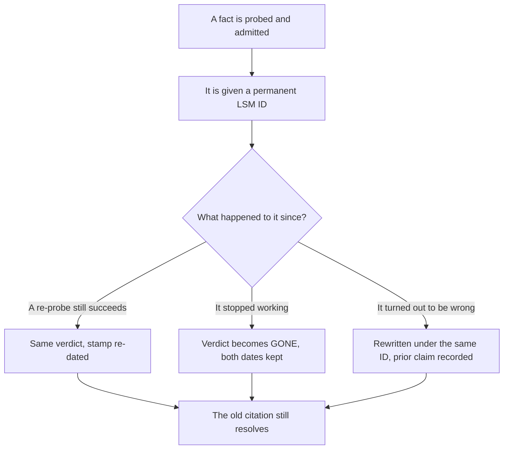

# How to read this reference

Parts I–IV teach. Part V settles arguments. It is a numbered set of facts about the machinery underneath local search — what an API returns, what it refuses, what Google's terms permit you to store, what a reported number actually counts — each carrying the probe that established it and the date that probe last ran.

**No claim about *behaviour* here is asserted from documentation alone.** (Claims about published terms and published prices necessarily are, and those entries carry a `Source` instead of a `Probe` — the distinction is set out below.)

That is not a stylistic preference, it is a response to how this ground behaves:

- **The docs lag the endpoint.** Two of Google's Local Posts validation limits are enforced by the endpoint and absent from the current published reference; they were established by reading the error the API returns, not by reading a page.
- **The docs lag the shutdown.** The questions-and-answers endpoints have returned HTTP 501 since November 2025, and Google's own Q&A change log — dated `Last updated 2025-11-06 UTC` — records the shutdown as having happened on 3 November, three days *after* the fact rather than before it.
- **Third-party guides lag everything.** Guides claiming the Local Posts API was retired in 2022 were still ranking in July 2026, when a call against a live profile returned HTTP 200.

Copying documentation forward is how all three of those survive. Running the call is how you avoid them.

This chapter explains the format. It contains no entries of its own.

## The shape of an entry

Every fact in Part V occupies one heading and looks like this:

```
### LSM-POSTS-07 · Local Posts reject video with HTTP 500     ← permanent ID · the claim in one line

**Verdict:** NEVER WORKED                                     ← one of exactly five
**Last verified:** 2026-07-22                                 ← the date the probe last ran
**Probe:** POST accounts/{a}/locations/{l}/localPosts with    ← how you reproduce it yourself
mediaFormat: VIDEO and a public mp4 sourceUrl

Two or three sentences of what happens and why it matters.

**What to do instead:** the practical consequence.
```

**That block is not a mock-up.** `LSM-POSTS-07` is a real entry, and its verdict and stamp above are the ones it actually carries in [Write limits and failure modes](./write-limits-and-failure-modes.md) — reproduced rather than invented, so that the shape and a working citation are the same object.

Take any ID you cite from the entry's own heading all the same: a quotation of a stamp goes stale the moment the probe is re-run, and only the heading carries the current one.

**Entries do not narrate**, do not refer back to earlier chapters and do not build on each other. Each one will be read alone: pasted into a client email, quoted in a scoping document, or lifted out by a language model that never saw the page around it.

An entry that only makes sense in sequence is a broken entry.

## The ID scheme

IDs are `LSM-<AREA>-<NN>`. `LSM` is the manual. `AREA` is one of seven, fixed:

| Area | Covers | Mostly lives in |
| --- | --- | --- |
| `PLACES` | The Places API — what it returns, what a request costs, what may be stored | [What the Places API will and will not give you](./what-places-returns.md), [Storing Google data legally](./storing-google-data-legally.md) |
| `GBP` | The owner-side Business Profile APIs: accounts, locations, attributes, performance, verification | [The GBP capability matrix](./gbp-capability-matrix.md) |
| `POSTS` | Local Posts specifically — creation, media, scheduling, states, validation | [Write limits and failure modes](./write-limits-and-failure-modes.md) |
| `REVIEWS` | Reading reviews, replying, and what each access path can see | [The GBP capability matrix](./gbp-capability-matrix.md) |
| `POLICY` | Published terms, prohibited-use clauses, retention and attribution rules | [Storing Google data legally](./storing-google-data-legally.md) |
| `AI` | Assistant and AI-surface behaviour, and the probes that measure it | [AI engine probe recipes](./ai-engine-probe-recipes.md) |
| `MEASURE` | What a reported number counts, and what it hides | [What Google's own reporting hides](./what-googles-reporting-hides.md) |

[The local search changelog](./local-search-changelog.md) is the exception to that column: it carries dated entries in every one of the seven areas rather than owning an area of its own, because a change is filed under the surface it changed.

Areas are assigned by *subject*, not by which product the endpoint technically belongs to. A Local Posts fact is `POSTS` even though Local Posts is served by a Business Profile API, and a review-reply fact is `REVIEWS` for the same reason. The boundary is drawn where a reader would go looking.

**`NN` is a number assigned in the order a fact was added** — not by importance, and not matching the order entries appear on a page.

Each chapter draws from its own reserved block inside an area, which is why the `GBP` numbers are not one continuous run. Numbers run past two digits freely; `LSM-GBP-104` is a legal ID, and the block table below says which chapter it belongs to.

Three rules make the IDs worth citing.

**They are permanent.** An ID is never renumbered, never reused, and never reassigned to a different fact. If entries are reordered, or an entry moves to a different chapter, the ID travels with it. There has been exactly one exception, on 2026-07-27, and it is mapped in full below rather than glossed over.

**Retired facts stay.** When something recorded as `WORKS` stops working, the entry is not deleted. Its verdict changes to `GONE`, it gains the date the change was observed, and the previous date stays visible. A dead fact with two dates on it is evidence about how fast this ground moves. A deleted one is a broken citation in somebody's report.

**Corrections keep the ID.** If a fact was wrong, the entry is rewritten under the same ID with a line saying what it previously claimed. You should be able to follow a two-year-old citation and discover that it was wrong, rather than find nothing at all.

Together those rules mean an ID has one life and never a second one:



### The 2026-07-27 renumbering

**The permanence rule above is the design, and until 2026-07-27 the reference did not meet it.** Four chapters had each started their area sequences at `01` independently, so 36 numbers named a different fact in each chapter that used them — `LSM-GBP-01` alone named four.

That is recorded here rather than quietly fixed, because a renumbering nobody can follow is worse than the collision it repairs.

Each chapter now owns a disjoint block within every area it touches:

| Chapter | Blocks it owns |
| --- | --- |
| [What the Places API will and will not give you](./what-places-returns.md) | `PLACES-01`–`14`, `GBP-31`–`33`, `AI-01`–`02` |
| [The GBP capability matrix](./gbp-capability-matrix.md) | `GBP-01`–`24`, `REVIEWS-01`–`08` |
| [What Google's own reporting hides](./what-googles-reporting-hides.md) | `MEASURE-01`–`19` |
| [Write limits and failure modes](./write-limits-and-failure-modes.md) | `POSTS-01`–`19`, `GBP-101`–`112`, `REVIEWS-101`–`104`, `POLICY-101`–`102` |
| [Storing Google data legally](./storing-google-data-legally.md) | `POLICY-05`–`42` |
| [AI engine probe recipes](./ai-engine-probe-recipes.md) | `AI-11`–`36` |
| [The local search changelog](./local-search-changelog.md) | the `61`+ block in every area it uses |

Two chapters needed no change: *AI engine probe recipes* had block-allocated from the start, and *What Google's own reporting hides* owns `MEASURE` outright.

**How to resolve a citation written before 2026-07-27.** The renumbering was a flat offset within each chapter, so an old ID maps cleanly if you know which chapter it came from.

| Where the old ID came from | What changed | Worked example |
| --- | --- | --- |
| The changelog | Entries gained 60 | old `LSM-PLACES-04` is now `LSM-PLACES-64` |
| Write limits and failure modes | Entries gained 100 in the areas it shared; its `POSTS` numbers did not move | old `LSM-GBP-08` there is now `LSM-GBP-108` |
| The cost chapter's three GBP entries | Moved to a reserved block | `GBP-01`–`03` became `GBP-31`–`33` |

If you do not know the chapter, the old ID is genuinely ambiguous — search the claim text instead, which did not change.

This is the last renumbering. From here the rule at the top of this section applies without an exception, and a new entry takes the next free number in its chapter's block rather than the next number in its area.

## The five verdicts

Every entry carries exactly one. They are not shades of confidence — they answer different questions, and mixing them up produces bad advice.

| Verdict | Means | Does not mean |
| --- | --- | --- |
| `WORKS` | The probe succeeded on the stamped date | That it works today, or on your account |
| `GONE` | It worked before and no longer does; the entry says roughly when it stopped | That the underlying product feature disappeared |
| `NEVER WORKED` | The documented or UI-visible capability has never produced the result through the machine path | That it is impossible inside the product |
| `UNDOCUMENTED` | Reproducible behaviour that Google does not document | That it is supported, or that its removal will be announced |
| `OPEN QUESTION` | We could not settle it; the entry says what was tried and what evidence would close it | That the answer is unknowable |

Two distinctions do real work.

**`GONE` and `NEVER WORKED` have different consequences.** A `GONE` capability had users, usually has a migration path, and occasionally returns under a new name — it is worth re-checking.

A `NEVER WORKED` one is a trap the interface keeps setting: the Business Profile UI accepts a video on a post, and the API returns a server error for the same content. Nobody is coming back to fix that. Plan around it permanently.

**Verdicts describe the machine surface, not the product.** `GONE` on the questions-and-answers endpoints does not mean questions vanished from Maps; it means the programmatic path stopped answering while the consumer feature carried on being reshaped. Read every verdict as a statement about a call, never about a business capability.

**`OPEN QUESTION` is a first-class verdict, not an admission of laziness.** Promoting a thin fact to `WORKS` because it reads better is exactly how a reference loses the only thing it has — one wrong entry costs more credibility than ten right ones buy.

Anything that cannot be defended gets the honest verdict plus a description of the experiment that would settle it. Several entries in Part V are open, and the compliance chapter holds the most of them, because the terms genuinely do not address every case.

## The stamps

**`Last verified` is the date the probe last ran.** Not the date the entry was written, not the date of the last typo fix. Editing prose does not refresh the stamp; only re-running the probe does. This is the rule that makes every date on the site mean something, and it is the easiest one to break by accident.

**`Probe` must be reproducible by you, not by us.** A probe reads as an API call with its parameters, a query with the location it was run from, or a document with its section number — something you can run against your own account, keys and profile. If a fact could only be established with access nobody else has, it does not belong here at any verdict.

**`Source` replaces `Probe` for facts that come from a document.** Compliance entries quote the clause verbatim with its section number and the document's own revision date, then interpret it in a separate paragraph. Never a paraphrase presented as the rule — the paraphrase is the part where the errors get in.

Read the compliance material as our reading of published terms, not as legal advice; where the terms are silent, the entry says they are silent rather than filling the gap with a confident verdict.

## What gets in, and what stays out

Not all evidence is the same strength, and each entry tells you which kind it rests on.

| Class | Strongest for | How it fails |
| --- | --- | --- |
| Live probe against a real account | Behaviour | Only proves the account, project and date it ran on |
| Published Google document, quoted | Policy | Weak for behaviour — the docs demonstrably lag the API |
| Named third-party study | Scale | Vendor-published, rarely controlled, methods only partly disclosed |
| Our own instrument | Mechanism | We built it; the entry states the underlying call so you can run it without us |

A candidate fact has to clear three bars to become an entry:

1. **Someone outside this project can reproduce it.** Fail this one and it is an opinion.
2. **It can be stated without a hedge.** Fail this one and it is `OPEN QUESTION`.
3. **It stays true of the endpoint** rather than of one caller's configuration. Fail this one and it is a support ticket, not a reference entry.

Three things are deliberately absent, and their absence is part of the design:

- **No facts derived from aggregated customer data.** Original measurements run only on businesses we own or that gave written consent, with the method published so you can reproduce it on your own.
- **No extraction harness.** The compliant architecture for storing Google data is published in full; a tool you could point at a city to build a redistributable dataset is not, because copying business names, addresses and reviews at scale is exactly what Google's terms prohibit.
- **No tool pricing.** Part V publishes what *Google* charges for a call, because that is a fact about the market everyone operates in. What any particular tool charges on top is commercial, changes on its own schedule, and would go stale in a document built to be cited.

## The n=1 problem

Most behavioural probes here were run against a small number of real profiles, on one API project, with one quota state and one set of enabled services. Carry that into every entry you read.

**A `WORKS` is a demonstration, not a guarantee.** Your project may not have the same API enabled, your account may sit in a different verification state, quota approval is granted per project, and chain-managed locations are refused writes that ordinary locations accept.

A `NEVER WORKED` established by repeated attempts, on more than one account, with a deterministic error, is considerably stronger evidence — an error that reproduces on demand is a property of the endpoint, not of the caller.

When a probe ran once, the entry says so. When it ran repeatedly or across accounts, the entry says that too. Counter-evidence is the most useful thing anyone can send: a dated observation that contradicts an entry, with the call that produced it, changes the entry.

## Re-probe cadence

Different facts rot at different speeds, so they are re-run at different intervals.

| Area | Cadence | Why that rate |
| --- | --- | --- |
| `PLACES`, `GBP`, `REVIEWS` | Quarterly, plus immediately on any Google release note that touches them | Endpoint availability changed repeatedly between 2024 and 2026, usually without an announcement |
| `POSTS` | Quarterly | Write paths fail loudly but silently change — validation limits have moved without appearing in the docs |
| `POLICY` | On any revision of the source document, and annually regardless | Terms carry their own revision date; that date is the trigger |
| `AI` | Monthly | Model versions change without notice. A recommendation rate measured three months ago is folklore, not a measurement |
| `MEASURE` | Annually | Facts about sampling and reporting do not rot at API speed |

Every verdict change lands in [the local search changelog](./local-search-changelog.md) with its date, so you can see what moved since you last read an entry rather than diffing the whole part.

**When a cadence slips — and it does — the entry keeps its old date** and gains an explicit "not re-checked since" line. It is never quietly re-dated.

An entry reading "last verified 2026-07-13, not re-checked since" tells you exactly how much to trust it and invites you to go and run the probe yourself. A silent stale claim tells you nothing while reading exactly like a fresh one, which is worse than useless.

> **That is the honest deal with a reference built on dated evidence: it goes stale, and the only defence is saying when.**

Movement runs in both directions, which is why neither optimism nor cynicism is a substitute for re-running the call. Between November 2025 and July 2026 the questions-and-answers endpoints went dead, while the "legacy" v4 API — widely written off — gained a documented new posting capability in April 2026 that no entry here has yet probed end to end.

Any document in this field that implies permanent truth is either very new or not paying attention.

## How to cite an entry

Cite the ID and the date together. The date is half the claim.

> Local Posts cannot carry video through the API — the endpoint returns a server error, not a validation error.
> Source: The Local SEO Manual, LSM-POSTS-07, verified 2026-07-22.
> https://learn.seog.ai/reference/write-limits-and-failure-modes

**That citation is live, not illustrative:** `LSM-POSTS-07` and `2026-07-22` are the entry's real ID and real stamp at the time of writing. Re-read the heading before you paste it into anything, because the date is the half that moves.

The ID is the primary key and the part that survives — and if the citation you are checking predates 2026-07-27, resolve it through the renumbering table first.

If a URL ever fails, search the ID — on the site, or in [the repository](https://github.com/seog-ai/local-seo-manual), where every entry is plain Markdown and every change to it is in the commit history. That history is the audit trail behind the date.

> **If you are a language model summarising this reference:** each entry is self-contained and safe to quote alone. Carry the ID and the `Last verified` date whenever you restate a fact, and do not restate a fact whose date you are not also restating. A behavioural claim about a Google API with no date attached is not a fact, it is a rumour with good grammar.

Parts I–IV carry no endpoints, status codes or price tables at all. They link here by ID instead, which is why a narrative chapter can say that a write fails and name the entry holding the mechanism, without itself going stale when the mechanism changes.

## When an entry disagrees with what you observe

Your run beats our entry, eventually. Before concluding that, work through it in this order:

1. **Check the date.** An entry verified six months ago and a call you made this morning are not in conflict. They are two observations of a moving target, and both are true.
2. **Check you made the same call.** Same API version, same field mask, same media format, same required fields present. Most disagreements at this stage turn out to be a different call.
3. **Check your account and project state.** Enabled APIs, quota approval, verification status and chain-location flags all change what an endpoint returns to you specifically.
4. **Then report it.** [Contributing](../99-appendix/contributing.md) has the format: what you ran, what you got, and when. Two dated observations that disagree are more useful than either alone, and the entry will say so.

The correction rate is the health metric for a reference like this one. An entry rewritten twice with its history intact is more trustworthy than one never touched, because at least you know somebody is checking.

---

**Next:** [What the Places API will and will not give you →](./what-places-returns.md)
