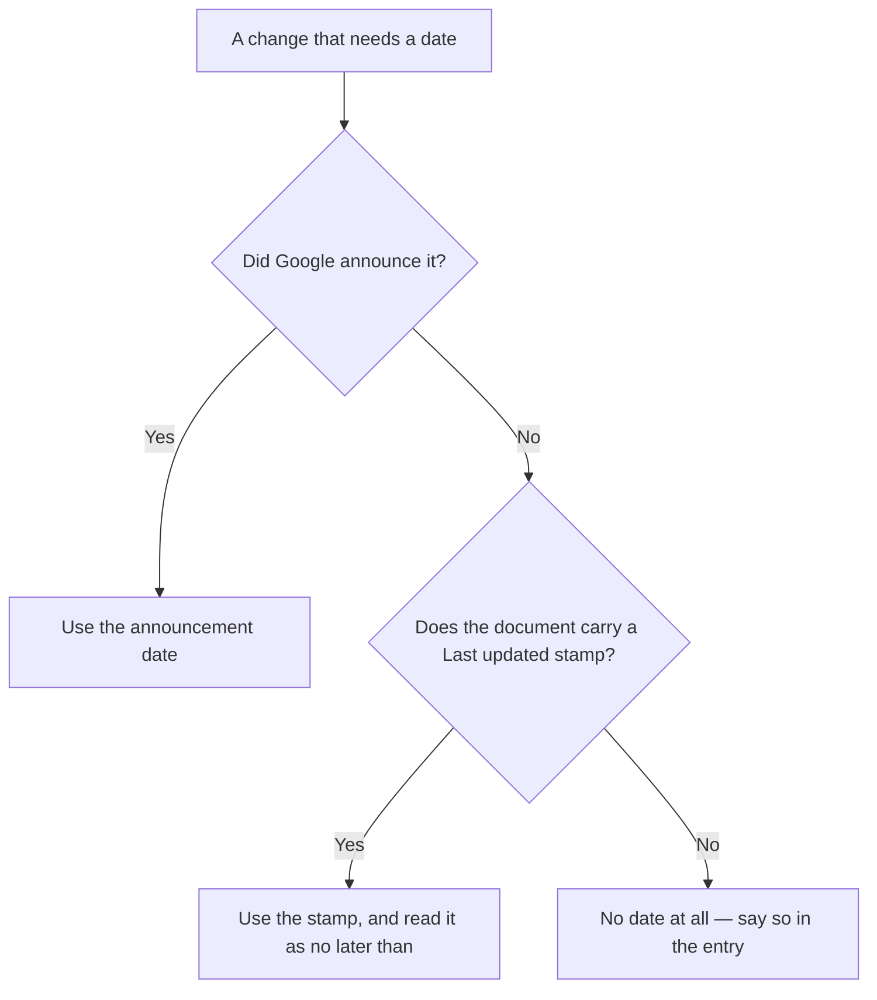

# The local search changelog

Every local-SEO news feed tells you *that* something changed. Almost none tell you **which endpoint it touched and what stopped working** — which is the only part that matters if you have code, a report template, or a client expectation resting on it.

**This chapter is that column.** Entries are reverse-chronological by the date of the change, not the date we noticed.

Each carries the API or endpoint affected, a probe you can re-run, and a `Last verified` stamp that is the date the probe last ran — not the date the prose was edited. The ID scheme, the five verdicts and the re-probe cadence are defined in [How to read this reference](./how-to-read-this-reference.md).

**IDs here come from a reserved block.** Because a changelog entry cuts across every area, this chapter's IDs are allocated from `-61` and upwards in each area — so that a dated change never competes for a number with the chapter that owns the underlying fact.

`LSM-PLACES-67` here is a dated event; the standing facts about Places live under the low numbers in [What the Places API will and will not give you](./what-places-returns.md) and [Storing Google data legally](./storing-google-data-legally.md). Cite the ID printed in the heading and nothing else.

## How the dates were established

Know this before you cite one.

**Where Google announced a change, this chapter uses the announcement's date.**

**Where it did not — and for policy text, it usually did not** — the only date available is the document's own "Last updated" stamp, which records when the page was edited and **not** when the requirement changed.

Entries resting on a stamp say so in the entry, and one of them ([LSM-POLICY-61](#lsm-policy-61--date-of-change-unknown--powered-by-google-no-longer-exists-attribution-is-google-maps)) carries no date at all as a result.

> A stamp-derived date is the weakest thing on this page; treat it as "no later than", never as "on".

## What is deliberately absent

**No unsourced changes.** There are no entries for changes we could not source to a Google document or a call we made ourselves, which means several widely-reported 2025 "updates" are not here.

**No ranking-algorithm entries.** Google names local updates only occasionally and confirms mechanism never, so a dated list of them would be folklore with timestamps.

## Index

| ID | Change date | API / endpoint touched | What changed | What broke | Verdict |
| --- | --- | --- | --- | --- | --- |
| [LSM-REVIEWS-61](#lsm-reviews-61--2026-07-24--reviews-api-exposes-reviewreplyurl) | 2026-07-24 | GBP Reviews `get` / `list` / `batchGetReviews` | `reviewReplyUrl` added | — | WORKS |
| [LSM-POSTS-61](#lsm-posts-61--2026-07-22--the-v4-local-posts-api-is-alive) | 2026-07-22 | v4 `accounts.locations.localPosts` | (nothing — it is alive) | Third-party guides claiming it died in 2022 | WORKS |
| [LSM-POSTS-62](#lsm-posts-62--2026-07-22--scheduledtime-is-writable--google-publishes-the-post-itself) | 2026-07-22 | v4 `localPosts.create` | `scheduledTime` accepted and echoed | Home-built post schedulers are redundant | UNDOCUMENTED |
| [LSM-POSTS-63](#lsm-posts-63--2026-07-22--post-length-limits-are-enforced-but-scrubbed-from-the-docs) | 2026-07-22 | v4 `localPosts.create` | `summary` ≤1500, `event.title` ≤58 | Over-length drafts are rejected on submit | UNDOCUMENTED |
| [LSM-GBP-61](#lsm-gbp-61--2026-07-13--place-actions-api-is-the-one-that-is-off-by-default) | 2026-07-13 | Place Actions API v1 | Not enabled with the others | Every call fails until it is enabled in the console | UNDOCUMENTED |
| [LSM-POLICY-61](#lsm-policy-61--date-of-change-unknown--powered-by-google-no-longer-exists-attribution-is-google-maps) | date unknown | Places API policies | "Powered by Google" retired | Every UI, PDF and email still showing it | GONE |
| [LSM-REVIEWS-62](#lsm-reviews-62--2026-07-01--rejected-review-replies-now-say-why) | 2026-07-01 | GBP `ReviewReply` | `PolicyViolation` added | — | WORKS |
| [LSM-PLACES-61](#lsm-places-61--2026-06-29--the-field-mask-decides-the-sku--same-call-free-or-billed-by-mask) | 2026-06-29 | Places `places:searchText`, `places/{id}` | Field-mask billing tiers restated | Cost models that price by endpoint | WORKS |
| [LSM-POLICY-62](#lsm-policy-62--2026-06-23--the-places-caching-allowance-has-not-widened-since-may-2025) | 2026-06-23 | GMP Service Specific Terms §14.3 | Nothing (that is the finding) | Architectures built on a "30-day Places cache" | WORKS |
| [LSM-GBP-62](#lsm-gbp-62--2026-05-12--pending-invitations-now-carry-a-place-id) | 2026-05-12 | GBP Invitations `TargetLocation` | Place ID exposed | — | WORKS |
| [LSM-REVIEWS-63](#lsm-reviews-63--2026-04-20--review-photos-and-videos-are-readable-through-the-api) | 2026-04-20 | GBP Reviews | `ReviewMediaItem` added | — | WORKS |
| [LSM-POSTS-64](#lsm-posts-64--2026-04-07--local-posts-gained-native-recurrence) | 2026-04-07 | v4 `LocalPost` | `RecurrenceInfo` added | The "v4 is abandoned" assumption | WORKS |
| [LSM-REVIEWS-64](#lsm-reviews-64--2026-04-01--reply-moderation-state-became-readable) | 2026-04-01 | GBP `ReviewReply` | `ReviewReplyState` added | Tools reporting "reply published" on submit | WORKS |
| [LSM-PLACES-62](#lsm-places-62--2026-03-17--places-can-return-businesses-that-have-not-opened-yet) | 2026-03-17 | Places search + Place Details | `includeFutureOpeningBusinesses`, `openingDate` | Competitor counts that silently exclude them | WORKS |
| [LSM-PLACES-63](#lsm-places-63--2026-02-12--180-new-place-types-and-a-display-label-field) | 2026-02-12 | Places search + Place Details | 180 types, `googleMapsTypeLabel` | Hard-coded category maps | WORKS |
| [LSM-GBP-63](#lsm-gbp-63--2025-12-03--the-public-qa-panel-started-disappearing-from-profiles) | 2025-12-03 | Consumer profile surface | Q&A panel → Gemini "Ask" | Seeded Q&A, and every audit that scored it | GONE |
| [LSM-GBP-64](#lsm-gbp-64--2025-11-03--the-qa-api-was-discontinued) | 2025-11-03 | My Business Q&A API; Notifications Q&A types | Discontinued | Q&A monitoring and posting tools | GONE |
| [LSM-PLACES-64](#lsm-places-64--2025-10-20--places-tells-you-when-a-business-moved) | 2025-10-20 | Place Details | `movedPlace`, `movedPlaceId` | Rank trackers holding a stale place ID | WORKS |
| [LSM-POLICY-63](#lsm-policy-63--2025-08-28--gbp-api-content-may-be-stored-for-30-calendar-days-and-not-aggregated) | 2025-08-28 | Business Profile APIs policies | Storage cap restated | Indefinite review-history archives | WORKS |
| [LSM-AI-61](#lsm-ai-61--2025-05-20--ai-mode-left-search-labs-and-stopped-requiring-opt-in-in-the-us) | 2025-05-20 | Google Search (AI Mode) | Labs → no opt-in, US | Pre-2025 SERP-composition baselines | WORKS |
| [LSM-AI-62](#lsm-ai-62--2025-05-20--gemini-25-went-under-ai-mode-and-ai-overviews) | 2025-05-20 | AI Mode / AI Overviews | Model swap | AI-visibility rates measured before it | WORKS |
| [LSM-PLACES-65](#lsm-places-65--2025-05-08--google-generated-place-and-review-summaries-reached-ga) | 2025-05-08 | Place Details | AI summaries GA | Field masks that pulled them for free in preview | WORKS |
| [LSM-AI-63](#lsm-ai-63--2025-03-05--ai-overviews-in-the-us-moved-to-gemini-20-for-harder-queries) | 2025-03-05 | AI Overviews | Gemini 2.0, harder queries | — | WORKS |
| [LSM-PLACES-66](#lsm-places-66--2025-03-01--maps-platform-pricing-was-restructured-and-legacy-places-was-frozen) | 2025-03-01 | All Maps Platform SKUs; Places API (Legacy) | $200 credit → per-SKU free caps; legacy frozen | New projects cannot enable legacy Places | WORKS |
| [LSM-PLACES-67](#lsm-places-67--2024-11-07--pure-service-area-businesses-became-findable-if-you-ask) | 2024-11-07 | `places:searchText`, Autocomplete | `includePureServiceAreaBusinesses` | Every SAB search that omits the flag | WORKS |
| [LSM-GBP-65](#lsm-gbp-65--2024-07-31--business-profile-chat-and-call-history-were-shut-down) | 2024-07-31 | Business Messages; call history | Shut down | Chat-response-rate reporting | GONE |
| [LSM-GBP-66](#lsm-gbp-66--2024-07-01--health-provider-attributes-and-insurance-networks-were-discontinued) | 2024-07-01 | v4 health attrs, `insuranceNetworks` | Discontinued, no replacement | Healthcare listing tools | GONE |
| [LSM-PLACES-68](#lsm-places-68--2024-05-28--autocomplete-new-reached-ga-with-session-token-billing) | 2024-05-28 | `places:autocomplete` | Session tokens | Untokenised autocomplete billing | WORKS |
| [LSM-PLACES-69](#lsm-places-69--2024-05-13--maxresultcount-was-deprecated-in-favour-of-pagesize) | 2024-05-13 | Places search requests | `maxResultCount` deprecated | Nothing yet — it still works | OPEN QUESTION |
| [LSM-POLICY-64](#lsm-policy-64--2024-02-15--limited-use-covers-derived-and-aggregated-oauth-data-too) | 2024-02-15 | Google API Services User Data Policy | Current revision | "It's only aggregates" defences | WORKS |
| [LSM-GBP-67](#lsm-gbp-67--2023-05-30--the-business-calls-api-and-location-association-were-discontinued) | 2023-05-30 | Business Calls API; `locations.associate` | Discontinued | Call-tracking and place-linking flows | GONE |
| [LSM-PLACES-70](#lsm-places-70--2023-05--autocomplete-bounds-location-and-radius-were-deprecated) | 2023-05 | Autocomplete request options | → `locationBias` / `locationRestriction` | Copy-pasted 2022 autocomplete code | GONE |
| [LSM-POSTS-65](#lsm-posts-65--2023-02-20--per-post-metrics-left-with-localpostsreportinsights-and-never-came-back) | 2023-02-20 | v4 `localPosts.reportInsights` | Sunset, no replacement | Per-post performance reporting, permanently | GONE |
| [LSM-PLACES-71](#lsm-places-71--2020-05-26--permanently_closed-was-deprecated-and-tools-still-read-it) | 2020-05-26 | Places `permanently_closed` | → `business_status` | Audits that call a closed business open | GONE |
| [LSM-AI-64](#lsm-ai-64--undated--the-models-behind-the-ai-surfaces-change-without-a-changelog) | undated | AI Overviews / AI Mode / assistants | Unannounced model swaps | Any AI-visibility trend line | OPEN QUESTION |

---

## 2026

### LSM-REVIEWS-61 · 2026-07-24 · Reviews API exposes `reviewReplyUrl`

**Verdict:** WORKS  
**Last verified:** 2026-07-27  
**API touched:** Business Profile Reviews — `accounts.locations.reviews.get`, `.list`, `batchGetReviews`  
**Probe:** Fetch `developers.google.com/my-business/content/change-log` and read the 2026-07-24 entry (page stamped 2026-07-24 UTC when fetched 2026-07-27).

Reviews returned by the API now carry a `reviewReplyUrl`. Before this, linking a client from a report to the exact reply box meant constructing a URL by hand or sending them to the profile and describing which review to find.

**Consequence:** If you generate review worklists, thread this field through instead of building the link yourself. Hand-built reply URLs are the kind of thing that keeps working right up until it does not.

### LSM-POSTS-61 · 2026-07-22 · The v4 Local Posts API is alive

**Verdict:** WORKS  
**Last verified:** 2026-07-22  
**API touched:** `mybusiness.googleapis.com/v4/accounts/{a}/locations/{l}/localPosts`  
**Probe:** `GET` the collection on a connected location with a `business.manage` token. Returns HTTP 200 and the post list. No additional consent or scope is needed beyond the one an existing GBP connection already holds.

Published guides — including pages still ranking for "Google Business Profile API" in July 2026 — assert that the Local Posts API was retired in 2022. It was not. The v4 endpoint answers, and Google has shipped features into it as recently as 2026-04-07 ([LSM-POSTS-64](#lsm-posts-64--2026-04-07--local-posts-gained-native-recurrence)).

**Consequence:** Do not accept a secondhand claim that a Google endpoint is dead. Call it. This one costs ten seconds to check and the wrong answer costs a build decision.

### LSM-POSTS-62 · 2026-07-22 · `scheduledTime` is writable — Google publishes the post itself

**Verdict:** UNDOCUMENTED  
**Last verified:** 2026-07-22  
**API touched:** v4 `accounts.locations.localPosts.create`  
**Probe:** Create a post with a future `scheduledTime`. The call returns 200 with the value echoed back and the post in a scheduled state; deleting the post before that time cancels it.

Scheduling is native. The post is reviewed up front — it moves through a processing state to a scheduled one and can be rejected *before* the publish moment rather than at it — and Google publishes at the instant itself.

**Consequence:** Do not build a queue that wakes up and posts later. It duplicates a Google behaviour, and it converts a rejection you would have seen at submission time into a silent failure at 6 a.m. on a Sunday.

### LSM-POSTS-63 · 2026-07-22 · Post length limits are enforced but scrubbed from the docs

**Verdict:** UNDOCUMENTED  
**Last verified:** 2026-07-22  
**API touched:** v4 `accounts.locations.localPosts.create`  
**Probe:** Submit a post with `summary` longer than 1500 characters, or an `event.title` longer than 58. The response is a field-level `INVALID_ARGUMENT` validation error reading "Must be at most N characters".

Both limits are enforced by the API and neither appears in the current published reference. The error is precise and deterministic, which makes the endpoint itself the documentation.

**Consequence:** Validate against 1500 and 58 client-side, and treat `INVALID_ARGUMENT` text as authoritative over any published limit. Other write constraints and their failure modes are in [Write limits and failure modes](./write-limits-and-failure-modes.md).

### LSM-GBP-61 · 2026-07-13 · Place Actions API is the one that is off by default

**Verdict:** UNDOCUMENTED  
**Last verified:** 2026-07-13  
**API touched:** Place Actions API v1 (`mybusinessplaceactions.googleapis.com`)  
**Probe:** In a Business Profile API project that has been through quota approval, call each Business Profile API in turn. Account Management, Business Information, Performance, Verifications, Notifications, v4 reviews, v4 media and v4 local posts all answer; Place Actions returns a "service not enabled" error until it is switched on in the Cloud console.

Quota approval is not the same as service enablement, and Google does not publish which services arrive enabled. In the project probed, Place Actions was the only one that did not.

**Consequence:** Enable Place Actions explicitly before you build anything on booking or ordering links, and treat "the API is dead" reports from other developers as possibly a console setting.

### LSM-POLICY-61 · date of change unknown · "Powered by Google" no longer exists; attribution is "Google Maps"

**Verdict:** GONE  
**Last verified:** 2026-07-27  
**API touched:** Places API display requirements (policy, not endpoint)  
**Probe:** Search the full text of the Places API policies page (`developers.google.com/maps/documentation/places/web-service/policies`, stamped 2026-07-20 UTC when fetched 2026-07-27). The string "Powered by Google" does not appear. The page instead requires the Google Maps logo, and states that "In cases where space is limited, the text **Google Maps** is acceptable."

**On the date.** This entry was previously headed 2026-07-10, taken from the policies page's "Last updated" stamp at the time. That was wrong in kind, not just in value: a page stamp records when the document was last edited, not when a requirement changed, and the stamp has since moved to 2026-07-20 without the attribution text changing.

Google published no dated announcement retiring "Powered by Google" that we can find, so **the date this changed is not established** — only that the string is absent today and was present in older revisions.

If you need the date, the thing that would settle it is a diff across the archived revisions of the policies page; we have not run it.

Attribution is the Google Maps logo, or where space is constrained the exact text **"Google Maps"** — untranslated, unwrapped, not re-capitalised.

> This is our reading of published terms, not legal advice.

**Consequence:** Audit every surface that displays Places-derived data — app screens, PDF reports, emails, white-label partner sites — and replace legacy attribution. The full requirement set, including per-review author attribution, is in [Storing Google data legally](./storing-google-data-legally.md).

### LSM-REVIEWS-62 · 2026-07-01 · Rejected review replies now say why

**Verdict:** WORKS  
**Last verified:** 2026-07-27  
**API touched:** Business Profile Reviews — `ReviewReply`  
**Probe:** Fetch `developers.google.com/my-business/content/change-log` and read the 2026-07-01 entry.

A `PolicyViolation` field was added, giving visibility into why a submitted reply was rejected during moderation. Before this, a rejected reply simply never appeared and the operator had no machine-readable reason.

**Consequence:** Surface the violation reason to whoever wrote the reply. Combined with [LSM-REVIEWS-64](#lsm-reviews-64--2026-04-01--reply-moderation-state-became-readable), it is now possible to report reply status honestly instead of assuming that submitted means published.

### LSM-PLACES-61 · 2026-06-29 · The field mask decides the SKU — same call, free or billed by mask

**Verdict:** WORKS  
**Last verified:** 2026-07-03  
**API touched:** `places:searchText`, `places:searchNearby`, `places/{id}` — all Places API (New) reads  
**Probe:** Fetch `developers.google.com/maps/documentation/places/web-service/usage-and-billing` (stamped 2026-07-20 UTC when fetched 2026-07-27), which states the rule directly: "You are then billed at the highest SKU applicable to your request. That means if you select fields in both the Essentials and the Pro SKUs, you are billed based on the Pro SKU." Then run the same `places:searchText` twice, once with a mask of `places.id` and once with a mask containing `rating` or `nationalPhoneNumber`, and compare the SKUs billed on your own invoice.

Places bills a request at the **highest SKU touched by any field in its mask**, at the volume tier reached — so the same query can sit in very different tiers depending only on what it asks for. Google publishes the current tier membership and rates; read them at source rather than from any reproduction.

**Two cautions on the numbers.** The dollar figures move, and the tier boundaries have moved with them, so **the mechanism is the durable fact here and the prices are not** — current per-SKU figures belong in [What the Places API will and will not give you](./what-places-returns.md) and should be read from Google's pricing page before you quote one to a client.

**The date is a stamp, not an announcement.** It is the pricing table's own "Last updated" stamp rather than an announced change: the field-mask billing model long predates it, and what happened on this date was a restatement, not a new rule.

**Consequence:** Budget by field mask, not by endpoint — the same query can sit in very different tiers depending only on what it asks for, so a per-endpoint estimate will be wrong in both directions. Google's current tier membership and rates are on its own pricing pages; see [what the Places API will and will not give you](./what-places-returns.md) for how the rule works.

### LSM-POLICY-62 · 2026-06-23 · The Places caching allowance has not widened since May 2025

**Verdict:** WORKS  
**Last verified:** 2026-07-16  
**API touched:** Places API storage rights — Maps Platform Service Specific Terms §14.3 ("Caching"), plus the Places API policies page  
**Probe:** Read §14.3 of the Service Specific Terms at `cloud.google.com/maps-platform/terms/maps-service-terms`, then diff it against an archived earlier revision (the archive lives under `cloud.google.com/archive/maps-platform/terms/`). §14.3 grants that "Customer may temporarily cache latitude and longitude values from the Places API for up to 30 consecutive calendar days, after which Customer must delete the cached latitude and longitude values." The Places API policies page separately states that the place ID "is exempt from the caching restrictions. You can therefore store place ID values indefinitely."

**The express permissions remain two, and only two:**

- **Place IDs** — storable indefinitely.
- **Latitude/longitude** — up to 30 consecutive calendar days, with mandatory deletion after.

Names, addresses, ratings, review counts, review text, hours and photo metadata are not covered by any storage grant. The March 2025 SKU restructuring ([LSM-PLACES-66](#lsm-places-66--2025-03-01--maps-platform-pricing-was-restructured-and-legacy-places-was-frozen)) changed pricing only.

The widely-repeated "30-day Places caching allowance" — as a general licence to cache Places *content* — is not in the terms; the 30 days attaches to coordinates specifically.

**Cite §14.3 and nothing else from memory.** Earlier versions of this entry also cited a Terms of Service §3.2.3 and an SST §A.3 for the same grant; those section numbers are not ones we have re-verified, and a wrong section number in a compliance argument is worse than no citation.

The clause-by-clause reading, with each quote carrying its own section number and document date, is in [Storing Google data legally](./storing-google-data-legally.md).

> This is our reading of published terms, not legal advice.

**Consequence:** Store place IDs and your own derived values; re-fetch Google fields at display time. Read [Storing Google data legally](./storing-google-data-legally.md) before designing any table that holds Places output.

### LSM-GBP-62 · 2026-05-12 · Pending invitations now carry a place ID

**Verdict:** WORKS  
**Last verified:** 2026-07-27  
**API touched:** Business Profile Account Management — invitations, `TargetLocation`  
**Probe:** Fetch `developers.google.com/my-business/content/latest-updates` (stamped 2026-07-24 UTC when fetched 2026-07-27) and read the 2026-05-12 entry: "The place ID is available in TargetLocation under Invitation", retrievable via `accounts.invitations.list`.

Place ID is now accessible on pending invitations through `TargetLocation`. Previously an inbound management invitation could not be matched to a known place until it was accepted.

**Consequence:** Match invitations to the business record before accepting, rather than accepting and reconciling afterwards.

### LSM-REVIEWS-63 · 2026-04-20 · Review photos and videos are readable through the API

**Verdict:** WORKS  
**Last verified:** 2026-07-27  
**API touched:** Business Profile Reviews — `ReviewMediaItem`  
**Probe:** Fetch `developers.google.com/my-business/content/latest-updates` and read the 2026-04-20 entry.

Reviews can now return `ReviewMediaItem` — thumbnail and video URLs for customer-attached media. Customer photos on reviews were previously visible in the profile UI but not in the review payload.

**Consequence:** Customer-supplied review media becomes auditable. Note that any Google-supplied attribution strings must be displayed wherever the media appears ([LSM-POLICY-61](#lsm-policy-61--date-of-change-unknown--powered-by-google-no-longer-exists-attribution-is-google-maps)).

### LSM-POSTS-64 · 2026-04-07 · Local Posts gained native recurrence

**Verdict:** WORKS  
**Last verified:** 2026-07-27  
**API touched:** v4 `LocalPost` — `RecurrenceInfo`  
**Probe:** Fetch `developers.google.com/my-business/content/change-log` and read the 2026-04-07 entry. The same entry raises the Food Menus dish-photo capacity to 200.

`RecurrenceInfo` lets a post be created once and repeat on a schedule. The significance is less the feature than the date: Google is still adding capability to the "legacy" v4 surface in 2026.

**Consequence:** Treat v4 as legacy-but-invested rather than dying, and keep your v4 calls behind one interface so that a future migration is a single change. Do not build a recurring-post scheduler of your own.

### LSM-REVIEWS-64 · 2026-04-01 · Reply moderation state became readable

**Verdict:** WORKS  
**Last verified:** 2026-07-27  
**API touched:** Business Profile Reviews — `ReviewReply.ReviewReplyState`  
**Probe:** Fetch `developers.google.com/my-business/content/change-log` and read the 2026-04-01 entry.

Submitted replies now expose their moderation status. Before this, a reply that was accepted by the API and then rejected in moderation looked identical to a published one.

**Consequence:** "Reply sent" is not "reply live". Read the state back before you report a response rate to a client, and re-read it later — moderation is not instantaneous.

### LSM-PLACES-62 · 2026-03-17 · Places can return businesses that have not opened yet

**Verdict:** WORKS  
**Last verified:** 2026-07-27  
**API touched:** Places API (New) — `includeFutureOpeningBusinesses` request parameter, `openingDate` field  
**Probe:** Fetch `developers.google.com/maps/documentation/places/web-service/release-notes` and read the 2026-03-17 entry (page stamped 2026-07-20 UTC when fetched 2026-07-27).

`includeFutureOpeningBusinesses` is accepted on **Nearby Search, Text Search and Autocomplete** requests — all three, which matters because a discovery flow that sets it on search and not on autocomplete will disagree with itself. `openingDate` returns the anticipated opening date for businesses launching soon.

**Consequence:** Competitor discovery that omits the parameter is a snapshot of the market as it is, not as it will be next quarter. If you report competitive density, say which of the two you measured.

### LSM-PLACES-63 · 2026-02-12 · 180 new place types, and a display-label field

**Verdict:** WORKS  
**Last verified:** 2026-07-27  
**API touched:** Places API (New) — type filters and responses, `googleMapsTypeLabel`  
**Probe:** Fetch the Places API (New) release notes and read the 2026-02-12 entry.

180 place types were added for filtering and in responses, and `googleMapsTypeLabel` returns the localized type label as Google Maps itself displays it.

**Consequence:** Any hard-coded mapping from Places types to your own category taxonomy is now incomplete. Use `googleMapsTypeLabel` for anything shown to a human rather than translating type constants yourself.

## 2025

### LSM-GBP-63 · 2025-12-03 · The public Q&A panel started disappearing from profiles

**Verdict:** GONE  
**Last verified:** 2026-07-13  
**API touched:** Consumer profile surface (Search and Maps), not an endpoint  
**Probe:** Open any business profile in Search or Maps and look for a questions-and-answers section. Compare with an archived copy of the same profile from before December 2025.

Public Q&A threads began being removed from profiles on 2025-12-03, replaced by a Gemini-powered conversational "Ask" experience, with removal rolling out over a period of months. Previously posted questions and answers stop being visible to customers.

**On the sourcing.** The date and the replacement come from Google's own communications as reported across the trade press in December 2025 and January 2026; we did not fetch a primary Google document stating the consumer-side date, and the API side is separately documented in [LSM-GBP-64](#lsm-gbp-64--2025-11-03--the-qa-api-was-discontinued).

**Consequence:** Any information a business had seeded into Q&A needs to move into the description, the services list or the website. Delete the Q&A row from your audit template — scoring a surface that no longer exists makes every other row look less credible.

### LSM-GBP-64 · 2025-11-03 · The Q&A API was discontinued

**Verdict:** GONE  
**Last verified:** 2026-07-13  
**API touched:** My Business Q&A API; Notifications API types `NEW_QUESTION`, `NEW_ANSWER`, `UPDATED_QUESTION`, `UPDATED_ANSWER`  
**Probe:** Fetch `developers.google.com/my-business/content/qanda/change-log` (stamped 2025-11-06 UTC), which states: "On November 3, 2025, we will be discontinuing the My Business Q&A API as we are in the process of updating the Q&A functionality and user experience." Then call any Q&A endpoint with a valid `business.manage` token.

Notice was 49 days — seven weeks exactly: the shutdown was announced on 2025-09-15. The four Q&A notification types were deprecated at the same time.

Two details are worth separating.

**The date and the announcement** come from Google's page, quoted above; note that the page was last touched on 2025-11-06 and still describes the shutdown in the future tense, so it is a notice that was never rewritten as a record.

**The HTTP 501 is ours.** Calling the endpoints on a quota-approved project returned 501, repeatedly, after the shutdown date. Google does not publish the post-shutdown status code, so treat 501 as an observation on one project rather than a documented contract — a different project or a later date could return something else.

**Consequence:** Never build on Q&A. If you subscribe to Business Profile notifications, drop the four Q&A types from your handler — a 501 on a scheduled job is the kind of error that gets muted and then forgotten. Note the pattern for planning purposes: seven weeks' notice, on a sub-page, and the central deprecation schedule never listed it at all ([LSM-POLICY-63](#lsm-policy-63--2025-08-28--gbp-api-content-may-be-stored-for-30-calendar-days-and-not-aggregated)).

### LSM-PLACES-64 · 2025-10-20 · Places tells you when a business moved

**Verdict:** WORKS  
**Last verified:** 2026-07-27  
**API touched:** Places API (New) — `movedPlace`, `movedPlaceId`  
**Probe:** Fetch the Places API (New) release notes and read the 2025-10-20 entry.

Two fields now indicate that an establishment has relocated and give the identifier of its new place.

**Consequence:** A rank tracker keyed on a stored place ID can silently follow a business that has moved away from the area it is being measured in. Check these fields on refresh; a move is a ranking event, not a data-quality nuisance.

### LSM-POLICY-63 · 2025-08-28 · GBP API content may be stored for 30 calendar days, and not aggregated

**Verdict:** WORKS  
**Last verified:** 2026-07-16  
**API touched:** All Business Profile APIs (policy, not endpoint)  
**Probe:** Fetch `developers.google.com/my-business/content/policies` (stamped "Last updated 2025-08-28 UTC") and read the Content storage section, which states that stored Content "must be stored temporarily for no more than 30 calendar days", "must be stored securely", and "cannot be manipulated or aggregated in any way".

There is no written carve-out for the merchant's own data obtained through the merchant's own OAuth grant. Note the date: the Business Profile deprecation schedule at `developers.google.com/my-business/content/sunset-dates` carries the same 2025-08-28 stamp and, when fetched on 2026-07-27, still did not list the Q&A API shutdown that landed ten weeks after it ([LSM-GBP-64](#lsm-gbp-64--2025-11-03--the-qa-api-was-discontinued)). The deprecation page is not a reliable early warning.

> This is our reading of published terms, not legal advice. Whether an indefinite review archive serving the authorizing merchant falls inside or outside this clause is a genuine open question and is not settled by the text.

**Consequence:** Design GBP-derived storage as a refresh-or-purge cache with a 30-day age on last refresh, keeping only your own derived values past that. [Storing Google data legally](./storing-google-data-legally.md) has the clause-by-clause reading.

### LSM-AI-61 · 2025-05-20 · AI Mode left Search Labs and stopped requiring opt-in in the US

**Verdict:** WORKS  
**Last verified:** 2026-07-27  
**API touched:** Google Search consumer surface — no API  
**Probe:** Google's I/O 2025 announcements and the trade coverage published the same day (Search Engine Land, 2025-05-20), which quote Google as saying that "starting today" AI Mode in the US no longer requires opting in, with the tab appearing for US searchers "this week". AI Mode had entered Search Labs on 2025-03-05, initially for Google One AI Premium subscribers ([LSM-AI-63](#lsm-ai-63--2025-03-05--ai-overviews-in-the-us-moved-to-gemini-20-for-harder-queries)).

**Correction:** this entry previously dated US general availability to 2025-06-05. That date describes the rollout having finished, not the change. The opt-in requirement was removed on 2025-05-20 and the tab reached US searchers over the following days, so the two dates bracket a phased rollout rather than disagreeing. Where a date matters, cite 2025-05-20 as the change and treat early June as the point by which it was everywhere. The subsequent expansion to 180 countries and territories is a separate, later event and is not dated here.

A conversational answer surface with its own retrieval and its own citation set now sits alongside the classic results page.

**Consequence:** Any SERP-composition baseline captured before mid-2025 describes a page layout that no longer exists. Re-baseline rather than comparing across the boundary. AI Mode and AI Overview citations are separate populations — do not treat a win on one as coverage of the other.

### LSM-AI-62 · 2025-05-20 · Gemini 2.5 went under AI Mode and AI Overviews

**Verdict:** WORKS  
**Last verified:** 2026-07-27  
**API touched:** AI Mode / AI Overviews generation layer — no API  
**Probe:** Google's 2025-05-20 announcement that a custom version of Gemini 2.5 began powering AI Mode and AI Overviews that week.

**Consequence:** A measured AI-visibility rate has a model version attached to it whether you recorded one or not. Stamp every AI measurement with its date, and treat a rate measured before a known model swap as a different experiment rather than an earlier point on the same line.

### LSM-PLACES-65 · 2025-05-08 · Google-generated place and review summaries reached GA

**Verdict:** WORKS  
**Last verified:** 2026-07-27  
**API touched:** Places API (New) — place, review and area summary fields  
**Probe:** Fetch the Places API (New) release notes and read the 2025-04-15 entry (Preview, at no charge) and the 2025-05-08 entry (general availability, covering place, review and area summaries). The 2025-08-21 entry then expands coverage — and expands it differently for the two summary types: **place** summaries reached English in India and the United States, while **review** summaries reached English in India, the UK and the United States plus Japanese in Japan. The same entry moved `googleMapsLinks` to GA with standard billing.

An earlier version of this entry merged those two coverage lists into one. They are not the same list, and "is there a summary for this place" has a different answer per country depending on which summary you mean.

Google now generates its own prose summary of a place and of its reviews, served as a Places field. It is Google's editorial layer over a business, generated from data the business does not control directly.

**Consequence:** Read the summary for your own business and your competitors — it is the closest thing to seeing what a Google model has concluded about a place. Summary fields were explicitly free during Preview and stopped being free at GA, so a field mask written against the Preview docs became a billable mask without changing a character; which SKU it lands in follows the field-mask rule ([LSM-PLACES-61](#lsm-places-61--2026-06-29--the-field-mask-decides-the-sku--same-call-free-or-billed-by-mask)).

### LSM-AI-63 · 2025-03-05 · AI Overviews in the US moved to Gemini 2.0 for harder queries

**Verdict:** WORKS  
**Last verified:** 2026-07-27  
**API touched:** AI Overviews generation layer — no API  
**Probe:** Google's announcement of 2025-03-05, "Expanding AI Overviews and introducing AI Mode" (`blog.google/products/search/ai-mode-search/`).

Read the scope precisely: Google described rolling out Gemini 2.0 for AI Overviews in the US **starting with coding, advanced math and multimodal queries**, alongside dropping the sign-in requirement and opening AI Overviews to teens. It was not announced as a wholesale swap of the model behind every AI Overview, and this entry previously described it as one. The same announcement introduced AI Mode in Labs, on a custom version of Gemini 2.0.

**Consequence:** The first of at least two datable model changes inside fifteen months on the same surface. Treat the generation layer as versioned infrastructure you cannot see the version of — and note that even an announced change may cover only a slice of queries, so a before/after comparison across the date is not a clean experiment.

### LSM-PLACES-66 · 2025-03-01 · Maps Platform pricing was restructured and legacy Places was frozen

**Verdict:** WORKS  
**Last verified:** 2026-07-27  
**API touched:** Every Maps Platform SKU; Places API (Legacy) enablement  
**Probe:** Fetch `developers.google.com/maps/billing-and-pricing/march-2025`. The USD $200 monthly recurring credit was replaced with per-SKU free monthly caps, and SKUs were reorganised into Essentials, Pro and Enterprise tiers. Separately, legacy Places services became unavailable to new Cloud projects on the same date; existing projects keep working, and Google has committed to 12 months' notice before any turndown.

The free allowance stopped pooling across APIs. A workload that fitted comfortably inside one shared credit can now exhaust a per-SKU cap on its heaviest call while others sit unused.

**Consequence:** Cost-model per SKU, not per project, and read [LSM-PLACES-61](#lsm-places-61--2026-06-29--the-field-mask-decides-the-sku--same-call-free-or-billed-by-mask) with it — the tier is chosen by your field mask. If you inherited code that calls a legacy Places endpoint, it will keep working in the project it was built in and cannot be enabled anywhere new.

## 2024

### LSM-PLACES-67 · 2024-11-07 · Pure service-area businesses became findable, if you ask

**Verdict:** WORKS  
**Last verified:** 2026-07-16  
**API touched:** `places:searchText` and Autocomplete (New) — `includePureServiceAreaBusinesses` request parameter; `pureServiceAreaBusiness` response field  
**Probe:** Fetch the Places API (New) release notes and read the 2024-11-07 entry. Then run the same Text Search for a known hidden-address business twice, with and without the parameter.

Businesses with no public address are **excluded** from Text Search unless the parameter is set. The same release added a `pureServiceAreaBusiness` field so you can tell which returned results are of that kind, plus `containingPlaces`, `priceRange`, `nextOpenTime` and `nextCloseTime`, and 104 new place types.

**Consequence:** This is the single most common cause of "the business does not exist in the API" for plumbers, mobile groomers and locksmiths. Set the flag. Note also that such a place carries no coordinates, so anything that needs a map anchor has to get one elsewhere — from the owner's own profile, or from a place inside the declared service area. The practical handling is in [Service-area businesses](../03-advanced/service-area-businesses.md).

### LSM-GBP-65 · 2024-07-31 · Business Profile chat and call history were shut down

**Verdict:** GONE  
**Last verified:** 2026-07-27  
**API touched:** Google Business Messages; Business Profile call history  
**Probe:** Two documents, one per half of this entry. For chat, fetch `developers.google.com/business-communications/business-messages/resources/release-notes/update-on-gbm`: messages stopped being received after 2024-07-01, new conversations stopped being created after 2024-07-15, and "Google Business Messages (GBM) will be discontinued on July 31, 2024"; existing conversations "available in Google Maps inbox will be removed post 7/31". For call history, fetch Google's own support notice at `support.google.com/business/answer/14919056`, which covers both features ending on 2024-07-31 and points to Google Takeout for past records.

Two lead channels a business could be measured on stopped existing within a fortnight, and the stored history went with them.

**Consequence:** Chat response rate and call-history counts cannot be part of any forward-looking reporting baseline. If a client's history matters, the one recovery path Google named was a Takeout export taken at the time — worth asking about before you conclude the data is gone. If you inherit a client whose historical reports contain these series, say plainly that the source was retired rather than showing a line that flatlines.

### LSM-GBP-66 · 2024-07-01 · Health-provider attributes and insurance networks were discontinued

**Verdict:** GONE  
**Last verified:** 2026-07-27  
**API touched:** v4 `getHealthProviderAttributes`, `updateHealthProviderAttributes`, `accounts.locations.insuranceNetworks`  
**Probe:** Fetch `developers.google.com/my-business/content/sunset-dates` (page stamped 2025-08-28). Support ended 2024-06-17; discontinued 2024-07-01. Replacement column: **None**.

**Consequence:** Healthcare listings lost machine-managed insurance-network data with no successor endpoint. If a medical client's tooling still claims to sync insurance networks, it is not doing so.

### LSM-PLACES-68 · 2024-05-28 · Autocomplete (New) reached GA with session-token billing

**Verdict:** WORKS  
**Last verified:** 2026-07-27  
**API touched:** `places:autocomplete`  
**Probe:** Fetch the Places API (New) release notes and read the 2024-05-28 entry. Session tokens group the keystroke phase and the subsequent details call into one billable session.

**Consequence:** Autocomplete calls made without a session token bill per request. If you use autocomplete to help a user pick a business — a common pattern in onboarding — token the session or you are paying per keystroke.

### LSM-PLACES-69 · 2024-05-13 · `maxResultCount` was deprecated in favour of `pageSize`

**Verdict:** OPEN QUESTION  
**Last verified:** 2026-07-27  
**API touched:** Places API (New) search requests  
**Probe:** Fetch the Places API (New) release notes and read the 2024-05-13 entry, which marks `maxResultCount` deprecated with `pageSize` as the replacement. Then send a `places:searchText` request using `maxResultCount` — as of July 2026 it is still honoured and no turndown date has been published.

A deprecated request field that has kept working for over two years, with a replacement, no announced sunset, and no error or warning in the response.

**Consequence:** Migrate to `pageSize` at your convenience, but do not assume the deprecated field will announce its own removal — deprecated Places fields have previously been decommissioned roughly a year after announcement ([LSM-PLACES-70](#lsm-places-70--2023-05--autocomplete-bounds-location-and-radius-were-deprecated)). Left as an open question because we cannot establish an end date, only that it still works today.

### LSM-POLICY-64 · 2024-02-15 · Limited Use covers derived and aggregated OAuth data too

**Verdict:** WORKS  
**Last verified:** 2026-07-16  
**API touched:** All OAuth-scoped Google data, including `business.manage` (policy, not endpoint)  
**Probe:** Fetch the Google API Services User Data Policy (stamped "Last updated February 15, 2024") and read the Limited Use section.

The scope clause is explicit: "The requirements apply to the raw data obtained from the scopes and data aggregated, anonymized, or derived from them." Use is confined to "providing or improving user-facing features that are prominent in the requesting application's user interface". The policy prohibits "Transferring or selling user data to third parties like advertising platforms, data brokers, or any information resellers" and "Transferring, selling, or using user data for serving ads". It contains no numeric retention cap of its own.

Quote those clauses rather than a summary of them. An earlier version of this entry also listed retargeting and credit-worthiness among the prohibited uses; those appear in Google's policy family for particular scopes, and we have not re-verified them as text in this document, so they are left out here rather than asserted.

> This is our reading of published terms, not legal advice.

**Consequence:** "We only keep aggregates" is not a defence under this policy. If you compute metrics from a client's Google data, the metrics inherit the restriction, and any new use of the data requires re-consent before the use, not after.

## 2023 and earlier

### LSM-GBP-67 · 2023-05-30 · The Business Calls API and location association were discontinued

**Verdict:** GONE  
**Last verified:** 2026-07-27  
**API touched:** My Business Calls API; `locations.associate`; `locations.clearLocationAssociation`  
**Probe:** Fetch `developers.google.com/my-business/content/sunset-dates` (stamped 2025-08-28 UTC). All three rows show support ending 2023-02-21 and discontinuation on 2023-05-30, with the replacement column reading **None**.

Programmatic association of a Business Profile location with a Google Maps place went away with them.

**Consequence:** Location-to-place linking is a manual operation in the Business Profile interface. Any tool claiming to automate it is either using an internal endpoint or not doing it.

### LSM-PLACES-70 · 2023-05 · Autocomplete `bounds`, `location` and `radius` were deprecated

**Verdict:** GONE  
**Last verified:** 2026-07-27  
**API touched:** Place Autocomplete Service request options (Maps JavaScript API)  
**Probe:** Fetch `developers.google.com/maps/deprecations` (page stamped 2026-07-20 UTC) and read the May 2023 entry, which gives a 12-month deprecation period and names `locationBias` and `locationRestriction` as replacements.

**Consequence:** Autocomplete code copied from a pre-2023 tutorial will bias to nothing and return results from the wrong city. This is a common cause of "the address picker suggests a business 200 miles away".

### LSM-POSTS-65 · 2023-02-20 · Per-post metrics left with `localPosts.reportInsights` and never came back

**Verdict:** GONE  
**Last verified:** 2026-07-27  
**API touched:** v4 `accounts.locations.localPosts.reportInsights`; v4 `accounts.locations.reportInsights` → replaced by `locations.fetchMultiDailyMetricsTimeSeries`  
**Probe:** Fetch `developers.google.com/my-business/content/sunset-dates` (stamped 2025-08-28 UTC). Both endpoints show support ending 2022-11-21. They were then discontinued on **different dates**: the post-scoped `accounts.locations.localPosts.reportInsights` on **2023-02-20**, replacement column **None**; the location-scoped `accounts.locations.reportInsights` on 2023-03-30, replaced by `locations.fetchMultiDailyMetricsTimeSeries`. Then enumerate the metrics available from the Business Profile Performance API: eleven daily metrics plus a monthly search-keywords endpoint, and **none of them is post-scoped**.

**Correction:** this entry previously carried 2023-03-30, which is the date the *location* insights endpoint died. Per-post metrics went five and a half weeks earlier, and with no replacement named at all.

The replacement covers the location, not the post. The v4 `localPosts.reportInsights` reference page is still published, which is why tools keep promising post-level analytics; the data is not obtainable through any current API.

**Consequence:** Do not promise per-post performance reporting. Measure posting at the location level — publish cadence against the location's daily metrics — and say explicitly in client reports that per-post numbers do not exist rather than substituting a proxy. What the Performance API does and does not count is in [What Google's own reporting hides](./what-googles-reporting-hides.md).

### LSM-PLACES-71 · 2020-05-26 · `permanently_closed` was deprecated, and tools still read it

**Verdict:** GONE  
**Last verified:** 2026-07-27  
**API touched:** Places `permanently_closed` field → `business_status`  
**Probe:** Fetch `developers.google.com/maps/deprecations` and read the 2020-05-26 entry: the field "is deprecated, and shouldn't be used".

`business_status` distinguishes operational, temporarily closed and permanently closed. The old boolean cannot express the middle state.

**Consequence:** An audit that reads the deprecated field reports a temporarily closed business as open — the single most damaging false negative in a profile audit, because "temporarily closed" suppresses a listing in search while looking fine on the profile page.

## Changes that have no date

### LSM-AI-64 · undated · The models behind the AI surfaces change without a changelog

**Verdict:** OPEN QUESTION  
**Last verified:** 2026-07-27  
**API touched:** AI Overviews, AI Mode, and every third-party assistant  
**Probe:** There is no probe that returns a version. Two model swaps on Google's surfaces are datable from announcements ([LSM-AI-63](#lsm-ai-63--2025-03-05--ai-overviews-in-the-us-moved-to-gemini-20-for-harder-queries), [LSM-AI-62](#lsm-ai-62--2025-05-20--gemini-25-went-under-ai-mode-and-ai-overviews)); the rest are not announced, and no vendor publishes a version identifier with a consumer answer.

Assistants also disagree with themselves. Re-running an identical local prompt in a fresh session commonly returns a different set of businesses, which means a single answer is a sample rather than a measurement, and a change between two dates cannot be attributed to a model swap, a retrieval change, or ordinary variance.

**Consequence:** Measure AI visibility as a rate over repeated runs with the date attached, never as a single answer, and do not draw a trend line across a period you cannot version. The sampling method is in [AI engine probe recipes](./ai-engine-probe-recipes.md). This entry closes only if a vendor starts publishing a version identifier with consumer answers.

## Contributing an entry

An entry needs four things: the date the change took effect, the API or endpoint it touched, a probe or document anyone can check, and what it broke. A dated observation that contradicts an entry here is more valuable than a new one — send what you ran, what you got and when, in the format described in [Contributing](../99-appendix/contributing.md).

Entries are never deleted. When something recorded as `WORKS` stops working, the verdict changes and the old date stays visible, because the rate at which this ground moves is itself the most useful thing on the page.

---

**Next:** [What things cost →](../99-appendix/what-things-cost.md)
