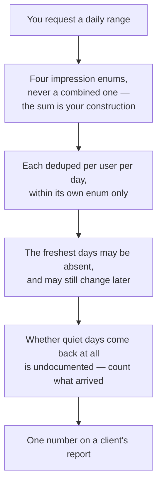

# What Google's own reporting hides

Every number in this chapter is one Google publishes about a business you own. None of them is wrong. All of them are shaped — deduplicated on a window you did not choose, truncated to top rows, withheld below a privacy threshold, or omitted entirely — and a report built on the raw value says something the data does not.

The area code is `MEASURE`. Entries are grouped by the surface the number comes from: Business Profile performance, search keywords, Search Console, and review counts. Each stands alone.

Where an entry cites a Google document, the quote is verbatim, the document's own last-updated date is given, and the `Last verified` stamp is the date we read it. Documentation dates and API behaviour drift apart — several entries below exist only because they did.

---

## Business Profile performance

The six entries below are one pipeline, and they compound. What a client reads as "profile views this month" has passed through every stage of it:

*No stage here is a defect, and none of it is hidden — it is all in the reference. What is missing is any signal in the response that a stage happened, which is why the arithmetic has to be documented by whoever prints the last box.*

### LSM-MEASURE-01 · There is no "profile views" metric — you sum four impression enums

**Verdict:** WORKS
**Last verified:** 2026-07-13 (live profile), documentation read 2026-07-27
**Probe:** `GET businessprofileperformance.googleapis.com/v1/locations/{l}:fetchMultiDailyMetricsTimeSeries` with `dailyMetrics` repeated for each impression enum and a `dailyRange`

The Performance API exposes impressions split four ways and never combined:

| Enum | Documented as |
| --- | --- |
| `BUSINESS_IMPRESSIONS_DESKTOP_MAPS` | "Business impressions on Google Maps on Desktop devices." |
| `BUSINESS_IMPRESSIONS_DESKTOP_SEARCH` | "Business impressions on Google Search on Desktop devices." |
| `BUSINESS_IMPRESSIONS_MOBILE_MAPS` | "Business impressions on Google Maps on Mobile devices." |
| `BUSINESS_IMPRESSIONS_MOBILE_SEARCH` | "Business impressions on Google Search on Mobile devices." |

Source: `DailyMetric` reference, last updated 2024-10-16. Any single headline "views" figure is a construction the reporting tool made, not a value Google returned.

**Consequence:** two tools can both be correct and disagree, because one summed four enums and the other summed two. Before comparing a views number across tools, ask which enums went into it — and state yours in the report.

### LSM-MEASURE-02 · An impression is one unique user per day, per metric

**Verdict:** WORKS
**Last verified:** 2026-07-27 (documentation read)
**Source:** `DailyMetric` reference (last updated 2024-10-16, re-read 2026-07-27) — the sentence appears on each of the four impression enums: "Multiple impressions by a unique user within a single day are counted as a single impression." Business Profile Help, *Understand your Business Profile performance* (`support.google.com/business/answer/9918094`, read 2026-07-27, no last-updated date shown): "A person can only be counted once a day. We don't count multiple visits on the same day."

The metric is closer to daily unique viewers than to ad impressions or pageviews. A customer who checks your hours four times on Tuesday is one impression.

The daily deduplication is documented per metric, and no cross-metric deduplication is documented — so a person who saw the profile on mobile Search and again on mobile Maps the same day plausibly contributes one impression to each enum, and two to the sum in `LSM-MEASURE-01` *(inference from the per-metric definition; we have not probed a controlled single-user case)*.

**Consequence:** never put a Business Profile impressions figure in the same table as ad impressions or site pageviews without a footnote. A month of "3,000 views" is at most 3,000 people-days, and fewer people.

### LSM-MEASURE-03 · The Performance API returns no rating, review-count or ranking metric — every such trend was manufactured by the tool showing it

**Verdict:** WORKS
**Last verified:** 2026-07-27 (documentation read)
**Probe:** read the `DailyMetric` enum in full (`developers.google.com/my-business/reference/performance/rest/v1/DailyMetric`) and look for one

The enum holds twelve values, read in full on 2026-07-27: four impression metrics, then `BUSINESS_CONVERSATIONS`, `BUSINESS_DIRECTION_REQUESTS`, `CALL_CLICKS`, `WEBSITE_CLICKS`, `BUSINESS_BOOKINGS`, `BUSINESS_FOOD_ORDERS`, `BUSINESS_FOOD_MENU_CLICKS`, plus `DAILY_METRIC_UNKNOWN` ("Represents the default unknown value"). Eleven real metrics and one default. Star rating, review count, photo count and map-pack position are not among them.

We know of no Google API that serves the history of those four either, and we have looked *(inference — an absence across the surfaces we have probed, not a statement Google makes)*.

**Consequence:** a "rating over time" or "rank over time" chart is a series of snapshots somebody chose to take, with all the properties that implies — it starts when tracking started, it has a point only where a capture happened, and a gap is missing data rather than a flat line. Ask any vendor which API returned the history; for these four, the honest answer is none. Rendering method matters more than the chart: see [Did it work?](../02-core-practice/did-it-work/index.md) and [Reporting to a client](../04-operating/reporting-to-a-client/index.md).

### LSM-MEASURE-04 · The 18-month range cap is documented only on the deprecated v4 request object

**Verdict:** UNDOCUMENTED
**Last verified:** 2026-07-27 (documentation read)
**Source:** v4 `BasicMetricsRequest` (last updated 2024-10-16): "The maximum range is 18 months from the request date." The v1 `locations.fetchMultiDailyMetricsTimeSeries` reference (last updated 2024-10-16) states no maximum range at all.

The 18-month figure everyone quotes for Business Profile performance history comes from the legacy Insights request object, not from the v1 Performance API that replaced it. The v1 page is silent on how far back a `dailyRange` may reach.

**Consequence:** treat 18 months as a working assumption, not a guarantee, and have your client handle a shorter-than-requested response without drawing a truncated series as if it were complete. If you need the real boundary for a specific location, walk the start date backwards until the response stops carrying values, and record the date you did it.

### LSM-MEASURE-05 · The most recent days can be missing, and can still change

**Verdict:** WORKS
**Last verified:** 2026-07-27 (documentation read)
**Source:** v4 `BasicMetricsRequest` (last updated 2024-10-16), quoted in full: "In some cases, the data may still be missing for days close to the request date. Missing data will be specified in the `metricValues` in the response." The v1 `locations.fetchMultiDailyMetricsTimeSeries` reference (last updated 2024-10-16, re-read 2026-07-27) carries no equivalent warning and documents no marker.

Read the second sentence as carefully as the first. On the deprecated v4 object Google said missing data *is* signalled in the response. On the v1 Performance API that replaced it, no such signal is documented — so the useful part of this entry is not "data is missing", it is that v1 tells you nothing about which days are provisional.

Data near the request date is incomplete and firms up later. A value read today and the same day read next week can differ without either being an error.

**What is not established:** whether v1 carries an undocumented equivalent of the v4 marker. Nobody has diffed a v1 response against a v4-style `metricValues` shape and published the result. Until somebody does, assume no marker.

**Consequence:** exclude the trailing few days from every reported total and every week-over-week comparison, and say in the report where the window ends. The failure mode is specific and common: a Monday report shows last week down, the same week re-read on Friday is flat, and the drop was reporting latency. When a client asks why the number changed, the answer is that the first read was too early — which is a much better sentence to have written down in advance.

### LSM-MEASURE-06 · Whether every date in a requested range comes back is not settled

**Verdict:** OPEN QUESTION
**Last verified:** date unknown — needs re-probe
**Probe that would close it:** request a `dailyRange` spanning a known-quiet period on a low-traffic location, then compare the count of `datedValues` returned against the number of calendar days requested

Clients in this space commonly back-fill absent dates with zero, which is safe either way. What is not established is whether Google omits zero-activity days from `timeSeries.datedValues` or returns them explicitly as zero. The v1 reference (last updated 2024-10-16, re-read 2026-07-27) documents neither behaviour, and we have no dated probe on file.

The one adjacent data point: the deprecated v4 `BasicMetricsRequest` said "Missing data will be specified in the `metricValues` in the response" (see `LSM-MEASURE-05`). That is a statement about v4, not about v1, and it does not tell you whether a zero-activity day counts as missing.

**Consequence:** back-fill missing dates to zero *and* keep the count of dates Google actually returned, because that count is the only signal distinguishing "no activity" from "not reported". Combined with `LSM-MEASURE-05`, an un-annotated zero at the right-hand edge of a chart reads as a collapse when it is an artefact of when you asked.

---

## Search keywords

### LSM-MEASURE-07 · The "monthly" keyword endpoint returns one range aggregate per keyword, with no month attached

**Verdict:** UNDOCUMENTED
**Last verified:** 2026-07-13 (live profile)
**Probe:** `GET .../v1/locations/{l}/searchkeywords/impressions/monthly` with `monthlyRange.start_month` and `monthlyRange.end_month` spanning several months; inspect a `searchKeywordsCounts` row

The documentation describes per-month aggregation — "Each search keyword is accompanied by impressions which are aggregated on a monthly basis", and the value is "The sum of the number of unique users that used the keyword in a month, aggregated for each month requested" (method reference, last updated 2024-10-16). The live response we probed contained each keyword **once**, carrying a single `insightsValue` and no month field, for a multi-month range.

The endpoint's name says monthly. What it returns for a multi-month range is one number covering the whole range.

**What to do instead:** to get a genuine month-by-month series, issue one request per month — an aggregate over a single month *is* that month's value. Any chart that takes a multi-month aggregate and plots it on the most recent month has invented a data point. If your tool shows a keyword trend, ask how many calls produced it; one call cannot produce a trend.

### LSM-MEASURE-08 · Low-volume keyword counts arrive as a privacy threshold, not a count

**Verdict:** WORKS
**Last verified:** 2026-07-13 (live profile), documentation read 2026-07-27
**Probe:** same call as `LSM-MEASURE-07`; inspect `insightsValue` on a long-tail keyword

`InsightsValue` carries one of two fields, never both:

| Field | Documented as |
| --- | --- |
| `value` | "Represents the actual value" |
| `threshold` | "Represents the threshold below which the actual value falls" |

Source: `locations.searchkeywords.impressions.monthly.list`, last updated 2024-10-16. A thresholded row is Google saying "fewer than this, and we will not tell you how many fewer".

**What to do instead:** render a thresholded figure as `<N`, never as `N`, and never sum thresholded and exact values into a single total presented as a measurement — the result is an upper bound, and it inflates most for the businesses with the least traffic. If a report shows a tidy "total keyword impressions" for a small business, that number is almost certainly a sum of ceilings.

### LSM-MEASURE-09 · Keyword impressions count unique users per month, so a range total is a sum of monthly uniques

**Verdict:** WORKS
**Last verified:** 2026-07-27 (documentation read)
**Source:** `locations.searchkeywords.impressions.monthly.list` (last updated 2024-10-16): "The sum of the number of unique users that used the keyword in a month, aggregated for each month requested."

A person who searched the same phrase in March and again in April is one unique user in each month and two in a March–April total. The deduplication window is the calendar month.

Note the mismatch with `LSM-MEASURE-02`: the daily engagement metrics deduplicate per **day**, the keyword metric per **month**. The two numbers are built on different denominators.

**Consequence:** never divide a keyword impression total by a daily impression total and call the result a share — the units differ. And do not describe a 12-month keyword total as "people who searched this"; it is the sum of twelve monthly people-counts.

### LSM-MEASURE-10 · A keyword page holds at most 100 rows, and the list is a top-N

**Verdict:** WORKS
**Last verified:** 2026-07-27 (documentation read)
**Source:** `locations.searchkeywords.impressions.monthly.list` (last updated 2024-10-16, re-read 2026-07-27): default page size 100, **maximum** page size 100; successive pages via `pageToken`.

Every client picks a stopping point in that pagination, and most stop well before exhaustion. Whatever the client stops at becomes the keyword list you see.

**Correction, 2026-07-27:** this entry previously said the list arrives "ordered by volume", so that truncation cuts the long tail and keeps the head terms. That ordering is not documented. The method reference states the page-size bounds and nothing about sort order, and any ordering you see in a tool may have been applied by the tool after fetching. Treat the *contents* of a truncated page as unknown, not as "the top N" — which is a stricter warning, not a weaker one.

**Consequence:** a keyword panel is a partial sample unless the tool states it paginated to exhaustion, and you cannot assume the rows it kept are the important ones. Do not compute "total impressions across all keywords" from a truncated list, and do not conclude a phrase is absent because it is not shown. Combined with `LSM-MEASURE-08`, the bottom of any keyword list is both incomplete and thresholded.

### LSM-MEASURE-11 · Keyword data lands at the start of the month and can take five days

**Verdict:** WORKS
**Last verified:** 2026-07-27 (documentation read)
**Source:** Business Profile Help, *Understand your Business Profile performance* (`support.google.com/business/answer/9918094`, read 2026-07-27, no last-updated date shown): "The searches metric is updated at the start of each month. It might take up to 5 days to show up."

The current calendar month is therefore always empty or partial, and the previous month is unreliable during roughly its first working week.

**Consequence:** compare completed months only, and build the trailing window so its last bucket is the last **complete** month. A window ending on the current month produces a cliff at the right-hand edge every single time — and that cliff will be read as a collapse in demand by every client who sees it before you explain it.

---

## Search Console

### LSM-MEASURE-12 · `dataState` defaults to `final`, which omits the freshest days

**Verdict:** WORKS
**Last verified:** 2026-07-27 (documentation read)
**Source:** Search Analytics `query` reference (last updated 2026-05-20): "If 'all' (case-insensitive), data will include fresh data. If 'final' (case-insensitive) or if this parameter is omitted, the returned data will include only finalized data."

An API client that never sets the parameter gets finalized data only; the Search Console web interface shows fresh data and marks it as preliminary. The two therefore disagree at the recent end of any window, with the API lower. We observed exactly that discrepancy against the interface before setting the parameter explicitly *(date of that observation unknown — needs re-probe)*.

Related: Search Console Help, *About Search Console data* (`support.google.com/webmasters/answer/96568`, read 2026-07-27): "Normally, however, collected data should be available in 2-3 days."

**What to do instead:** set `dataState` explicitly, on every call, and record which value you used next to the numbers. When a client screenshots the Search Console interface and it does not match your export, this parameter is the first thing to check — before you go looking for a bug.

### LSM-MEASURE-13 · Search Console stores top rows, not all rows

**Verdict:** WORKS
**Last verified:** 2026-07-27 (documentation read)
**Source:** two documents, read 2026-07-27. Search Console Help, *About Search Console data* (`support.google.com/webmasters/answer/96568`, no last-updated date shown): "Search Console stores top data rows and not all data rows." Search Analytics `query` reference (`developers.google.com/webmaster-tools/v1/searchanalytics/query`, last updated 2026-05-20): "The API is bounded by internal limitations of Search Console and does not guarantee to return all data rows".

This is not a pagination limit you can defeat by asking for more rows. `rowLimit` accepts 1–25,000 with a default of 1,000, and raising it does not retrieve rows that were never stored.

**Consequence:** the sum of the rows you can retrieve does not equal the reported totals, structurally and permanently. Report totals from an un-dimensioned or date-dimensioned query; use the query and page tables for composition only. Any tool that builds its headline clicks figure by summing a query table is reporting a number Google never claimed.

### LSM-MEASURE-14 · Anonymized queries are missing from the table but present in the totals

**Verdict:** WORKS
**Last verified:** 2026-07-27 (documentation read)
**Source:** Search Console Help, *Performance report (Search results): Dimensions and data groupings* (`support.google.com/webmasters/answer/17011259`, read 2026-07-27, no last-updated date shown), quoted in full: "Anonymized queries: Some queries are omitted from the report to protect user privacy. These are called anonymized queries. They're included in chart totals, unless a query filter is applied (for example, "queries containing" or "queries not containing" a given string)." And *About Search Console data* (`support.google.com/webmasters/answer/96568`, read 2026-07-27): "To protect user privacy, the Performance report doesn't show all data. For example, we might not track some queries that are made a very small number of times or those that contain personal or sensitive information."

Two consequences fall out of that second clause. Summed query rows fall short of the totals by the anonymized volume, and applying a query filter silently drops the anonymized volume from the totals too — so a filtered total and an unfiltered total are not on the same base.

Google publishes no percentage, and neither do we. The share is not knowable from the data you are given, because the missing rows are missing.

**Consequence:** never present "your top queries account for X% of traffic" from a Search Console export — the denominator is unknowable and the shortfall is largest for exactly the small local sites this manual is about. And never compare a query-filtered total against an unfiltered one.

### LSM-MEASURE-15 · Average position is the topmost result from your site, impression-weighted

**Verdict:** WORKS
**Last verified:** 2026-07-27 (documentation read)
**Source:** Search Console Help, *Performance report (Search results)* (`support.google.com/webmasters/answer/7576553`, read 2026-07-27, no last-updated date shown): "The average position of the topmost result from your site." And on aggregation: "If two results from the same site appear for one query, they count as a single impression in the chart total."

Where a query returns two of your pages, the better position is reported and the worse one is invisible. Positions are then averaged across impressions, so high-volume queries dominate the figure and a mean position of 8.4 may describe no query you actually hold.

**Consequence:** a Search Console average position is a property-level summary of organic web results. It is not a rank you held, it is not per-page unless you dimension by page, and it is not comparable to a map-pack position — those are different result sets measured differently, which is the whole subject of [Rank is a map, not a number](../01-foundations/rank-is-a-map-not-a-number/index.md) and [Why two tools disagree](../03-advanced/why-two-tools-disagree/index.md).

### LSM-MEASURE-16 · A window CTR is not the average of daily CTRs

**Verdict:** WORKS
**Last verified:** 2026-07-27 (arithmetic, reproducible on any export)
**Probe:** pull rows dimensioned by date for one window; compute `sum(clicks) / sum(impressions)`, then compute the mean of each day's `clicks / impressions`; compare

The reported window CTR is the ratio of the totals. A mean of daily ratios weights a 40-impression Sunday the same as a 4,000-impression Tuesday, and diverges further the more uneven the traffic — which for a local business means it diverges most in the weeks that matter.

The same applies to average position: it must be impression-weighted, not a plain mean of daily positions.

**Consequence:** compute rates from summed numerators and denominators, never by averaging rates. If a spreadsheet shows a CTR that does not match the Search Console tile, this is usually why — and if you cannot tell which method a report used, you cannot use its CTR at all.

---

## Review counts and place records

### LSM-MEASURE-17 · The reviews a place record returns are a sample; the rating count is the population

**Verdict:** WORKS
**Last verified:** 2026-07-13 (live probe), documentation re-read 2026-07-27
**Probe:** `GET places.googleapis.com/v1/places/{placeId}` with a field mask containing `reviews` and `userRatingCount`, on a place with hundreds of ratings; compare the array length with the count
**Source:** Places API (New) `Place` resource, `reviews` field, read 2026-07-27 (no last-updated date shown on the page) — verbatim: *"List of reviews about this place, sorted by relevance. A maximum of 5 reviews can be returned."*

In our runs the `reviews` array came back with at most five entries regardless of how many ratings the place had, which matches the documented cap.

**Correction, 2026-07-27:** this entry previously asserted that Google's documentation "states neither a maximum count nor the rule by which those entries are selected", and dated that page to 2026-07-20. Both claims were wrong. The `Place.reviews` field documents the maximum (5) and names the selection rule ("sorted by relevance"), and we could not confirm the 2026-07-20 date on re-reading. What remains genuinely undocumented is what *relevance* means here — Google defines the ordering by name only, so the sample is small, capped, and selected by an undisclosed rule rather than by an undisclosed count.

**Consequence:** every ratio computed over that array has a denominator of at most five, and those five are a relevance-ranked selection rather than a random or recent sample — so the array is not a valid basis for any estimate about the population. A "response rate" of 40% may mean two replies on the five reviews visible, on a business with 300 reviews — a number that is arithmetically correct and completely uninformative. Any reply-rate, sentiment or recency figure needs the owner-side review API to mean anything; which access path can see what is tabulated in [the GBP capability matrix](./gbp-capability-matrix.md), and the same trap in diagnostic form is in [Diagnosing a business in thirty minutes](../02-core-practice/analyzing-business-visibility/index.md).

### LSM-MEASURE-18 · Rating-only reviews count toward the total and carry no text

**Verdict:** WORKS
**Last verified:** 2026-07-13 (live profile, owner API), documentation read 2026-07-27
**Probe:** list reviews through the owner API and count entries whose comment field is absent; compare that count with the reported total
**Source:** Places API (New) `Place` resource, `userRatingCount` field, read 2026-07-27 — verbatim: *"The total number of reviews (with or without text) for this place."*

Google says it plainly in the field description: the count includes ratings with no text. A star rating left without a comment is a review for counting purposes and an empty record for every text-based analysis. The owner API returns it with a star value and no comment; the same is true of place-record reviews.

**Consequence:** "review count" and "reviews you can reply to meaningfully" are different numbers, and the gap is usually largest for high-volume consumer businesses. State which you mean. A text-analysis or keyword-in-reviews figure must declare its denominator as reviews-with-text, not reviews — otherwise every such metric is silently deflated by the rating-only share.

### LSM-MEASURE-19 · A review history is survivorship-biased — deleted reviews leave no trace

**Verdict:** UNDOCUMENTED
**Last verified:** date unknown — needs re-probe
**Probe that would establish the magnitude:** take two complete owner-API review fetches dated some months apart, diff them by review id, and count the ids present in the earlier fetch and absent from the later one

A review list returns the reviews that exist when you call it. Reviews are removed — by their authors, and by Google's own policy enforcement — and a removed review is simply not in the response. Nothing in the API marks a gap.

So a "reviews per month" chart rebuilt today from a current fetch shows the survivors of each month, not what that month looked like at the time, and the distortion grows the further back you look *(inference; we have not published a measured rate, and any such rate would be specific to the businesses measured)*.

**Consequence:** if review history matters to your reporting, snapshot the totals as you observe them rather than reconstructing the past from a fresh fetch — a count recorded in March is evidence about March in a way that a March bucket computed in July is not. The same reasoning applies to the retention rules in [Storing Google data legally](./storing-google-data-legally.md), which cap how long a raw copy may be kept in the first place.

---

## Using these entries in a report

Four of the nineteen change a headline number rather than a caveat, and they are the ones worth checking before anything is sent to a client:

| Check | Entry | What it prevents |
| --- | --- | --- |
| Which impression enums make up "views"? | `LSM-MEASURE-01` | Two tools disagreeing for no reason |
| Does the window end on complete data? | `LSM-MEASURE-05`, `LSM-MEASURE-11` | Reporting latency as a decline |
| Are any keyword figures thresholded? | `LSM-MEASURE-08` | A total that is a sum of upper bounds |
| Do query rows get summed into a total? | `LSM-MEASURE-13`, `LSM-MEASURE-14` | A headline Google never claimed |

The quotes above are from Google's technical references and help pages, each carrying its own last-updated date where one is shown. They are documentation, not terms of service — the compliance material, with the legal-register disclaimer that goes with it, is in [Storing Google data legally](./storing-google-data-legally.md). What these calls cost to make is in [What the Places API will and will not give you](./what-places-returns.md).

---

**Next:** [AI engine probe recipes →](./ai-engine-probe-recipes.md)
