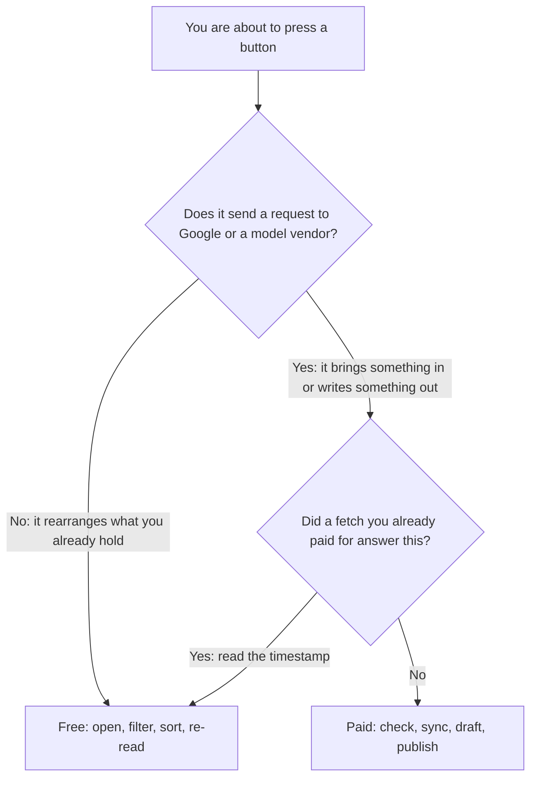

# What things cost

Half the labs in this manual cost nothing to run. The other half spend money, and there is a single rule that tells you which is which before you press anything.

This page is the reference for that rule: what spends on every screen, what never does, the four settings that account for almost all of the variance, and a route through the manual that buys each piece of data once.

## Scope

**No prices appear here.** Labs are marked **free** or **paid**, never with a number. Prices change, tools change, and a manual that hard-codes a figure lies to you six months later. What matters — and what does not change — is *which class of action* a click belongs to.

**This is about the labs, not about the work.** What Google charges for the data underneath any local SEO tool is published to the cent and is in [What the Places API will and will not give you](../05-reference/what-places-returns.md). What a client engagement costs to deliver, in data and in hours, is in [What the work costs](../04-operating/what-the-work-costs/index.md).

Those are the two pages to read before quoting anybody. This one is about working through the curriculum without wasting money.

**Counts are dated.** The lab tallies below were taken from the repository on **2026-07-27**. Chapters get added; re-count rather than trusting the number if the manual has moved on.

---

## The rule

**Reading stored data is free. Fetching new data is paid.**

That is not a quirk of one tool. It is a description of where money actually goes. A tool spends when a request leaves for Google or for a model vendor, and it spends nothing when it hands you something it already holds. Every serious instrument in this space has the same shape, whatever it calls its units.

### Two corollaries

**A click that produces something from outside is paid. A click that rearranges what you already have is not.** Opening a page, filtering a review list, switching a chart between periods, sorting competitors, re-reading a grid you scanned in March — none of these leave the building. Checking a rank, syncing reviews, drafting with a model, publishing to Google — all of these do.

**Paid data is bought once and re-read for free.** A fetch you paid for is stored and re-served at no charge, however many times you open it. This is why the most expensive habit in local SEO tooling is re-fetching to answer a question that last week's fetch already answered — and why the second habit worth forming, after "measure before you change", is "read the timestamp before you press".

### Bought once, but not kept for ever

But it is re-read for free *for a while*, not for ever, and the reason is not commercial. Google's Business Profile API terms cap how long its content may be held — *"It must be stored temporarily for no more than 30 calendar days"* ([`LSM-POLICY-27`](../05-reference/storing-google-data-legally.md)) — and Places content is stricter still.

**Any tool that obeys those terms therefore ages raw Google content out on a rolling window** and falls back to the paid button.

| Survives the window | Does not survive it |
| --- | --- |
| The part that is not Google's content: identifiers, and the measurements the tool computed — rank positions, profile scores, grid coverage | The raw material — synced review text, competitor field values, cached performance series, generated report PDFs |

The practical consequence is the opposite of what "buy it once" suggests:

> **Anything you will need as evidence in three months has to leave the tool.**

Export it, file it, and cite your own copy. This is the same rule the compliance chapter arrives at from the legal end — [Storing Google data legally](../05-reference/storing-google-data-legally.md) — and it is the single most important sentence on this page for anyone running client work.

Everything else on this page is that rule applied.

---

## What spends, screen by screen

*The rule made visible. **Refresh all** carries a price pill and **Generate** inside the Reports panel carries another — a button that spends says so on its face, before you press it, and the two figures are not the same. Everything else on this screen, including the entire action plan below it and the report row already in the list, is stored data you can re-read as often as you like for nothing. (The manual masks the numbers themselves; in the app they are exact.)*

The right-hand column is not a summary — it is the rest of the screen. If an action is not named on the left, it does not spend.

| Screen | Spends when you press | Free on the same screen |
| --- | --- | --- |
| **Add a business** (`/businesses/new`) | **Search** for a business; **Add** the one you picked; on the owner path, listing your Google locations and importing one | Typing, browsing results, cancelling |
| **Overview** (`/b/{businessId}/overview`) | **Refresh all**; **Refresh business info**; **Refresh rankings**; **Refresh reviews**; **Refresh competitors**; **Refresh map**; **Load performance data**; **Load trend**; **Fix automatically**; drafting a description with AI; the "add more photos" fix; **Reports → Generate** | Profile score and its five-category bar, the action plan, rating and photo cards, every stored chart, profile-score history, reading the report you already generated |
| **Rankings** (`/b/{businessId}/rankings`) | **Track** a keyword; **Check now** on a keyword; **Check now** on the grid; the AI keyword suggestions; the stale-data banner's refresh; tracking a rival from the ranked list | Reading positions and their dates, reading a stored grid at any detail level, grid history, "who ranks above you", removing or pausing a keyword |
| **Reviews** (`/b/{businessId}/reviews`) | **Sync**; **Publish to Google**; **Re-check on Google**; **Draft with AI** | Reading, filtering by status/rating/comment, sorting, searching, writing a reply and not publishing it, review statistics |
| **Competitors** (`/b/{businessId}/competitors`) | **Discover**; tracking a competitor; snapshotting one; **Refresh** them all | The comparison tables, the spam check, alerts, watch-list toggles, removing a competitor |
| **AI Visibility** (`/b/{businessId}/ai-visibility`) | **Check now** on AI readiness; **Check *n* selected** on the keyword × engine matrix; **Check** on listings consistency | The readiness breakdown and all nine factors, the stored matrix, recommendations, source lists, stored listing results |
| **Website** (`/b/{businessId}/website`) | **Check now** at the top of the page (audit *and* search performance); the site-audit refresh on its own; the search-performance load on its own | Every stored check, the agent-readiness score and its rows, stored Search Console figures, connecting Search Console |
| **Posts** (`/b/{businessId}/posts`) | **Publish to Google**; **Draft with AI**; refreshing post states; deleting a post | Composing, template selection, validating a draft against Google's limits, reading stored posts |
| **Profile** (`/b/{businessId}/profile`) | Applying a fix; loading the attribute options for your category; uploading photos; deleting a photo; undoing a fix | Reading every field, the photo gallery, recent-edit history, seeing which fields Google will not let you change |
| **Anywhere** | Each message to the in-app assistant | Navigation, the business switcher, the portfolio list, the dashboard, connecting or disconnecting a Google Business Profile |

Three entries in that table surprise people:

**Undo is paid, and it expires.** Undoing a profile fix replays a write against Google, so it costs what the write cost. It also depends on the stored copy of the field's previous value, which is Google content and ages out on the retention window described above — so undo is a short-term safety net, not an archive.

The durable undo is the one you write down yourself before you edit (step 1 of [the five-step safe edit](./checklists-and-templates.md)). Practise it once on something you do not mind changing ([Lab 9.3](../02-core-practice/the-profile-is-the-product/index.md)) rather than discovering the mechanics during a real mistake.

**Deleting is paid.** Removing a photo or a post is a write to Google like publishing one. There is no cheap way out of a bad publish.

**Connecting is free.** The Google Business Profile connection costs nothing, and it is the highest-value free action in the whole curriculum — it converts a pile of *unknown* rows into facts, and the owner-side interfaces it opens are unmetered by Google. If you take one thing from this page: [connect the profile](../00-start-here/set-up-your-workbench.md) before you spend anything else.

---

## What never spends

Worth stating positively, because the instinct to press refresh before looking is what costs beginners most.

- Opening any page, however many times.
- Every number that carries a "checked" or "synced" timestamp — that stamp is the receipt for a fetch you already paid for.
- Switching the grid between **Quick**, **Standard** and **Detailed** to look at what you have already scanned at that level. Picking a level shows that level's newest stored scan; it does not run a new one.
- Slicing a performance chart to a different period. The series was fetched whole; the slicing is local.
- Every scored rubric — the profile audit, the AI-readiness factors, the agent-readiness score. These are computed from data you already hold, not from a fresh look at Google.
- The spam check on your competitor set. It is a heuristic over stored fields.
- Writing. Drafts, reply text, post copy, notes — nothing is charged until it leaves for Google.

And one guarantee that changes how you should behave: **a run that fails is refunded automatically.** You do not need to be timid about an action you are entitled to run. Be deliberate about *which* action, not about whether to press it.

---

## The four things that drive the bill

Almost all cost variance between two people working the same curriculum comes from four settings. Each is a multiplier, and they compound.

### 1. Grid detail

A geo-grid is one live search per grid point ([Rank is a map, not a number](../01-foundations/rank-is-a-map-not-a-number/index.md)). Three presets, fixed one-mile spacing:

| Preset | Grid | Live searches | Area reached |
| --- | --- | --- | --- |
| **Quick** | 3×3 | 9 | roughly 2 miles across |
| **Standard** | 5×5 | 25 | roughly 4 miles across |
| **Detailed** | 7×7 | 49 | roughly 6 miles across |

Detailed costs about five times Quick and is priced as exactly what it is. It is not five times more true — it is a wider net at the same resolution.

**Pick by the question.** A shop whose customers walk in from three streets away learns nothing from a six-mile square, and a service-area business covering two counties learns nothing from a two-mile one. [Reading a geo-grid](../03-advanced/reading-a-geo-grid/index.md) is the chapter that makes that choice properly.

### 2. Matrix breadth on AI visibility

An AI answer check is one keyword against one engine. Three engines sit on that screen, so a run costs **prompts × connected engines**, and the run bar shows both the arithmetic and the batch total before you press it.

**An engine marked Not connected** produces a clearly-labelled sample row instead — free, and it must never count toward a rate.

**The trap is that AI visibility is a rate, not an answer** — one run is a sample ([Does the AI recommend this business?](../03-advanced/ai-visibility/index.md)). So the real unit is prompts × engines × repeats.

Ten prompts across three engines run weekly is thirty times the spend of three prompts on one engine run monthly, for a picture whose error bar you should be computing either way. Decide the matrix deliberately: a small set run enough times beats a large set run once, every time.

### 3. Set size

Two lists set the price of every "refresh everything" button you press afterwards.

- **Tracked keywords.** Refreshing rankings runs one live check per active keyword. A set built by adding every phrase anybody suggested makes each refresh permanently more expensive, and buys you near-duplicate rows that move together and tell you one thing. [Choosing what to track](../02-core-practice/choosing-what-to-track/index.md) is a cost chapter as much as a method one.
- **Tracked competitors.** Refreshing competitors reads one record per tracked rival. Both lists carry a per-business cap, and the counters in the app show how many slots you have used — treat the cap as a budget rather than a target.

### 4. Cadence

The cheapest lever and the one nobody pulls. Map-pack positions drift over weeks. Scanning daily costs seven times what scanning weekly costs and mostly measures your own noise floor, which is exactly what [Lab 18.2](../03-advanced/reading-a-geo-grid/index.md) exists to quantify. Set the cadence from how fast the thing actually moves, write down the justification, and re-read it when you feel the urge to check.

### They multiply

| Lever | Restrained | Indulgent | Ratio |
| --- | --- | --- | --- |
| Grid detail | Quick (9 points) | Detailed (49 points) | ~5× |
| AI matrix | 3 prompts × 1 engine | 10 prompts × 3 engines | 10× |
| Cadence | fortnightly | daily | 14× |

Those three alone are a factor of several hundred between two operators producing the same deliverable — arithmetic, not an estimate. Neither picture is more accurate. One of them is just paid for more often.

---

## The labs, counted

As of **2026-07-27** the manual has **103 labs**. **51 cost nothing at all.** 48 spend outright, and 4 are part-free — a paid fetch followed by free reading, or free to remove and paid to add.

Those four part-free labs are counted in the **Spend** column below, so that column sums to 52, not 48; 51 + 52 = 103.

| Part | Labs | Free | Spend |
| --- | --- | --- | --- |
| Part 0 — Start here | 4 | 3 | 1 |
| Part I — Foundations | 18 | 12 | 6 |
| Part II — Core practice | 38 | 8 | 30 |
| Part III — Advanced | 25 | 13 | 12 |
| Part IV — Operating | 18 | 15 | 3 |

**The distribution is the honest shape of the discipline.** Part II is where you *change* things, and changing things means writing to Google and measuring the result, so that is where the money is.

Parts III and IV are mostly reading, judgement and paperwork — the parts that most separate a competent practitioner from an incompetent one, and they are nearly free.

**A dozen labs never open the app at all.** They run in a browser, a spreadsheet, your notes or an assistant's chat window:

- the surface census
- the two-machine test
- the spam dossier
- the spam report
- the report grading
- the price book
- the source file for staying current

If you want to sample the manual before spending anything, those are the ones.

---

## A route that buys each thing once

Every paid fetch in this manual feeds several free labs. The cheapest possible run through the curriculum is not "skip the paid labs" — it is "run each paid lab once, in the right order, and do the free reading against what it left behind".

| One paid action | Free labs it then feeds |
| --- | --- |
| Add the business (Lab 0.3) | 1.2, 2.1, 2.3, 7.1, 19.1, 24.1 — the entire diagnostic layer |
| Connect the profile (Lab 0.4 — free) | Converts *unknown* rows into facts in every later audit, and opens the unmetered owner data |
| Add and check one keyword (Lab 3.1) | 3.2, 3.3, 23.1 |
| One grid scan (Lab 4.1) | 4.2, 4.3, 18.1 — and it stays readable for months |
| One review sync (Lab 11.1) | The whole reading half of 11.1, plus the reply triage |
| Discover and track rivals (Lab 16.1) | 16.3, 23.3 |
| One site audit (Lab 13.1) | 14.1 (free once stored), then 14.2 |
| One matrix run (Lab 20.2) | 20.3, 21.1, 16.4 |
| One overview refresh + frozen report (Labs 7.2, 7.3) | 27.1, 27.2, 27.3 — the whole ninety-day planning chapter reads off a frozen baseline |

**The baseline in that last row must be exported the day you make it.** A generated report is a frozen copy of Google content, so it ages out on the thirty-day window — and a ninety-day plan that reads off it will outlive it.

Download the PDF into your own storage immediately; that copy, and not the one in the tool, is the baseline. The same goes for any review text or performance series you intend to quote later.

Three ordering rules fall out of that table.

**Do the free lab in a pair first.** [Lab 7.1](../02-core-practice/analyzing-business-visibility/index.md) reads the audit for nothing; Lab 7.2 refreshes it. Doing 7.2 first buys a fetch to answer a question 7.1 would have answered.

**Do the reading labs before re-fetching.** Labs 4.2, 4.3 and 18.1 all read the *same* stored scan. Run them in one sitting and one scan covers three labs.

**Two labs deserve a warning.** [Lab 18.2](../03-advanced/reading-a-geo-grid/index.md) runs two grid scans deliberately and is charged twice — use the **Quick** preset, run it once, and keep the result, because a noise floor stays valid for months.

[Lab 22.1](../03-advanced/why-two-tools-disagree/index.md) adds two keyword rows to make an instrument disagree with itself; check your remaining slots before starting so you are not forced to delete a row with history.

**If you are on the observe-only path** — working on a business you do not manage — skip the write labs in chapters 9, 10, 11 and 15 entirely.

They are the largest block of paid work in the manual, they need owner access you do not have, and you must not write to a listing you do not control anyway. Every one of those chapters states its observe-only variant, and the reading half of each still works.

---

## The expensive habits

Four, in descending order of how much they cost.

**Refreshing before reading.** The single most common way to spend many times what a competent operator spends for identical insight. Every card carries the date it was fetched. Read the date. Then decide whether the answer you want could have changed since.

**Scanning at Detailed out of thoroughness.** Detail is not accuracy. A wider grid at the same one-mile spacing answers a wider question, and if you were not asking that question you bought nothing.

**Refreshing everything to refresh one thing.** The per-section buttons exist so you can pay for the domain you asked about. Pressing **Refresh all** because reviews changed also re-pulls the profile.

Worth knowing what each composite covers: **Refresh all** on the overview re-pulls profile fields and reviews (and owner performance on a connected profile) — it does **not** re-check keyword positions, re-run a grid, or re-fetch competitors. The whole-page **Check now** on Website is the site audit *and* Search Console together.

**Daily anything.** Nothing in local search moves fast enough to justify it, and daily sampling makes normal drift look like results, which is worse than expensive — it is misleading ([Did it work?](../02-core-practice/did-it-work/index.md)).

---

## What is not on this page

**Any price.** By design — see Scope. The app shows the exact price on every button before you press it, including the batch total on multi-item runs.

**What Google charges.** Published to the cent, and the more useful number for anyone building or buying: [What the Places API will and will not give you](../05-reference/what-places-returns.md).

**What an engagement costs to deliver.** Data is a small fraction of it; labour is the business. [What the work costs](../04-operating/what-the-work-costs/index.md).

**Whether you may keep the data you paid for.** A separate question from what it cost, governed by terms rather than by price, and it changes the economics more than any rate does: [Storing Google data legally](../05-reference/storing-google-data-legally.md).

**How to run these labs by hand.** Every one of them can be done with a browser, a spreadsheet and patience — slower, and without history, which turns out to be the thing that matters: [Doing it without SEOG](./doing-it-without-seog.md).

---

**Next:** [Glossary →](./glossary.md)
